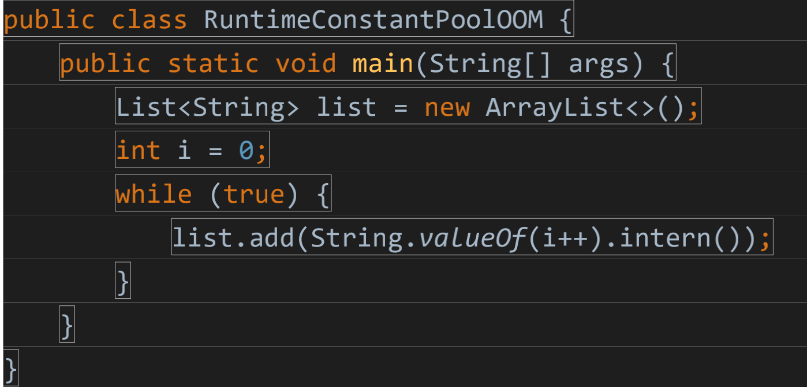
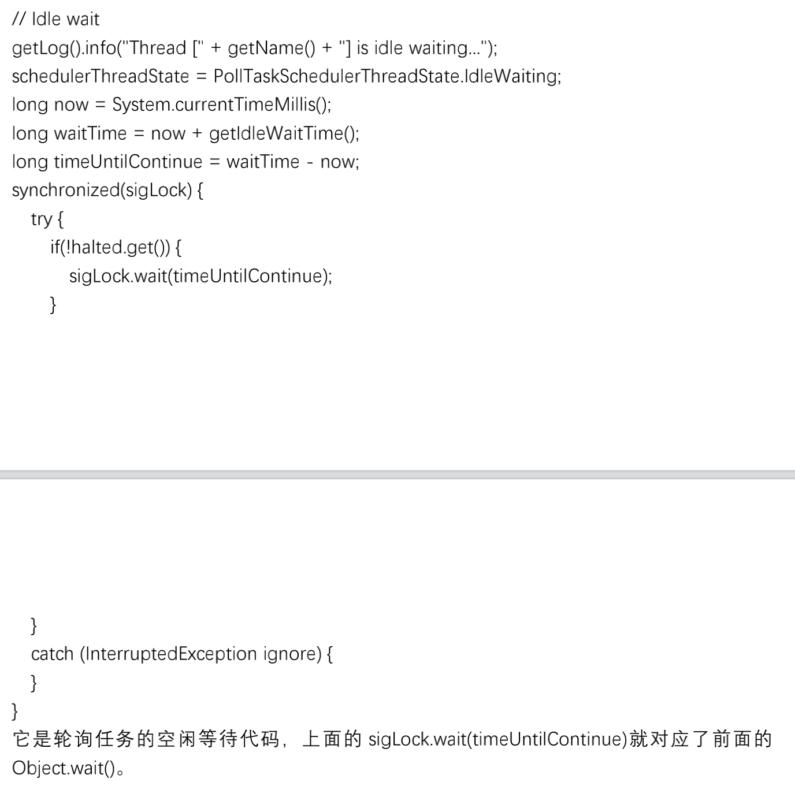

# 1 jvm内存结构


灰色部分,线程私有 不存在垃圾回收

## 1.1 类装载器 classLoader

负责加载class文件，class文件在文件开头**有特定的文件标示**，将class文件字节码内容加载到内存中，并将这些内容转换成方法区中的运行时数据结构并且ClassLoader只负责class文件的加载，至于它是否可以运行，则由Execution Engine决定 


echo %JAVA_HOME%

echo %PATH%

echo %CLASSPATH%

### 1.1.1 类加载器的种类

虚拟机自带的加载器有四种

- 启动类加载器（Bootstrap）C++

lang包下的类

可以去jar的rt.jar下去看看


- 扩展类加载器（Extension）Java

javax的包下都在这里加载

- 应用程序类加载器（AppClassLoader）Java也叫系统类加载器，加载当前应用的classpath的所有类
- 用户自定义加载器 Java.lang.ClassLoader的子类，用户可以定制类的加载方式

ClassLoader是一个抽象类,可以继承它,重写,正常不会用

### 双亲委派机制&沙箱安全机制 

自己写 代码不能污染java的源代码

比如我自己也写一个java.long.String  这样的话去运行,就会报错

当一个类收到了类加载请求，他首先不会尝试自己去加载这个类，而是把这个请求委派给父类去完成，每一个层次类加载器都是如此，因此所有的加载请求都应该传送到启动类加载其中，只有当父类加载器反馈自己无法完成这个请求的时候（在它的加载路径下没有找到所需加载的Class），子类加载器才会尝试自己去加载。

采用双亲委派的一个好处是比如加载位于 rt.jar 包中的类 java.lang.Object，不管是哪个加载器加载这个类，最终都是委托给顶层的启动类加载器进行加载，这样就保证了使用不同的类加载器最终得到的都是同样一个 Object对象。 

借此也就保证了**沙箱安全**,防止恶意代码污染java源代码,保证了java源代码的安全性


`sun.misc.Launcher`它是一个java虚拟机的入口应用

## 1.2 execution engine

**Execution Engine ** **执行引擎负责解释命令，提交操作系统执行。** 

加载验证通过即可

## 1.3  Native Interface 本地接口

native关键字,只有声明没有实现

通俗来说,native标识的方法代表就是跟java无关的,这一部分方法就要放到native method stack中去运行

 本地接口的作用是融合不同的编程语言为 Java 所用，它的初衷是融合 C/C++程序，Java 诞生的时候是 C/C++横行的时候，要想立足，必须有调用 C/C++程序，于是就在内存中专门开辟了一块区域处理标记为native的代码，**它的具体做法是 Native Method Stack中登记 native方法，在Execution Engine 执行时加载native libraies**。

优势会被趋势取代  

 目前该方法使用的越来越少了，除非是与硬件有关的应用，比如通过Java程序驱动打印机或者Java系统管理生产设备，在企业级应用中已经比较少见。因为现在的异构领域间的通信很发达，比如可以使用 Socket通信，也可以使用Web Service等等，不多做介绍。


## 1.4 **Native Method Stack** 本地方法栈


运行Native标识的方法在这里运行,

本地方法栈（NativeMethodStack）与虚拟机栈所发挥的作用是非常相似的，它们之间的区别不过是虚拟机栈为虚拟机执行Java方法（字节码）服务，而本地方法栈为虚拟机使用到的Native方法服务。


## 1.5 PC寄存器(也叫程序计数器)


Program Counter Register(**寄存**)

一个指针,我这个方法运行完了,指向下一个运行的方法,记录方法之间的调用和执行情况,类似排班,这种指针行号的记录器就是  PC寄存器

 每个线程都有一个程序计数器，是线程私有的,就是一个指针，指向方法区中的方法字节码（用来存储指向下一条指令的地址,也即将要执行的指令代码），由执行引擎读取下一条指令，是一个非常小的内存空间，几乎可以忽略不记。

这块内存区域很小，它是当前线程所执行的字节码的行号指示器，字节码解释器通过改变这个计数器的值来选取下一条需要执行的字节码指令。

如果执行的是一个Native方法，那这个计数器是空的。

用以完成分支、循环、跳转、异常处理、线程恢复等基础功能。不会发生内存溢出(OutOfMemory=OOM)错误


## 1.6 **Method Area** **方法区**


方法区（MethodArea）与Java堆一样，是各个线程共享的内存区域，它用于存储已被虚拟机加载的类信息、常量、静态变量、即时编译器编译后的代码等数据。虽然Java虚拟机规范把方法区描述为堆的一个逻辑部分，但是它却有一个别名叫做Non-Heap（非堆），目的应该是与Java堆区分开来。
“PermGenspace”是方法区。不过方法区和“PermGenspace”又有着本质的区别。前者是JVM的规范，而后者则是JVM规范的一种实现，并且只有HotSpot才有“PermGen space”。
HotSpot虚拟机将GC分代收集拓展至方法区，或者说使用永久代来实现方法区。这样的HotSpot的垃圾收集器可以像管理Java堆一样管理这部分内存，能够省去专门为方法区编写内存管理代码的工作。如果实现方法区属于虚拟机实现细节，不受虚拟机规范约束，但是用永久代实现方法区，并不是一个好主意，因为这样容易遇到内存溢出问题。
垃圾收集行为在这个区域是比较少出现的，但并非数据进入方法区就永久存在了。这区域的内存回收目标主要是针对常量池的回收和对类型的卸载。
在Java8中，永久代被删除，方法区的HotSpot的实现为Metaspace元数据区，不放在虚拟机中而放在本地内存中，存储类的元信息；
而将类的静态变量（放在Class对象中）和运行时常量池放在堆中。

---

它存储了每一个类的**结构信息**

方法区是规范

所有线程共享,这里存在垃圾回收

供各线程共享的运行时内存区域。它存储了每一个类的**结构信息**，例如运行时常量池（Runtime Constant Pool）、字段和方法数据、构造函数和普通方法的字节码内容。方法区是规范，在不同虚拟机里头实现是不一样的，最典型的就是永久代(PermGen space)和元空间(Metaspace)。

But

实例变量存在堆内存中,和方法区无关

## 1.7 java虚拟机栈


> Java虚拟机栈也是线程私有的，它的生命周期与线程相同。虚拟机栈描述的是Java方法执行的内存模型：每个方法在执行的同时都会创建一个栈帧（StackFrame）用于存储局部变量表、操作数栈、动态链接、方法出口等信息。每一个方法从调用到执行完成的过程，就对应着一个栈帧在虚拟机栈中入栈到出栈的过程。

栈管运行  

堆管存储

 	栈也叫栈内存，主管Java程序的运行，是在线程创建时创建，它的生命期是跟随线程的生命期，线程结束栈内存也就释放，**对于栈来说不存在垃圾回收问题**，只要线程一结束该栈就Over，生命周期和线程一致，是线程私有的。

​	8种基本类型的变量+对象的引用变量+实例方法都是在函数的**栈**内存中分配。

### 1.7.1 栈存储什么 

栈帧:java中的方法进入虚拟机后就变成了栈帧

栈帧中主要保存3 类数据

```
本地变量（Local Variables）:输入参数和输出参数以及方法内的变量；

栈操作（Operand Stack）:记录出栈、入栈的操作；

栈帧数据（Frame Data）:包括类文件、方法等等。
```


### 1.7.2 栈运行原理

栈中的数据都是以栈帧（Stack Frame）的格式存在，栈帧是一个内存区块，是一个数据集，是一个有关方法(Method)和运行期数据的数据集，当一个方法A被调用时就产生了一个栈帧 F1，并被压入到栈中，

A方法又调用了 B方法，于是产生栈帧 F2 也被压入栈，

B方法又调用了 C方法，于是产生栈帧 F3 也被压入栈，

……

执行完毕后，先弹出F3栈帧，再弹出F2栈帧，再弹出F1栈帧……

遵循“先进后出”/“后进先出”原则。

每个方法执行的同时都会创建一个栈帧，用于存储局部变量表、操作数栈、动态链接、方法出口等信息，每一个方法从调用直至执行完毕的过程，就对应着一个栈帧在虚拟机中入栈到出栈的过程。栈的大小和具体JVM的实现有关，通常在256K~756K之间,与等于1Mb左右。


```
图示在一个栈中有两个栈帧：

栈帧 2是最先被调用的方法，先入栈，

然后方法 2 又调用了方法1，栈帧 1处于栈顶的位置，

栈帧 2 处于栈底，执行完毕后，依次弹出栈帧 1和栈帧 2，

线程结束，栈释放。 
```

每执行一个方法都会产生一个栈帧，保存到栈(后进先出)的**顶部，顶部栈就是当前的方法，该方法执行完毕 后会自动将此栈帧出栈。**


### 1.7.3   栈 + 堆 + 方法区的交互关系 


```java
HotSpot是使用指针的方式来访问对象
Java堆中会存放访问类元数据的地址，
reference存储的就直接是对象的地址
```

## 1.8 heap 堆


对大多数应用来说，Java堆是Java虚拟机所管理的内存中最大的一块。Java堆是被所有线程共享的一块内存区域，在虚拟机启动时创建。此内存区域的唯一目的就是存放对象实例。Java堆是垃圾收集器管理的主要区域。从内存回收的角度来看，由于现在收集器基本都采用分代收集算法，所以Java堆中还可以分为：新生代和老年代；再细致一点的有Eden空间、FromSurvivor空间、ToSurvivor空间等。从内存分配的角度来看，线程共享的Java堆中可能划分出多个线程私有的分配缓冲区（ThreadLocalAllocationBuffer，TLAB）。
Java堆可以处于物理上不连续的内存空间中，只要逻辑上是连续的即可。


一个JVM实例只存在一个堆内存，堆内存的大小是可以调节的。类加载器读取了类文件后，需要把类、方法、常变量放到堆内存中，保存所有引用类型的真实信息，以方便执行器执行，堆内存分为三部分：

Young Generation Space 新生区           Young/New

Tenure generation space 养老区           Old/ Tenure

Permanent Space    永久区            		 Perm

java8,永久区改为元空间


Heap堆(**Java7**之前)

 一个JVM实例只存在一个堆内存，堆内存的大小是可以调节的。类加载器读取了类文件后，需要把类、方法、常变量放到堆内存中，保存所有引用类型的真实信息，以方便执行器执行。

**堆内存**

java7之前: **逻辑上分为三部分：新生+养老+永久**

java8 : **新生+养老+元空间**


java8为例

物理上

​	新生区

​	养老区


### 1.8.1 新生区

新生区是类的诞生、成长、消亡的区域，一个类在这里产生，应用，最后被垃圾回收器收集，结束生命。新生区又分为两部分： 伊甸区（Eden space）和幸存者区（Survivor pace） ，所有的类都是在伊甸区被new出来的。幸存区有两个： 0区（Survivor 0 space）和1区（Survivor 1 space）。当伊甸园的空间用完时，程序又需要创建对象，JVM的垃圾回收器将对伊甸园区进行垃圾回收(Minor GC)，将伊甸园区中的不再被其他对象所引用的对象进行销毁。然后将伊甸园中的剩余对象移动到幸存 0区。若幸存 0区也满了，再对该区进行垃圾回收，然后移动到 1 区。那如果1 区也满了呢？再移动到养老区。若养老区也满了，那么这个时候将产生MajorGC（FullGC），进行养老区的内存清理。若养老区执行了Full GC之后发现依然无法进行对象的保存，就会产生OOM异常“OutOfMemoryError”。


如果出现java.lang.OutOfMemoryError: Java heap space异常，说明Java虚拟机的堆内存不够。原因有二：

（1）Java虚拟机的堆内存设置不够，可以通过参数-Xms、-Xmx来调整。

（2）代码中创建了大量大对象，并且长时间不能被垃圾收集器收集（存在被引用）。


from 是幸存者0区, to是幸存者1区 ,比例为8:1:1

**MinorGC**的过程（复制->清空->互换） 

```
1：eden、SurvivorFrom 复制到 SurvivorTo，年龄+1 

首先，当Eden区满的时候会触发第一次GC,把还活着的对象拷贝到SurvivorFrom区，当Eden区再次触发GC的时候会扫描Eden区和From区域,对这两个区域进行垃圾回收，经过这次回收后还存活的对象,则直接复制到To区域（如果有对象的年龄已经达到了老年的标准，则赋值到老年代区），同时把这些对象的年龄+1

2：清空 eden、SurvivorFrom 

然后，清空Eden和SurvivorFrom中的对象，也即复制之后有交换，谁空谁是to

3：SurvivorTo和 SurvivorFrom 互换 

最后，SurvivorTo和SurvivorFrom互换，原SurvivorTo成为下一次GC时的SurvivorFrom区。部分对象会在From和To区域中复制来复制去,如此交换15次(由JVM参数MaxTenuringThreshold决定,这个参数默认是15),最终如果还是存活,就存入到老年代
```

## 1.9 内存管理


Java HotSpot内存管理


 	实际而言，方法区（Method Area）和堆一样，是各个线程共享的内存区域，它用于存储虚拟机加载的：类信息+普通常量+静态常量+编译器编译后的代码等等，虽然JVM规范将方法区描述为堆的一个逻辑部分，但它却还有一个别名叫做Non-Heap(非堆)，目的就是要和堆分开。

  	对于HotSpot虚拟机，很多开发者习惯将方法区称之为“永久代(Parmanent Gen)” ，但严格本质上说两者不同，或者说使用永久代来实现方法区而已，永久代是方法区(相当于是一个接口interface)的一个实现，jdk1.7的版本中，已经将原本放在永久代的字符串常量池移走。


## 1.20 永久区(元空间)

永久区(**java7 **之前有 )

 永久存储区是一个常驻内存区域，用于存放JDK自身所携带的 Class,Interface 的元数据，也就是说它存储的是运行环境必须的类信息，被装载进此区域的数据是不会被垃圾回收器回收掉的，关闭 JVM 才会释放此区域所占用的内存。


## 1.21 运行时常量池


属于方法区一部分，用于存放编译期生成的各种字面量和符号引用。编译器和运行期(String 的 intern() )都可以将常量放入池中。内存有限，无法申请时抛出 OutOfMemoryError。

## 1.22 直接内存

直接内存（Direct Memory）并不是虚拟机运行时数据区的一部分，也不是 Java 虚拟机规范 

中定义的内存区域，但这部分内存也被频繁使用。JDK 的 NIO 类，引入了一种基于通道和 

缓冲区的 IO 方式，它可以使用 Native 函数库直接分配堆外内存，然后通过一个存储在堆中 

的 DirectByteBuffer 对象作为这块内存的引用进行操作。这样能在一些场合显著提高性能， 

避免了在 Java 堆和 Native 堆来回复制数据。 

直接内存的分配不会受到 Java 堆大小的限制，但会受到本机总内存的限制。

---


# 2 参数设置


Majior GC 就是 Full GC 


## 2.1 java 8 

在Java8中，永久代已经被移除，被一个称为**元空间**的区域所取代。元空间的本质和永久代类似。

​	元空间与永久代之间最大的区别在于：

永久带使用的JVM的堆内存，但是java8以后的**元空间并不在虚拟机中而是使用本机物理内存**。    

​	因此，默认情况下，元空间的大小仅受本地内存限制。类的元数据放入 native memory, 字符串池和类的静态变量放入 java 堆中，这样可以加载多少类的元数据就不再由MaxPermSize 控制, 而由系统的实际可用空间来控制。


jvm只用物理内存的1/4


```java
 System.out.println(Runtime.getRuntime().availableProcessors());//8
        long maxMemory = Runtime.getRuntime().maxMemory();//返回 Java 虚拟机试图使用的最大内存量。
        long totalMemory = Runtime.getRuntime().totalMemory();//返回 Java 虚拟机中的内存总量。
        System.out.println("MAX_MEMORY = " + maxMemory + "（字节）、" + (maxMemory / (double) 1024 / 1024) + "MB");
        System.out.println("TOTAL_MEMORY = " + totalMemory + "（字节）、" + (totalMemory / (double) 1024 / 1024) + "MB");
        /**
         * MAX_MEMORY = 7613186048（字节）、7260.5MB  jvm占用总内存
         * TOTAL_MEMORY = 514850816（字节）、491.0MB 堆内存
         */

```

## 2.2 如何配置

发现默认的情况下分配的内存是总内存的“1 / 4”、而初始化的内存为“1 / 64”


```java
VM参数：	-Xms1024m -Xmx1024m -XX:+PrintGCDetails
```


```
8
MAX_MEMORY = 1029177344（字节）、981.5MB
TOTAL_MEMORY = 1029177344（字节）、981.5MB
Heap
 PSYoungGen      total 305664K, used 20971K [0x00000000eab00000, 0x0000000100000000, 0x0000000100000000)
  eden space 262144K, 8% used [0x00000000eab00000,0x00000000ebf7afb8,0x00000000fab00000)
  from space 43520K, 0% used [0x00000000fd580000,0x00000000fd580000,0x0000000100000000)
  to   space 43520K, 0% used [0x00000000fab00000,0x00000000fab00000,0x00000000fd580000)
 ParOldGen       total 699392K, used 0K [0x00000000c0000000, 0x00000000eab00000, 0x00000000eab00000)
  object space 699392K, 0% used [0x00000000c0000000,0x00000000c0000000,0x00000000eab00000)
 Metaspace       used 3194K, capacity 4496K, committed 4864K, reserved 1056768K
  class space    used 344K, capacity 388K, committed 512K, reserved 1048576K

```

### 2.2.1 堆参数配置

```java
-Xms:初始堆大小
-Xmx:最大堆大小
-Xmn年轻代大小
-XX:NewRatio=n:设置年轻代和年老代的比值。如:为3，表示年轻代与年老代比值为1：3，年轻代占整个年轻代年老代和的1/4 
-XX:SurvivorRatio=n:年轻代中Eden区与两个Survivor区的比值。注意Survivor区有两个。如：3，表示Eden：Survivor=3：2，一个Survivor区占整个年轻代的1/5
```

```java
-Xmx3550m：设置 JVM 最大堆内存为 3550M。 

-Xms3550m：设置 JVM 初始堆内存为 3550M。此值可以设置与-Xmx 相同，以避免每次垃 

圾回收完成后 JVM 重新分配内存。 

-Xss128k：设置每个线程的栈大小。JDK5.0 以后每个线程栈大小为 1M，之前每个线程栈 

大小为 256K。应当根据应用的线程所需内存大小进行调整。在相同物理内存下，减小这个 

值能生成更多的线程。但是操作系统对一个进程内的线程数还是有限制的，不能无限生成， 

经验值在 3000~5000 左右。需要注意的是：当这个值被设置的较大（例如>2MB）时将会 

在很大程度上降低系统的性能。 

-Xmn2g：设置年轻代大小为 2G。在整个堆内存大小确定的情况下，增大年轻代将会减小 

年老代，反之亦然。此值关系到 JVM 垃圾回收，对系统性能影响较大，官方推荐配置为整 

个堆大小的 3/8。 

-XX:NewSize=1024m：设置年轻代初始值为 1024M。 

-XX:MaxNewSize=1024m：设置年轻代最大值为 1024M

-XX:PermSize=256m：设置持久代初始值为 256M。 

-XX:MaxPermSize=256m：设置持久代最大值为 256M。 

-XX:NewRatio=4：设置年轻代（包括 1 个 Eden 和 2 个 Survivor 区）与年老代的比值。表 

示年轻代比年老代为 1:4。 

-XX:SurvivorRatio=4：设置年轻代中 Eden 区与 Survivor 区的比值。表示 2 个 Survivor 区 

（JVM 堆内存年轻代中默认有 2 个大小相等的 Survivor 区）与 1 个 Eden 区的比值为 2:4， 

即 1 个 Survivor 区占整个年轻代大小的 1/6。 

-XX:MaxTenuringThreshold=7：表示一个对象如果在 Survivor 区（救助空间）移动了 7 次 

还没有被垃圾回收就进入年老代。如果设置为 0 的话，则年轻代对象不经过 Survivor 区， 

直接进入年老代，对于需要大量常驻内存的应用，这样做可以提高效率。如果将此值设置为 

一个较大值，则年轻代对象会在 Survivor 区进行多次复制，这样可以增加对象在年轻代存 

活时间，增加对象在年轻代被垃圾回收的概率，减少 Full GC 的频率，这样做可以在某种程 

度上提高服务稳定性。 

-XX:PretenureSizeThreshold 直接晋升到老年代的对象大小，设置这个参数后，大于 

这个参数的对象将直接在老年代分配。 

-XX：MaxTenuringThreshold 每次 minorGC 就增加一次，超过这个值，在 from 中 

的对象直接进入到老年代
```


### 2.2.2 栈设置

-Xss    设置每个线程的栈大小

### 2.2.3 元数据区设置

-XX:MetaspaceSize-XX:MaxMetaspaceSize元数据区的初始大小和最大大小

### 2.2.4 异常设置

```java
-XX:+HeapDumpOnOutOfMemoryError    使得JVM在产生内存溢出时自动生成堆内存快照（日后再进行分析，写监控脚本，如果发现应用崩溃则重启，并提醒开发人员去查看dump 信息）
-XX:HeapDumpPath    改变默认的堆内存快照生成路径，<path>可以是相对或者绝对路径
-XX:OnOutOfMemoryError    当内存发生溢出时执行一串指令
```

### 2.2.5 垃圾收集器配置


```java
-XX:+UseSerialGC:设置串行收集器
-XX:+UseParallelGC:设置并行收集器
-XX:+UseParalledlOldGC:设置并行年老代收集器-XX:+UseConcMarkSweepGC:设置并发收集器
```

### 2.2.6 打印信息

```java
-XX:+PrintGC 
-XX:+PrintGCDetails 
-XX:+PrintGCTimeStamps -Xloggc:filename
```

### 2.2.7 并行收集器设置

```java
-XX:ParallelGCThreads=n:设置并行收集器收集时使用的CPU数。并行收集线程数。
-XX:MaxGCPauseMillis=n:设置并行收集最大暂停时间
-XX:GCTimeRatio=n:设置垃圾回收时间占程序运行时间的百分比。公式为1/(1+n)
```

### 2.2.8 并发收集器设置

```java
-XX:+CMSIncrementalMode:设置为增量模式。适用于单CPU情况。
-XX:ParallelGCThreads=n:设置并发收集器年轻代收集方式为并行收集时，使用的CPU数。并行收集线程数。
```

## 2.3 模拟full GC

```
[GC (Allocation Failure) [PSYoungGen: 1585K->504K(2560K)] 1585K->692K(9728K), 0.0016178 secs] [Times: user=0.00 sys=0.00, real=0.00 secs] 
[GC (Allocation Failure) [PSYoungGen: 504K->488K(2560K)] 692K->708K(9728K), 0.0006112 secs] [Times: user=0.00 sys=0.00, real=0.00 secs] 
[Full GC (Allocation Failure) [PSYoungGen: 488K->0K(2560K)] [ParOldGen: 220K->614K(7168K)] 708K->614K(9728K), [Metaspace: 3139K->3139K(1056768K)], 0.0047019 secs] [Times: user=0.00 sys=0.00, real=0.01 secs] 
[GC (Allocation Failure) [PSYoungGen: 0K->0K(2560K)] 614K->614K(9728K), 0.0002164 secs] [Times: user=0.00 sys=0.00, real=0.00 secs] 
[Full GC (Allocation Failure) [PSYoungGen: 0K->0K(2560K)] [ParOldGen: 614K->596K(7168K)] 614K->596K(9728K), [Metaspace: 3139K->3139K(1056768K)], 0.0047743 secs] [Times: user=0.00 sys=0.00, real=0.00 secs] 
Heap
 PSYoungGen      total 2560K, used 104K [0x00000000ffd00000, 0x0000000100000000, 0x0000000100000000)
  eden space 2048K, 5% used [0x00000000ffd00000,0x00000000ffd1a008,0x00000000fff00000)
  from space 512K, 0% used [0x00000000fff00000,0x00000000fff00000,0x00000000fff80000)
  to   space 512K, 0% used [0x00000000fff80000,0x00000000fff80000,0x0000000100000000)
 ParOldGen       total 7168K, used 596K [0x00000000ff600000, 0x00000000ffd00000, 0x00000000ffd00000)
  object space 7168K, 8% used [0x00000000ff600000,0x00000000ff695180,0x00000000ffd00000)
 Metaspace       used 3224K, capacity 4496K, committed 4864K, reserved 1056768K
  class space    used 347K, capacity 388K, committed 512K, reserved 1048576K
Exception in thread "main" java.lang.OutOfMemoryError: Java heap space
	at fullgc.main(fullgc.java:9)

```


```java
[GC (Allocation Failure) GC类型 分配失败
[PSYoungGen: 1585K->504K(2560K)] 
young区       gc前占用   ->gc后占用   young区总大小
1585K->692K(9728K), 0.0016178 secs] 
youngGC前堆内存占用 	youngGC后堆内存占用		堆内存大小10M	
[Times: user=0.00 sys=0.00, real=0.00 secs] 
用户用时   系统用时     实际耗时
```

```java
[Full GC (Allocation Failure) 
[PSYoungGen: 0K->0K(2560K)] 
 
[ParOldGen: 614K->596K(7168K)] 614K->596K(9728K), 
			回收前  回收后  总     堆内存回收前  堆内存回收后
[Metaspace: 3139K->3139K(1056768K)], 0.0047743 secs] [Times: user=0.00 sys=0.00, real=0.00 secs] 
```


规律就是 

GC类型  区   GC内存前占用-> GC内存后占用(该区内存总大小)

年轻代GC跟年老代GC其实是类似的


# 3 GC  垃圾回收算法

## 3.1 GC总体概述


```JAVA
JVM在进行GC时，并非每次都对上面三个内存区域一起回收的，大部分时候回收的都是指新生代。
因此GC按照回收的区域又分了两种类型，一种是普通GC（minor GC），一种是全局GC（major GC or Full GC）
 
Minor GC和Full GC的区别
　　普通GC（minor GC）：只针对新生代区域的GC,指发生在新生代的垃圾收集动作，因为大多数Java对象存活率都不高，所以Minor GC非常频繁，一般回收速度也比较快。 
　　全局GC（major GC or Full GC）：指发生在老年代的垃圾收集动作，出现了Major GC，经常会伴随至少一次的Minor GC（但并不是绝对的）。Major GC的速度一般要比Minor GC慢上10倍以上 
```

## 3.2 对象是否存活

### 3.2.1 引用计数算法

很多教科书判断对象是否存活的算法是这样的：给对象添加一个引用计数器，每当有一个地方引用它时，计数器就加1；当引用失效时，计数器值就减1；

任何时刻计算器为0的对象就是不可能再被使用的。
主流的Java虚拟机中没有选用计数算法来管理内存，**最主要的原因是它很难就解决对象之间相互循环引用的问题。**


### 3.2.2 可达性分析算法

主流的商用程序语言的主流实现中，都是称通过可达性分析（ReachabilityAnalysis）来判定对象是否存活的。这个算法的基本思路就是通过一系列的称为GCRoots的对象作为起始点,从这些节点开始向下搜索，搜索所走过的路径称为引用链（ReferenceChain），当一个对象到GCRoots没有任何引用链相连时，则证明此对象是不可达的。下图章，对象object5、object6、object7虽然互相有关联，但是它们到GCRoots时不可达的，所以它们将会被判定为可回收的对象。


在Java中，可作为GCRoots的对象包括：

虚拟机栈中引用的对象
方法区中类静态属性引用的对象
方法区中常量引用的对象
本地方法栈中JNI（一般说的Native方法）引用的对象

### 3.2.3 finalize

即使在可达性分析中不可达的对象，也并非是非死不可。要真正宣告一个对象死亡，至少要经历两次标记过程：如果对象在进行可达性分析后发现没有与GCRoots相连接的引用链，那它将会被第一次标记并且进行一次筛选，筛选的条件就是此对象是否有必要执行finalize()方法。当对象没有覆盖finalize()方法，或者finalize()已经被虚拟机调用过，虚拟机将这两种情况视为没有必要执行。
如果这个对象被判为有必要执行finalize()方法，那么这个对象将会放置在一个叫做F-Queue队列之中，并在稍后由一个虚拟机自动建立的、低优先级的Finalizer线程去执行它。这里所谓的执行是指虚拟机会触发这个方法，但并不承诺会等待它运行结束，这样做的原因是，如果一个对象在finalize()方法中执行缓慢，或者发生了死循环，将很可能会导致F-Queue队列中其他对象永久处于等待，甚至导致整个内存回收系统崩溃。finalize()方法是对象逃脱死亡命运的最后一次机会，稍后GC将会对F-Queue中的对象进行第二次小规模的标记，\如果对象要在finalize()中拯救自己，只要重新与引用链上的任何一个对象建立联系即可，比如把自己this复制给某个类变量或对象的成员变量，那在第二次标记时它将被移出即将回收的集合；如果对象这时候还没有逃脱，那基本上它就真的被回收了。任何一个对象的finalize()方法都只会被系统调用一次，如果对象面临下一次回收，它的finalize()方法不会被再次执行。

### 3.2.4 回收方法区

在方法区（永久代）中进行垃圾收集的性价比较低：在堆中，尤其在新生代中，常规应用进行一次垃圾收集一般可以回收70%~95%的空间，而永久代的垃圾收集效率远低于此。
永久代的垃圾收集主要回收两部分内容：废弃常量和无用的类。回收废弃常量和回收Java 堆中的对象类似。以常量池中字面量的回收为例，没有任何String对象引用常量池中的某个字符串常量，这个常量就会被系统清理出常量池。常量池中的其他类、方法、字段的符号引用也与此类似。
判定一个类是否是无用的类的条件比较苛刻，需要同时满足以下三个条件：
1）该类的所有实例都已经被回收
2）加载该类的类加载器已经被回收
3）该类对应的Class对象没有在任何地方被引用，无法在任何地方通过反射访问该类的方法。
虚拟机可以对满足上述3个条件的无用类进行回收，这里说的仅仅是可以，而不是和对象一样，不适用了就必然会被回收。是否对类回收，HotSpot虚拟机提供了参数进行控制。在大量使用反射、动态代理、CGLib等ByteCode框架，动态生成JSP以及OSGi这类频繁自定义ClassLoader的场景都需要虚拟机具备类卸载的功能，以保证永久代不会溢出。


## 3.3 四大回收算法

怎么判断这个对象是垃圾?怎么对垃圾进行回收?

怎么用?

优缺点?

### 3.3.1 引用计数法

没有人引用我,就会被回收,


```java
/**@Description:-verbose:gc*/
public class RefCountGC
{
  private byte[] bigSize = new byte[2 * 1024 * 1024];//这个成员属性唯一的作用就是占用一点内存
  Object instance = null;
 
  public static void main(String[] args)
  {
    RefCountGC objectA = new RefCountGC();
    RefCountGC objectB = new RefCountGC();
    objectA.instance = objectB;
    objectB.instance = objectA;
    objectA = null;
    objectB = null;
 
    System.gc();
  }
}
```

### 3.3.2 复制算法

年轻代中使用的是Minor GC，这种GC算法采用的是复制算法(Copying)


Minor GC会把Eden中的所有活的对象都移到Survivor区域中，如果Survivor区中放不下，那么剩下的活的对象就被移到Old  generation中，也即一旦收集后，Eden是就变成空的了。
  当对象在 Eden ( 包括一个 Survivor 区域，这里假设是 from 区域 ) 出生后，在经过一次 Minor GC 后，如果对象还存活，并且能够被另外一块 Survivor 区域所容纳( 上面已经假设为 from 区域，这里应为 to 区域，即 to 区域有足够的内存空间来存储 Eden 和 from 区域中存活的对象 )，则使用复制算法将这些仍然还存活的对象复制到另外一块 Survivor 区域 ( 即 to 区域 ) 中，然后清理所使用过的 Eden 以及 Survivor 区域 ( 即 from 区域 )，并且将这些对象的年龄设置为1，以后对象在 Survivor 区每熬过一次 Minor GC，就将对象的年龄 + 1，当对象的年龄达到某个值时 ( 默认是 15 岁，通过-XX:MaxTenuringThreshold 来设定参数)，这些对象就会成为老年代。

`-XX:MaxTenuringThreshold — 设置对象在新生代中存活的次数`


#### 解释

```
年轻代中的GC,主要是复制算法（Copying）
 
 HotSpot JVM把年轻代分为了三部分：1个Eden区和2个Survivor区（分别叫from和to）。默认比例为8:1:1,一般情况下，新创建的对象都会被分配到Eden区(一些大对象特殊处理),这些对象经过第一次Minor GC后，如果仍然存活，将会被移到Survivor区。对象在Survivor区中每熬过一次Minor GC，年龄就会增加1岁，当它的年龄增加到一定程度时，就会被移动到年老代中。因为年轻代中的对象基本都是朝生夕死的(90%以上)，所以在年轻代的垃圾回收算法使用的是复制算法，复制算法的基本思想就是将内存分为两块，每次只用其中一块，当这一块内存用完，就将还活着的对象复制到另外一块上面。复制算法不会产生内存碎片。
```


在GC开始的时候，对象只会存在于Eden区和名为“From”的Survivor区，Survivor区“To”是空的。紧接着进行GC，Eden区中所有存活的对象都会被复制到“To”，而在“From”区中，仍存活的对象会根据他们的年龄值来决定去向。年龄达到一定值(年龄阈值，可以通过-XX:MaxTenuringThreshold来设置)的对象会被移动到年老代中，没有达到阈值的对象会被复制到“To”区域。经过这次GC后，Eden区和From区已经被清空。这个时候，“From”和“To”会交换他们的角色，也就是新的“To”就是上次GC前的“From”，新的“From”就是上次GC前的“To”。不管怎样，都会保证名为To的Survivor区域是空的。Minor GC会一直重复这样的过程，直到“To”区被填满，“To”区被填满之后，会将所有对象移动到年老代中。


因为Eden区对象一般存活率较低，一般的，使用两块10%的内存作为空闲和活动区间，而另外80%的内存，则是用来给新建对象分配内存的。一旦发生GC，将10%的from活动区间与另外80%中存活的eden对象转移到10%的to空闲区间，接下来，将之前90%的内存全部释放，以此类推。 

#### 优点

#### 缺点

复制算法它的缺点也是相当明显的。 
　　1、它浪费了一半的内存，这太要命了。 
　　2、如果对象的存活率很高，我们可以极端一点，假设是100%存活，那么我们需要将所有对象都复制一遍，并将所有引用地址重置一遍。复制这一工作所花费的时间，在对象存活率达到一定程度时，将会变的不可忽视。 所以从以上描述不难看出，复制算法要想使用，最起码对象的存活率要非常低才行，而且最重要的是，我们必须要克服50%内存的浪费。

### 3.3.3 标记清除

#### 解释

老年代一般是由标记清除或者是标记清除与标记整理的混合实现

因为复制算法有浪费空间的缺点,所以有了标记清除

何谓标记清除:先标记垃圾,在收垃圾,需要回收的再回收


用通俗的话解释一下标记清除算法，就是当程序运行期间，若可以使用的内存被耗尽的时候，GC线程就会被触发并将程序暂停，随后将要回收的对象标记一遍，最终统一回收这些对象，完成标记清理工作接下来便让应用程序恢复运行。

主要进行两项工作，第一项则是标记，第二项则是清除。  
  标记：从引用根节点开始标记遍历所有的GC Roots， 先标记出要回收的对象。
  清除：遍历整个堆，把标记的对象清除。 
  缺点：此算法需要暂停整个应用，会产生内存碎片 

#### 劣势

标记然后清除,就会产生碎片,节约空间,两次扫描耗时严重

1、首先，它的缺点就是效率比较低（递归与全堆对象遍历），而且在进行GC的时候，需要停止应用程序，这会导致用户体验非常差劲
2、其次，主要的缺点则是这种方式清理出来的空闲内存是不连续的**也就是有碎片**，这点不难理解，我们的死亡对象都是随即的出现在内存的各个角落的，现在把它们清除之后，内存的布局自然会乱七八糟。而为了应付这一点，JVM就不得不维持一个内存的空闲列表，这又是一种开销。而且在分配数组对象的时候，寻找连续的内存空间会不太好找。 

###  3.3.4 标记压缩

老年代一般是由标记清除或者是标记清除与标记整理的混合实现

#### 解释


弥补了标记清除的缺点,不连续变成连续

比标记清除多了一步整理,但是缺点就是慢


在整理压缩阶段，不再对标记的对像做回收，而是通过所有存活对像都向一端移动，然后直接清除边界以外的内存。
可以看到，标记的存活对象将会被整理，按照内存地址依次排列，而未被标记的内存会被清理掉。如此一来，当我们需要给新对象分配内存时，JVM只需要持有一个内存的起始地址即可，这比维护一个空闲列表显然少了许多开销。 

　　标记/整理算法不仅可以弥补标记/清除算法当中，内存区域分散的缺点，也消除了复制算法当中，内存减半的高额代价

#### 劣势

标记/整理算法唯一的缺点就是效率也不高，不仅要标记所有存活对象，还要整理所有存活对象的引用地址。
从效率上来说，标记/整理算法要低于复制算法。

#### 标记清除压缩(Mark-Sweep-Compact)


## 3.4 MinorFullGC


- MinorGC

从年轻代空间（包括Eden和Survivor区域）回收内存被称为MinorGC。非常频繁，回收速度较快。
各种YoungGC的触发原因都是eden区满了。

- FullGC

收集整个堆，包括年轻代、老年代、元数据区等所有部分。
速度较慢。
触发原因不确定，因具体垃圾收集器而异。
比如老年代内存不足，ygc出现promotionfailure，System.gc()等。
CMS垃圾收集器不能像其他垃圾收集器那样等待年老代机会完全被填满之后再进行收集，需要预留一部分空间供并发收集时的使用。


## 3.5 总结

 

内存效率：复制算法>标记清除算法>标记整理算法（此处的效率只是简单的对比时间复杂度，实际情况不一定如此）。 
内存整齐度：复制算法=标记整理算法>标记清除算法。 
内存利用率：标记整理算法=标记清除算法>复制算法。 

可以看出，效率上来说，复制算法是当之无愧的老大，但是却浪费了太多内存，而为了尽量兼顾上面所提到的三个指标，标记/整理算法相对来说更平滑一些，但效率上依然不尽如人意，它比复制算法多了一个标记的阶段，又比标记/清除多了一个整理内存的过程

　　难道就没有一种最优算法吗？ 猜猜看，下面还有

  回答：无，没有最好的算法，只有最合适的算法。==========>分代收集算法。

年轻代(Young Gen)  

年轻代特点是区域相对老年代较小，对像存活率低。

这种情况复制算法的回收整理，速度是最快的。复制算法的效率只和当前存活对像大小有关，因而很适用于年轻代的回收。而复制算法内存利用率不高的问题，通过hotspot中的两个survivor的设计得到缓解。

老年代(Tenure Gen)

老年代的特点是区域较大，对像存活率高。

这种情况，存在大量存活率高的对像，复制算法明显变得不合适。一般是由标记清除或者是标记清除与标记整理的混合实现。

Mark阶段的开销与存活对像的数量成正比，这点上说来，对于老年代，标记清除或者标记整理有一些不符，但可以通过多核/线程利用，对并发、并行的形式提标记效率。

Sweep阶段的开销与所管理区域的大小形正相关，但Sweep“就地处决”的特点，回收的过程没有对像的移动。使其相对其它有对像移动步骤的回收算法，仍然是效率最好的。但是需要解决内存碎片问题。

Compact阶段的开销与存活对像的数据成开比，如上一条所描述，对于大量对像的移动是很大开销的，做为老年代的第一选择并不合适。

基于上面的考虑，老年代一般是由标记清除或者是标记清除与标记整理的混合实现。以hotspot中的CMS回收器为例，CMS是基于Mark-Sweep实现的，对于对像的回收效率很高，而对于碎片问题，CMS采用基于Mark-Compact算法的Serial Old回收器做为补偿措施：当内存回收不佳（碎片导致的Concurrent Mode Failure时），将采用Serial Old执行Full GC以达到对老年代内存的整理。

#  4 对象

## 4.1 对象的创建

虚拟机遇到一条 new 指令时，首先将去检查这个指令的参数是否能在常量池中定位到一个类的符号引用，并且检查这个符号引用代表类是否已被加载、解析和初始化过。如果没有，那就执行类加载过程。 

**在类加载检查通过后，虚拟机为新生对象分配内存**对象所需内存的大小在类加载完成后 便可确定，为对象分配空间的任务等同于把一块确定大小的内存从 Java 堆中划分出来。假 设 Java 堆中内存是绝对规整的，所有用过的内存都放在一边，空闲的内存放在另一边，中间放着一个指针作为分界点的指示器，那所分配内存就仅仅是把那个指针向空闲空间那边挪 动一块与对象大小相等的距离，这种分配方式称为指针碰撞。如果 Java 堆中的内存不是规整的，虚拟机就必须维护一个列表，记录上哪些内存块是可用的，在分配的时候从列表中找到一块足够大的空间划分给对象实例，并更新列表上的记录，这种分配方式称为空闲列表（Free List）。选择哪种分配方式由 Java 堆是否规整决定，而 Java 堆是否规整又由所采用的垃圾收集器是否带有压缩整理功能决定。 除如何划分可用空间之外，还有另外一个需要考虑的问题是对象创建在虚拟机中是非常频繁的行为，即使是仅仅修改一个指针所指向的位置，在并发情况下也不是线程安全的，可能出 现正在给对象 A 分配内存，指针还没来得及修改，对象 B 又同时使用了原来的指针来分配 内存的情况。解决这个问题有两个方案，一种是对分配内存空间的动作进行同步处理，另一 种是把内存分配的动作按照线程划分在不同的空间之中进行，即每个线程在 Java 堆中预先 分配一小块内存，称为本地线程分配缓冲 TLAB。哪个线程分配内存，就在哪个线程的 TLAB 上分配，只有 TLAB 用完并分配新的 TLAB 时，才需要同步锁定。 内存分配完成后，虚拟机需要将分配到的内存空间都初始化为零值。接下来，虚拟机要对对 象进行必要的设置，例如这个对象是哪个类的实例、如何找到类的元数据等信息。这些信息 存放在对象的对象头之中。上述工作完成后，从虚拟机的视角来看，一个新的对象已经产生， 但从 Java 程序的视角来看，构造方法还没有执行，字段都还为 0。所以执行 new 指令之后 会接着执行构造方法等，这样一个对象才算真正产生出来。

## 4.2 **对象的内存布局**

在 HotSpot 虚拟机中，对象在内存中存储的布局可以分为 3 个区域：对象头（Header）、实 例数据（Instance Data）和对齐填充（Padding）。 对象头包括两部分信息，第一部分用于存储对象自身的运行时数据，如哈希码、GC 分代年 龄、锁状态标志等。对象头的另一部分是类型指针，即对象指向它的类元数据的指针，虚拟 机通过这个指针来确定这个对象是哪个类的实例。 实例数据是对象真正存储的有效信息，也是在程序代码中所定义的各种类型的字段内容。无 论是从父类继承的，还是在子类中定义的，都需要记录下来。相同宽度的字段总是被分配到 一起，在这个前提下，在父类中定义的变量会出现在子类之前。 对齐填充并不是必然存在的，它仅仅起着占位符的作用，HotSpot 虚拟机的自动内存管理系 统要求对象起始地址必须是 8 字节的整数倍，即对象大小必须是 8 字节的整数倍，而对象 头正好是 8 字节的整数倍。因此，当对象实例数据部分没有对齐时，就需要对齐填充来补全。

## 4.3 对象的访问定位

Java程序需要通过栈上的Reference数据来操作堆上的具体对象。由于Reference类型在Java 虚拟机规范中只规定了一个指向对象的引用，并没有定义这个引用应该通过何种方式来定位、 访问堆中对象的具体位置，所以对象访问方式也是取决于虚拟机实现而定的。目标主流的方 式有使用句柄和直接指针两种。 如果使用句柄访问的话，那么 Java 堆中将会划分出一块内存来作为句柄池，Reference 中 存储的就是对象的句柄地址，而句柄中包含了对象实例数据和类型数据各自的具体地址信息。


如果使用直接指针访问，那么Java堆对象的布局中就必须考虑如何放置访问类型数据的相关信息，而Reference中存储的直接就是对象地址。


使用句柄来访问的最大好处就是Reference中存储的是稳定的句柄地址，在对象被移动时只会改变句柄中的实例数据指针，而Reference本身不需要修改。使用直接指针访问方式的最大好处就是速度更快，它节省了一次指针定位的时间开销。

# 5 内存泄露与内存溢出

OOM；方法区OOM时的异常；查看dump文件，怎么查看，具体命令记得吗，答jstack 具体怎么用的

**获取JVM的dump文件的两种方式**

- 添加参数

```java
#出现 OOME 时生成堆 dump: 
-XX:+HeapDumpOnOutOfMemoryError
#生成堆文件地址：
-XX:HeapDumpPath=/home/liuke/jvmlogs/
```

- 发现程序异常前通过执行指令，直接生成当前JVM的dmp文件，6214是指JVM的进程号

```java
jmap -dump:format=b,file=/home/admin/logs/heap.hprof 6214
```

获得heap.hprof以后，就可以分析你的java线程里面对象占用堆内存的情况了。

推荐使用Eclipse插件Memory Analyzer Tool来打开heap.hprof文件。　

由于第一种方式是一种事后方式，需要等待当前JVM出现问题后才能生成dmp文件，实时性不高，第二种方式在执行时，JVM是暂停服务的，所以对**线上的运行会产生影响**。所以建议第一种方式。


## 5.1 堆溢出


可以理解为内存冒了,也就是不够用,这就是溢出,超出了堆内存的最大值

Java堆用于存储对象实例，只要不断增加对象，并且保证GCRoots到对象之间有可达路径来避免垃圾回收机制清除这些对象，那么在对象数量达到最大堆的容量限制后就会产生OOM异常。


```java
VMOptions:
-Xms20m -Xmx20m -XX:+HeapDumpOnOutOfMemoryError


java.lang.OutOfMemoryError:Javaheapspace 
Dumpingheaptojava_pid15080.hprof...
Heapdumpfilecreated[28193498bytesin0.125secs]
Exceptioninthread"main"java.lang.OutOfMemoryError:Javaheapspace

atjava.util.Arrays.copyOf(Arrays.java:3210)
atjava.util.Arrays.copyOf(Arrays.java:3181)
atjava.util.ArrayList.grow(ArrayList.java:261)
atjava.util.ArrayList.ensureExplicitCapacity(ArrayList.java:235)
atjava.util.ArrayList.ensureCapacityInternal(ArrayList.java:227)
atjava.util.ArrayList.add(ArrayList.java:458)
atcn.sinjinsong.se.review.oom.HeapOOM.main(HeapOOM.java:17)
```

> 要解决这个区域的异常，一般的手段是通过内存映像分析工具对dump出来的堆转储快照进行分析，重点是确认内存中的对象是否是必要的，也就是要判断是出现来内存泄露还是内存溢出。前者的话要进一步通过工具查看泄露对象到GCRoots的引用链；后者的话可以调大虚拟机的堆参数（-Xms和-Xmx），或者从代码上检查某些对象生命周期过长等。

## 5.2 栈溢出（虚拟机栈和本地方法栈）

对于HotSpot来说，虽然-Xoss参数（设置本地方法栈大小）存在，但实际上是无效的，栈容量只由-Xss参数设定。关于虚拟机栈和本地方法栈，在JVM规范中描述了两种异常：
1）如果线程请求的栈深度大于虚拟机所允许的最大深度，将抛出StackOverflowError异常。

2）如果虚拟机在扩展栈时无法申请到足够的内存空间，将抛出OutOfMemoryError异常。


```java
-Xss128k（设置栈容量）
 
  stacklength:998 
Exceptioninthread"main"java.lang.StackOverflowError
    
at cn.sinjinsong.se.review.oom.StackSOF.stackLeak(StackSOF.java:10)
at cn.sinjinsong.se.review.oom.StackSOF.stackLeak(StackSOF.java:11)...
```

操作系统分配给每个进程的内存是有限制的，每个线程分配到的栈容量越大，可以建立的线程数量自然就越少，建立线程时就越容易把剩下的内存耗尽。
如果线程过多导致SOF，可以通过减少最大堆和减少栈容量来换取更多的线程。


## 5.3 方法区溢出

注意Java8下运行时常量池在堆中，所以运行时常量池过大会体现为OOM：heap；而在此以前是放在永久代中，体现为OOM：PermGenspace。



```java
VMOptions:
-Xms20m -Xmx20m
  
Exceptioninthread"main"java.lang.OutOfMemoryError:GCoverheadlimitexceeded

at java.lang.Integer.toString(Integer.java:401)
at java.lang.String.valueOf(String.java:3099)
at cn.sinjinsong.se.review.oom.RuntimeConstantPoolOOM.main(RuntimeConstantPoolOOM.jav a:15)
```

方法区还存放Class的相关信息，运行时产生大量的类也会导致方法区（Java8中放在直接内存中）溢出。


```java
VMOptions: 
-XX:MetaspaceSize=10m -XX:MaxMetaspaceSize=10m
  Causedby:java.lang.OutOfMemoryError:Metaspace
    
    at java.lang.ClassLoader.defineClass1(NativeMethod)
at java.lang.ClassLoader.defineClass(ClassLoader.java:763)...11more
```

方法区溢出也是一种常见的内存溢出异常，一个类被GC，判定条件是比较苛刻的。在经常生成大量Class的应用中，需要特别注意类的回收情况。这类场景除了动态代理生成类和动态语言外，还有：大量使用JSP、基于OSGi的应用。

## 5.4 直接内存溢出

直接内存可以使用-XX:MaxDirectMemorySize指定，如果不指定，则默认与Java堆最大值相同。
虽然使用DirectByteBuffer分配内存也会抛出OOM异常，但它抛出异常时并没有真正向OS 申请分配内存，而是通过计算得知内存无法分配，于是手动抛出异常。
真正申请内存的方法是`unsafe.allocateMemory()`。


```java
VMOptions:-XX:MaxDirectMemorySize=10m
Exceptioninthread"main"java.lang.OutOfMemoryError
at sun.misc.Unsafe.allocateMemory(NativeMethod)
at cn.sinjinsong.se.review.oom.DirectMemoryOOM.main(DirectMemoryOOM.java:19)
  
```

## 5.5 内存泄露


没有及时释放,从而导致部分内存不能够使用

内存泄露 memory leak，是指程序在申请内存后，无法释放已申请的内存空间，一次内存泄露危害可以忽略，但内存泄露堆积后果很严重，无论多少内存,迟早会被占光。

一个不错的帖子

https://blog.csdn.net/weter_drop/article/details/89387564

1、**静态集合类**，如HashMap、LinkedList等等。如果这些容器为静态的，那么它们的生命周期与程序一致，则容器中的对象在程序结束之前将不能被释放，从而造成内存泄漏。简单而言，长生命周期的对象持有短生命周期对象的引用，尽管短生命周期的对象不再使用，但是因为长生命周期对象持有它的引用而导致不能被回收。

2、**各种连接，如数据库连接、网络连接和IO连接等**。在对数据库进行操作的过程中，首先需要建立与数据库的连接，当不再使用时，需要调用close方法来释放与数据库的连接。只有连接被关闭后，垃圾回收器才会回收对应的对象。否则，如果在访问数据库的过程中，对Connection、Statement或ResultSet不显性地关闭，将会造成大量的对象无法被回收，从而引起内存泄漏。

3、**变量不合理的作用域**。一般而言，一个变量的定义的作用范围大于其使用范围，很有可能会造成内存泄漏。另一方面，如果没有及时地把对象设置为null，很有可能导致内存泄漏的发生。

```java
public class UsingRandom {

		private String msg;

		public void receiveMsg(){
		
		readFromNet();// 从网络中接受数据保存到msg中
		
		saveDB();// 把msg保存到数据库中

		}
}
```

**如上面这个伪代码**，通过readFromNet方法把接受的消息保存在变量msg中，然后调用saveDB方法把msg的内容保存到数据库中，此时msg已经就没用了，由于msg的生命周期与对象的生命周期相同，此时msg还不能回收，因此造成了内存泄漏。

实际上这个msg变量可以放在receiveMsg方法内部，当方法使用完，那么msg的生命周期也就结束，此时就可以回收了。还有一种方法，在使用完msg后，把msg设置为null，这样垃圾回收器也会回收msg的内存空间。

4、**内部类持有外部类**，如果一个外部类的实例对象的方法返回了一个内部类的实例对象，这个内部类对象被长期引用了，即使那个外部类实例对象不再被使用，但由于内部类持有外部类的实例对象，这个外部类对象将不会被垃圾回收，这也会造成内存泄露。

5、**改变哈希值**，当一个对象被存储进HashSet集合中以后，就不能修改这个对象中的那些参与计算哈希值的字段了，否则，对象修改后的哈希值与最初存储进HashSet集合中时的哈希值就不同了，在这种情况下，即使在contains方法使用该对象的当前引用作为的参数去HashSet集合中检索对象，也将返回找不到对象的结果，这也会导致无法从HashSet集合中单独删除当前对象，造成内存泄露

# 6 内存分配原则

对象的内存分配，就是在堆上分配，对象主要分配在新生代的Eden区上，如果启动了本地线程分配缓冲，将按线程优先在TLAB上分配。少数情况下也可能直接分配在老年代中，分配的规则不是固定的，其细节取决于当前使用的是哪一种垃圾收集器组合，还有虚拟机中与内存相关的参数设置。
下面会讲解几条最普遍的内存分配原则。

## 6.1 对象优先在Eden分配

大多数情况下，对象在新生代Eden区中分配。当Eden区没有足够空间进行分配时，虚拟机将发起一次MinorGC。如果GC期间虚拟机发现已有的对象全部无法放入Survivor空间，会通过分配担保机制提前转移至老年代中。

## 6.2 大对象直接进入老年代

所谓的大对象是指，需要大量连续内存空间的Java对象，最典型的大对象就是那种很长的字符串以及数组。经常出现大对象容易导致内存还有不少空间就提前触发垃圾收集以获取足够的连续空间来安置它们。

## 6.3 长期存活的对象将进入老年代

虚拟机为每个对象定义一个对象年龄（Age）计数器。如果对象在Eden出生并经过第一次MinorGC后仍然存活，并且能够被Survivor容纳的话，将被移动到Survivor空间中，并且对象年龄设为1.对象在Survivor区中每熬过一次MinorGC，年龄就增加1岁，当它的年龄增加到一定程度（默认为15岁），就将会被晋升到老年代。

## 6.4 动态对象年龄判定

虚拟机并不是永远地要求对象的年龄必须达到MaxTenuringThreshold才能晋升老年代，如果在Survivor空间中相同年龄所有对象大小的总和大于Survivor空间的一半，年龄大于或等于该年龄的对象就可以直接进入老年代。

## 6.5 空间分配担保

在发生MinorGC之前，虚拟机会先检查老年代最大可用的连续空间是否大于新生代所有对象总空间，如果这个条件成立，那么MinorGC可以确保是安全的。如果不成立，则虚拟机会查看HandlePromotionFailure设置值是否允许担保失败。如果允许，那么会继续检查老年代最大可用的连续空间是否大于历次晋升到老年代对象的平均大小，如果大于，将尝试着进行一次MinorGC，尽管这次MinorGC是有风险的；如果小于，或者HandlePromotionFailure 设置不允许冒险，那此时也要改为进行一次FullGC。
冒险是指当出现大量对象在MinorGC后仍然存活的情况，就需要老年代进行分配担保，把Survivor区无法容纳的对象直接进入老年代。老年代要进行这样的担保，前提是老年代本身还有容纳这些对象的剩余空间，一共会有多少对象会活下来在实际完成内存回收之前是无法明确知道的，所以只好取之间每一次回收晋升到老年代对象容量的平均大小值作为经验值，与老年代的剩余空间进行比较，决定是否进行FullGC来让老年代腾出更多空间。
取平均值进行比较其实仍然是一种动态概率的手段，依然存在担保失败的情况。如果出现了HandlePromotionFailure失败，那就只好在失败后重新发起一次FullGC。

# 7 类文件结构


## 7.1 Class类文件的结构

Class文件并不一定定义在文件里，也可以通过类加载器直接生成。
Class文件是一组以8位字节为基础单位的二进制流，各个数据项目严格按照顺序紧凑地排列在Class文件之中，中间没有添加任何分隔符。当遇到需要占用8位字节以上空间的数据项时，则会按照高位在前的方式分割成若干个8位字节进行存储。
Class文件结构采用一种类似于C语言结构体的伪结构来存储数据，这种伪结构只有两种数据类型：无符号数和表。
无符号数属于基本的数据类型，以u1、u2、u4、u8来分别代表1个字节、2个字节、4个字节、8个字节的无符号数，无符号数可以用来描述数字、索引引用、数量值或者按照utf-8 编码构成字符串值。
表是由多个无符号数或者其他表作为数据项构成的复合数据类型，所有表都习惯性地以_info结尾。表用于描述有层次关系的复合结构的数据。


无论是无符号数还是表，当需要描述同一类型但数量不定的多个数据时，经常会使用一个前置的容量计数器加若干个连续的数据项的形式，这时称这一系列连续的某一类型的数据为某一类型的集合。

## 7.2 魔数与Class文件的版本

每个Class文件的头4个字节称为魔数，它的唯一作用是确定这个文件是否为一个能被虚拟机接收的Class文件。很多文件存储格式都使用魔数来进行身份识别。魔数的值为0xCAFEBABE。
紧接着魔数的4个字节存储的是Class文件的版本号：第5和第6个字节是此版本号，第7 和第8个字节是主版本号。
简单的一段Java代码，后面的内容将以此为例进行讲解：


## 7.3 常量池

紧接着主次版本号之后的是常量池入口，常量池可以理解为Class文件中的资源仓库，它是Class文件结构中和其他项目关联最多的数据类型，也是占用Class文件空间最大的数据项目之一，同时它还是在Class文件中第一个出现的表类型数据项目。
由于常量池中常量的数量是不固定的，所以在常量池入口需要放置一项u2类型的数据，代表常量池容量计数器（从1开始）。对于其他集合类型，包括接口索引集合、字段表集合、方法表集合等的容量计数都与一般习惯相同，是从0开始的。
常量池中主要存放两大类常量：字面量（Literal）和符号引用（SymbolicReferences）。字面量比较接近于Java语言层面的常量概念，如字符串、final常量值。而符号引用则属于编译原理方面的概念，包括了下面三类常量：

- 类和接口的全限定名

- 字段的名称和描述符

- 方法的名称和描述符

Java代码在javac编译的时候，并没有连接这一步骤，而是在虚拟机加载Class文件的时候进行动态连接。在Class文件中不会保存各个方法、字段的最终内存布局信息，因此这些字段、方法的符号引用不经过运行期转换的话无法得到真正的内存入口地址，也就无法直接被虚拟机使用。当虚拟机运行时，需要从常量池获得对应的符号引用，再在类创建时或运行时解析、翻译到具体的内存地址之中。
常量池中每一项常量都是一个表，在JDK1.7之前有11种不同结构的表结构数据。1.7增加了3种。它们的共同特点是表开始的第一位是一个u1类型的标志位，代表当前这个常量属于哪种常量类型。


pdf中有,不复制了


## 7.2 字节码指令简介

Java虚拟机指令是由一个字节长度的、代表着某种特定操作含义的数字（操作码，Opcode）以及跟随其后的零至多个代表此操作所需参数（操作数，Operands）而构成。由于Java虚拟机采用面向操作数栈而不是寄存器的架构，所以大多数的指令都不包含操作数，只有一个操作码。
1个字节意味着指令集的操作码总数不能超过256条；又由于Class文件格式放弃了编译后代码的操作数长度对齐，这就意味着虚拟机处理那些超过一个字节数据的时候，不得不在运行时从字节中重建出具体数据的结构。放弃了操作数长度对齐，就意味着可以省略很多填充和间隔符号。
Java虚拟机的解释器可以使用下面这个伪代码当做最基本的执行模型来理解：


#### 7.2.1 字节码与数据类型

在Java虚拟机的指令集中，大多数的指令都包含了其操作所对应的数据类型信息。iload指令用于从局部变量表中记载int型的数据到操作数栈中，而fload指令加载的则是float类型的数据。这两条指令的操作在虚拟机内部可能会是由同一段代码来实现的，但在Class文件中它们必须拥有各自独立的操作码。
对于大部分与数据类型相关的字节码指令，它们的操作码助记符中都有特殊的字符来表明专门为哪种数据类型服务，i代表对int类型的数据操作，l代表long等。
大部分的指令都没有支持整数类型byte、char和short，编译器会在编译时或运行时将byte 和short类型的数据带符号拓展为相应的int类型的数据。大多数对于boolean、byte、short 和char类型的数据的操作，实际上都是使用相应的int类型作为运算类型。

### 7.2.2 加载和存储指令

加载和存储指令用于将数据在栈帧中的局部变量表和操作数之间来回传输。


尖括号结尾的指令实际上是代表了一组指令，这几组指令都是某个带有一个操作数的通用指令的特殊形式，对于这若干组的特殊指令来说，它们省略掉了显式地操作数，不需要进行取操作数的动作，实际上操作数就隐含在指令中。

### 7.2.3 运算指令


### 7.2.4 类型转换指令


# 8 类加载机制

虚拟机把描述类的数据从Class文件加载到内存，并对数据进行校验、转换解析和初始化，最终形成可以被虚拟机直接使用的Java类型，这就是虚拟机的类加载机制。
与那些编译时需要进行连接的语言不同，Java语言里面，类型的加载、连接和初始化都是在程序运行期间完成的，这种策略虽然会令类加载时增加一些性能开销，但是是为Java应用程序提供高度的灵活性，Java里天生可以动态扩展的语言特性就是依赖运行期动态加载和动态连接这个特点实现的。

## 8.1 类加载的时机


加载、验证、准备、初始化和卸载这5个阶段的顺序是确定的，类的加载过程必须按照这种顺序开始，而解析阶段在某些情况下可以在初始化阶段之后再开始，这是为了支持Java语言的运行时绑定（动态绑定）。
什么时候开始类加载过程的第一个阶段：加载？
Java虚拟机规范规定有且只有5种情况必须立即对类进行初始化：
1）遇到new、getstatic、putstatic、invokestatic这4条字节码指令时，如果类没有过初始化，则需要先初始化。生成这4条指令的最常见的Java代码场景是：使用new实例化对象时、读取或设置一个类的静态字段时、调用一个类的静态方法时
2）反射
3）如果一个类的父类尚未初始化，那么先触发其父类的初始化
4）main方法所在类
5）java.lang.invoke.MethodHandle实例最后的解析结果REF_getStatic、REF_putStatic、REF_invokeStatic的方法句柄，并且这个方法句柄所对应的类没有进行过初始化，则需要先触发其初始化。
只有直接定义一个静态字段的类才会被初始化，因此通过其子类来引用父类中定义的静态字段，只会触发父类的初始化而不会触发子类的初始化。至于是否要触发子类的加载和验证，在虚拟机规范中并未明确确定，这点取决于虚拟机的具体实现。

当一个类在初始化时，要求其父类全部都已经初始化过了，但是一个接口在初始化时，并不要求其父类接口全部都完成了初始化，只有在真正使用到父接口（如引用接口中定义的常量）的时候才会初始化。

## 8.2 类加载的过程

### 8.2.1 加载

加载是类加载过程的一个阶段。
在加载阶段，虚拟机需要完成以下3件事情：
1）通过一个类的全限定名获得此类的二进制字节流
2）将这个字节流所代表的静态存储结构转化为方法区的运行时数据结构
3）在内存中生成一个代表这个类的Class对象（HotSpot中放在堆里），作为方法区这个类的各种数据的访问入口。
加载阶段既可以使用系统提供的引导类加载器来完成，也可以由用户自定义的类加载器，开发人员可以通过定义自己的类加载器去控制字节流的获取方式。
加载阶段和连接阶段的部分内容是交叉进行的
java.lang.Class实例并不负责记录真正的类元数据，而只是对VM内部的InstanceKlass对象的一个包装供Java的反射访问用，InstanceKlass放在方法区（Java8HotSpot中放在元数据区）

### 8.2.2 验证

验证是连接阶段的第一步，目的是为了确保Class文件的字节流中包含的信息符合当前虚拟机的要求，并且不会危害虚拟机自身的安全。
验证阶段是否严谨直接决定了Java虚拟机是否能承受恶意代码的攻击，从执行性能的角度上讲，验证阶段的工作量在虚拟机的类加载子系统中又占了相当大的一部分。
验证阶段大致会完成下面4个阶段的检验动作：文件格式验证、元数据验证、字节码验证、符号引用验证。
1、文件格式验证
验证字节流是否符合Class文件格式的规范，并且能被当前版本的虚拟机处理。这阶段的验证是基于二进制字节流进行的，只有通过了这个阶段的验证后，字节流才会进入内存的方法区中进行存储，所以后面的3个验证阶段全部是基于方法区的存储结构进行的，不会再直接操作字节流。
2、元数据验证
第二阶段是对字节码描述的数据进行语义分析，以保证其描述的信息符合Java语言规范的要求。
3、字节码验证
第三阶段是整个验证过程中最复杂的一个阶段，主要目的是通过数据流和控制流分析，确定程序语义是合法的、符合逻辑的。这个阶段将对类的方法体进行校验分析，保证被校验的类的方法在运行时不会做出危害虚拟机安全的事件。
如果一个方法体通过了字节码校验，也不能说明其一定就是安全的，这里涉及一个停机问题,通过程序去校验程序逻辑是无法做到绝对准确的-----不能通过程序准确地检查出程序是否能在有限的时间之内结束运行。
4、符号引用验证
最后一个阶段发生在虚拟机将符号引用转化为直接引用的时候，这个转化动作将在连接的第三阶段—解析阶段中发生。符号引用可以看做是对类自身以外（常量池中的各种符号引用）的信息进行匹配性校验。

### 8.2.3 准备

准备阶段是正式为类变量分配内存并设置类变量初始值的阶段，这些变量所使用的内存都将在方法区中进行分配。这时候进行内存分配的仅包括类变量，而不包括实例变量；这里所说的初始值，是指0值。
如果是staticfinal常量，那么会被初始化为ConstantValue属性所指定的值。

### 8.2.4 解析

解析阶段是虚拟机将常量池内的符号引用替换为直接引用的过程。
符号引用：符号引用是一组符号来描述所引用的目标，符号可以是任何形式的字面量，只要使用时无歧义地定位到目标即可。符号引用与虚拟机实现的内存布局无关，引用的目标并不一定都已经加载到内存中。
直接引用：直接引用是可以直接指向目标的指针，相对偏移量或是一个能间接定位到目标的句柄。直接引用是和虚拟机实现的内存布局相关的，同一个符号引用在不同虚拟机实例上翻译出来的直接引用一般不会相同。如果有了直接引用，那么引用的目标必须已经在内存中存在。
对同一个符号引用进行多次解析请求是很常见的事情，除了invokedynamic指令外，虚拟机实现可以对第一次解析的结果进行缓存，从而避免解析动作重复进行。动态（invokedynamic）的含义是必须等到程序实际运行到这条指令的时候，解析动作才能进行。

### 8.2.5 初始化

类初始化是类加载阶段的最后一步。到了初始化阶段，才真正开始执行类中定义的Java程序代码。
初始化阶段是执行类构造器<clinit>方法的过程。
类构造器<clinit>是由编译器自动收集类中的所有类变量的赋值动作和静态代码块中的语句合并产生的，编译器收集的顺序是由语句在源文件中出现的顺序决定的，静态代码块只能访问到定义在静态代码块之间的变量，定义在它之后的变量，在前面的静态代码块可以赋值，但是不能访问。
类构造器<clinit>与类的构造方法不同，它不需要显式调用父类构造器<clinit>，虚拟机会保证在子类的类构造器<clinit>执行之前，父类的类构造器<clinit>已经执行完毕。
类构造器<clinit>对于类或接口不是必需的，如果一个类中没有静态代码块，也没有对变量的赋值操作，那么编译器可以不为这个类生成类构造器<clinit>。
接口中不能使用静态代码块，但是仍然有变量初始化的赋值操作，因此接口和类一样都会生成类构造器<clinit>。但接口与类不同的是，执行接口的类构造器<clinit>不需要先执行父接口的类构造器<clinit>。只有当父接口中定义的变量使用时，父接口才会初始化，另外，接口的实现类在初始化时也一样不会执行接口的类构造器<clinit>。
虚拟机会保证一个类的类构造器<clinit>在多线程环境中被正确地加锁、同步，如果多个线程同时去初始化一个类，那么只有一个线程去执行这个类的类构造器<clinit>，其他线程都需要阻塞等待，直至活动线程执行类构造器<clinit>完毕。

### 8.2.6 类的主动引用和被动引用

主动引用（一定会发生类的初始化）

>new对象
>引用静态变量（static非final）和静态方法反射
>main方法所在类
>当前类的所有父类

被动引用（不会发生类的初始化）

>访问一个类的静态变量，只有真正声明这个静态变量的类才会被初始化通过数组定义类引用
>引用常量（存在方法区的运行时常量池）

## 8.3 类加载器

### 8.3.1 双亲委派模型


从Java虚拟机角度来讲，只存在两种不同的类加载器：一种是启动类加载器（bootstrap 
classloader），这个类加载器由C++语言实现（HotSpot），是虚拟机自身的一部分；另一种就是所有的其他类加载器，都由Java语言实现，独立于虚拟机外部。并且全继承自
java.lang.ClassLoader。
从Java开发人员的角度看，Java程序使用到以下3种系统提供的类加载器：
1）启动类加载器：负责将存放在\lib目录中的类库加载到虚拟机内存中。启动类加载器无法被Java程序直接引用。
2）扩展类加载器（ExtensionClassLoader）：这个加载器负责加载\lib\ext目录中的所有类库，开发者可以直接使用扩展类加载器。
3）应用程序类加载器（ApplicationClassLoader）：或称系统类加载器，负责加载用户
classpath下所指定的类库，开发者可以直接使用这个类加载器，如果应用程序中没有自定义过自己的类加载器，一般情况下这个就是程序中默认的类加载器。


类加载器之间的层次关系成为类加载器的双亲委派模型（ParentsDelegationModel）。双亲委派模型要求除了顶层了启动类加载器，其他的类加载器都应当有自己的父类加载器。这里类加载器之间的父子关系一般不会以继承的关系来实现，而是使用组合的方式来复用父加载器的代码。
双亲委派模型的工作过程是：如果一个类加载器收到了类加载的请求，它首先不会自己去尝试加载这个类，而是把这个请求委派给父类加载器去完成，每一个层次的类加载器都是如此，因此所有的加载请求最终都应该传送到顶层的启动类加载器中，只有当父加载器反馈自己无法完成这个加载请求，子加载器才会尝试自己去加载。
使用双亲委派模型来组织类加载器之间的关系，有一个显而易见的好处就是Java类随它的类加载器一起具备了一种带有优先级的层次关系。

### 8.3.1 破坏双亲委派模型

双亲委派模型并不是一个强制性的约束模型，而是Java设计者推荐给开发者的类加载器实现方式。比如OSGi环境下，类加载不再是双亲委派模型中的树形结构，而是进一步发展为更加复杂的网状结构，当收到类加载请求，OSGi将按照下面的顺序进行类搜索：


## 8.4 对象初始化的先后顺序


### 8.4.1单个类

1）类的静态变量清0 
2）静态变量赋值，静态代码块（按照编写顺序调用）
3）成员变量清0 
4）成员变量赋值，非静态代码块（按照编写顺序调用）5）构造方法
1、2统称为类的初始化
4、5统称为对象初始化

### 8.4.2 带有继承时

1）父类类初始化
2）子类类初始化
3）成员变量清0，包括父类和子类3）父类对象初始化
4）子类对象初始化

**案例**


# 9 性能监控与故障处理

>如果一个接口调用很慢，原因是，如何定位，没有日志的话：假设一下，复现问题，dump查看内存，查看监控日志
>如何把java内存的数据全部dump出来
>在生产线Dump堆分析程序是否有内存及性能问题
>jstackjmap、jconsole等工具可视化工具使用；如何线上排查JVM的相关问题？
>JVM线程死锁，你该如何判断是因为什么？如果用VisualVM，dump线程信息出来，会有哪些信息？
>查看jvm虚拟机里面堆、线程的信息，你用过什么命令？
>内存泄露如何定位

---

JPS：显示所有虚拟机进程
JConsole：图形化工具，查询JVM中的内存变化情况。

JVisualVM：图形化工具，分析GC趋势、内存消耗情况

可以分析堆dump文件

---

## 9.1 JMap：


> 命令行工具，查看JVM中各个代的内存状况、JVM 中对象的内存的占用状况，以及dump整个JVM中的内存信息。

>jmap–heap[pid]整个JVM中内存的状况
>jmap–histo[pid]JVM堆中对象的详细占用情况
>jmap–dump:format=b,file=文件名[pid]将整个JVM内存拷贝到文件中

---

## 9.2 JStack

> JStack：看到JVM中线程的运行状况，包括锁的等待、线程是否在运行等。

>jstack[pid]
>jstack[option]pid 
>jstack[option]executablecore 
>jstack[option][server-id@]remote-hostname-or-ip 
>命令行参数选项说明如下：
>-llonglistings，会打印出额外的锁信息，在发生死锁时可以用jstack-lpid来观察锁持有情况
>
>-mmixedmode，不仅会输出Java堆栈信息，还会输出C/C++堆栈信息（比如Native方法）jstack可以定位到线程堆栈，根据堆栈信息我们可以定位到具体代码，所以它在JVM性能调优中使用得非常多。下面我们来一个实例找出某个Java进程中最耗费CPU的Java线程并定位堆栈信息，用到的命令有ps、top、printf、jstack、grep。

第一步先找出Java进程ID，服务器上的Java应用名称为mrf-center：




---

## **9.3 JStat：JVM 统计监测工具** 


# 10 面试题汇总

## 10.1 如何减少 GC 的次数

尽量少使用静态变量 

静态变量属于全局变量，不会被 GC 回收，他们会一直占用内存


尽量使用 StringBuffer,而不使用 String 来累加字符串

对象不用置空(null),一般而言，为 NULL 的对象都会被作为垃圾处理，所以将不用的对象置为 NULL，有利于 GC 收集器判定垃圾，从而提高了 GC 的效率。


分散对象创建或删除的时间 

集中在短时间内大量创建新对象，特别是大对象，会导致突然需要大量内存,对象初始化的时候尽量都完成


能用基本数据类型就不用封装类如integer

增加-xmx的值

## 10.2 **对象的强、软、弱和虚引用**

见总结

## 10.3 介绍新生代 老年代 永久代

介绍一下堆,永久代替换为元空间

在拓展jvm整体架构

**年轻代：**

老年代

```
老年代存储的对象比年轻代多得多，而且不乏大对象，对老年代进行内存清理时，如果使用停止-复制 

算法，则相当低效。一般，老年代用的算法是标记-整理算法，即：标记出仍然存活的对象（存在引用的）， 

将所有存活的对象向一端移动，以保证内存的连续。 

在发生 Minor GC 时，虚拟机会检查每次晋升进入老年代的大小是否大于老年代的剩余空间大小，如果 

大于，则直接触发一次 Full GC，否则，就查看是否设置了-XX:+HandlePromotionFailure（允许担保失败）， 

如果允许，则只会进行 MinorGC，此时可以容忍内存分配失败；如果不允许，则仍然进行 Full GC（这代表 

着如果设置-XX:+Handle PromotionFailure，则触发 MinorGC 就会同时触发 Full GC，哪怕老年代还有很多 

内存，所以，最好不要这样做）。 
```


永久代

永久代的回收有两种：常量池中的常量，无用的类信息，常量的回收很简单，没有引用了就可以被回 

收。对于无用的类进行回收，必须保证 3 点：

1. 类的所有实例都已经被回收 

2. 加载类的 ClassLoader 已经被回收 

3. 类对象的 Class 对象没有被引用（即没有通过反射引用该类的地方

永久代的回收并不是必须的，可以通过参数来设置是否对类进行回收。HotSpot 提供-Xnoclassgc 进行控制


使用-verbose，-XX:+TraceClassLoading、-XX:+TraceClassUnLoading 可以查看类加载和卸载信息-verbose、-XX:+TraceClassLoading 可以在 Product 版 HotSpot 中使用； 

-XX:+TraceClassUnLoading 需要 fastdebug 版 HotSpot 支持


如何加快 gc 的速度 快速判断对象生死 

垃圾收机制简述，堆，栈，如何判断对象已死，有环 root 链如何找到了？ 

线程安全 java 里面的实现方式 

如果我们一个项目，理论上需要 1.5G 的内存就足够，但是项目上线后发现隔了几个星期， 

占用内存到了 2.5G，这时候你会考虑是什么问题？怎么解决？ 

可能造成内存泄漏的原因有哪些？检查内存泄漏的工具有哪些？你平时是怎么检查内存泄 

漏的？

jvm 多态原理。invokestatic invokeinterface 等指令。常量池中的符号引用 找到直 

接引用。在堆中找到实例对象，获取到偏移量，由偏移量在方法表中指出调用的具体方法。接 

口是在方法表中进行扫描）等等扯了半天 


