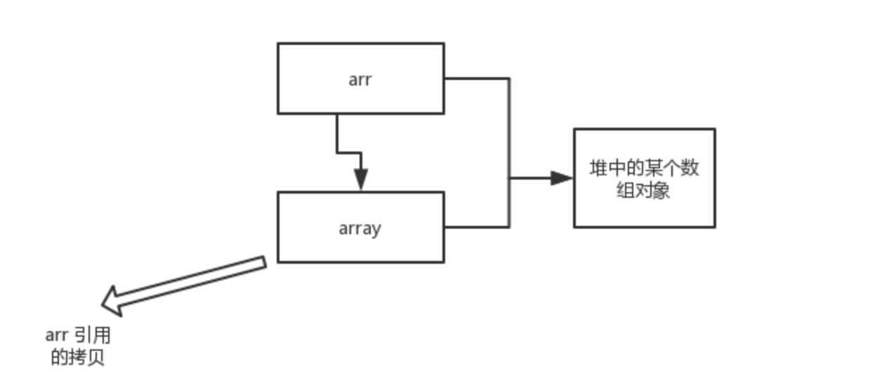

# 1 java基础知识

## **1.1 java语法**

### **1.1.1 字符型常量和字符串常量的区别**

1. 形式上: 字符常量是单引号引起的一个字符; 字符串常量是双引号引起的若干个字符
2. 含义上: **字符常量相当于一个整型值( ASCII 值),可以参加表达式运算; 字符串常量代表一个地址值(该字符串在内存中存放位置)**
3. 占内存大小 字符常量只占 2 个字节; 字符串常量占若干个字节 (注意： char 在 Java 中占两个字节)


### **1.1.2 java中常见的关键字**

| 访问控制             | private  | protected  | public   |              |            |           |        |
| -------------------- | -------- | ---------- | -------- | ------------ | ---------- | --------- | ------ |
| 类，方法和变量修饰符 | abstract | class      | extends  | final        | implements | interface | native |
|                      | new      | static     | strictfp | synchronized | transient  | volatile  |        |
| 程序控制             | break    | continue   | return   | do           | while      | if        | else   |
|                      | for      | instanceof | switch   | case         | default    |           |        |
| 错误处理             | try      | catch      | throw    | throws       | finally    |           |        |
| 包相关               | import   | package    |          |              |            |           |        |
| 基本类型             | boolean  | byte       | char     | double       | float      | int       | long   |
|                      | short    | null       | true     | false        |            |           |        |
| 变量引用             | super    | this       | void     |              |            |           |        |
| 保留字               | goto     | const      |          |              |            |           |        |

### **1.1.3  自增 自减**

一句口诀就是：“符号在前就先加/减，符号在后就后加/减”。

### **1.1.4 java的泛型 ,什么是类型擦除,通配符又是什么?**

Java 泛型（generics）是 JDK 5 中引入的一个新特性, 泛型提供了编译时类型安全检测机制，该机制允许程序员在编译时检测到非法的类型。泛型的本质是参数化类型，也就是说所操作的数据类型被指定为一个参数。

```java
List<Integer> list = new ArrayList<>();
list.add(12);
//这里直接添加会报错
list.add("a");
Class<? extends List> clazz = list.getClass();
Method add = clazz.getDeclaredMethod("add", Object.class);
//但是通过反射添加，是可以的
add.invoke(list, "kl");
System.out.println(list)
```


泛型一般有三种使用方式:泛型类、泛型接口、泛型方法。

1.泛型类：

```java
//此处T可以随便写为任意标识，常见的如T、E、K、V等形式的参数常用于表示泛型
//在实例化泛型类时，必须指定T的具体类型
public class Generic<T>{ 

    private T key;

    public Generic(T key) { 
        this.key = key;
    }

    public T getKey(){ 
        return key;
    }
}

//实例化
Generic<Integer> genericInteger = new Generic<Integer>(123456);
```

2.泛型接口 ：

```java
public interface Generator<T> {
    public T method();
}

//实现泛型接口，不指定类型：
class GeneratorImpl<T> implements Generator<T>{
    @Override
    public T method() {
        return null;
    }
}
//实现泛型接口，指定类型：
class GeneratorImpl<T> implements Generator<String>{
    @Override
    public String method() {
        return "hello";
    }
}
```

常用的通配符为： T，E，K，V，？

- ？ 表示不确定的 java 类型
- T (type) 表示具体的一个java类型
- K V (key value) 分别代表java键值中的Key Value
- E (element) 代表Element

#### **java的泛型擦除**

可以参考这篇帖子,写的很细致

> https://www.cnblogs.com/wuqinglong/p/9456193.html

代码中定义**List<Object>**和**List<String>**等类型，在编译后都会变成**List**，JVM看到的只是List，而由泛型附加的类型信息对JVM是看不到的。Java编译器会在编译时尽可能的发现可能出错的地方，但是仍然无法在运行时刻出现的类型转换异常的情况，类型擦除也是Java的泛型与C++模板机制实现方式之间的重要区别。

**验证**

**例1**

```java
public class Test {
    public static void main(String[] args) {
        ArrayList<String> list1 = new ArrayList<String>();
        list1.add("abc");
        ArrayList<Integer> list2 = new ArrayList<Integer>();
        list2.add(123);
        System.out.println(list1.getClass() == list2.getClass());//true
        //因为list1存储的是string
        //而list2存储的integer
        //但是getclass之后却是true,则证明编译后进行了泛型擦除
    }
 }
```

**例2**

```java
public class Test {
    public static void main(String[] args) throws Exception {

        ArrayList<Integer> list = new ArrayList<Integer>();

        list.add(1);  //这样调用 add 方法只能存储整形，因为泛型类型的实例为 Integer

        list.getClass().getMethod("add", Object.class).invoke(list, "asd");

        for (int i = 0; i < list.size(); i++) {
            System.out.println(list.get(i));
        }
    }
}
```


在程序中定义了一个**ArrayList**泛型类型实例化为**Integer**对象，如果直接调用**add()**方法，那么只能存储整数数据，不过当我们利用反射调用add()方法的时候，却可以存储字符串，这说明了Integer泛型实例在编译之后被擦除掉了，只保留了原始类型。

举一个很有意思的例子

```java
ArrayList<String> list1 = new ArrayList();  
list1.add("1"); //编译通过  
list1.add(1); //编译错误  
String str1 = list1.get(0); //返回类型就是String  

ArrayList list2 = new ArrayList<String>();  
list2.add("1"); //编译通过  
list2.add(1); //编译通过  
Object object = list2.get(0); //返回类型就是Object  

new ArrayList<String>().add("11"); //编译通过  
new ArrayList<String>().add(22); //编译错误  

String str2 = new ArrayList<String>().get(0); //返回类型就是String  
   
```
---

#### **通配符又是什么?**

可以参考这篇帖子写的很细致

> https://juejin.im/post/5d5789d26fb9a06ad0056bd9#heading-6 

常用的 T，E，K，V，？

本质上这些个都是通配符，没啥区别，只不过是编码时的一种约定俗成的东西。比如上述代码中的 T ，我们可以换成 A-Z 之间的任何一个 字母都可以，并不会影响程序的正常运行，但是如果换成其他的字母代替 T ，在可读性上可能会弱一些。**通常情况下，T，E，K，V，？ 是这样约定的：**

- ？ 表示不确定的 java 类型
- T (type) 表示具体的一个java类型
- K V (key value) 分别代表java键值中的Key Value
- E (element) 代表Element

? 代表了无界通配符

---

上界通配符 < ? extends E>

> 上届：用 extends 关键字声明，表示参数化的类型可能是所指定的类型，或者是此类型的子类。

在类型参数中使用 extends 表示这个泛型中的参数必须是 E 或者 E 的子类，这样有两个好处：

- 如果传入的类型不是 E 或者 E 的子类，编译不成功
- 泛型中可以使用 E 的方法，要不然还得强转成 E 才能使用

```java
private <K extends A, E extends B> E test(K arg1, E arg2){
    E result = arg2;
    arg2.compareTo(arg1);
    //.....
    return result;
}
```

---

下界通配符 < ? super E>

> 下界: 用 super 进行声明，表示参数化的类型可能是所指定的类型，或者是此类型的父类型，直至 Object

在类型参数中使用 super 表示这个泛型中的参数必须是 E 或者 E 的父类。

```java
private <T> void test(List<? super T> dst, List<T> src){
    for (T t : src) {
        dst.add(t);
    }
}

public static void main(String[] args) {
    List<Dog> dogs = new ArrayList<>();
    List<Animal> animals = new ArrayList<>();
    new Test3().test(animals,dogs);
}
// Dog 是 Animal 的子类
class Dog extends Animal {

}
```

dst 类型 “大于等于” src 的类型，这里的“大于等于”是指 dst 表示的范围比 src 要大，因此装得下 dst 的容器也就能装 src 。


### 1.1.5 ==和equals的区别

**`==`** : 它的作用是判断两个对象的地址是不是相等。即判断两个对象是不是同一个对象。(**基本数据类型==比较的是值，引用数据类型==比较的是内存地址**)

> 因为 Java 只有值传递，所以，对于 == 来说，不管是比较基本数据类型，还是引用数据类型的变量，其本质比较的都是值，只是引用类型变量存的值是对象的地址。

**`equals()`** : 它的作用也是判断两个对象是否相等，它不能用于比较基本数据类型的变量。`equals()`方法存在于`Object`类中，而`Object`类是所有类的直接或间接父类。

`Object`类`equals()`方法：

```java
public boolean equals(Object obj) {
     return (this == obj);
}
```

`equals()` 方法存在两种使用情况：

- 情况 1：类没有覆盖 `equals()`方法。则通过`equals()`比较该类的两个对象时，等价于通过“==”比较这两个对象。使用的默认是 `Object`类`equals()`方法。
- 情况 2：类覆盖了 `equals()`方法。一般，我们都覆盖 `equals()`方法来两个对象的内容相等；若它们的内容相等，则返回 true(即，认为这两个对象相等)。

**举个例子：**

```java
public class test1 {
    public static void main(String[] args) {
        String a = new String("ab"); // a 为一个引用
        String b = new String("ab"); // b为另一个引用,对象的内容一样
        String aa = "ab"; // 放在常量池中
        String bb = "ab"; // 从常量池中查找
        if (aa == bb) // true
            System.out.println("aa==bb");
        if (a == b) // false，非同一对象
            System.out.println("a==b");
        if (a.equals(b)) // true
            System.out.println("aEQb");
        if (42 == 42.0) { // true
            System.out.println("true");
        }
      /**
      new string 是引用同一个值,但是a b是两个对象 地址值不一样
      而"ab"存在于常量池中,而"ab"是string,是引用数据类型,所以==比较的是地址值,而aa与bb他们指向的都是"ab"
      	**/
    }
}
```

**说明：**

- `String` 中的 `equals` 方法是被重写过的，因为 `Object` 的 `equals` 方法是比较的对象的内存地址，而 `String` 的 `equals` 方法比较的是对象的值。
- 当创建 `String` 类型的对象时，虚拟机会在常量池中查找有没有已经存在的值和要创建的值相同的对象，如果有就把它赋给当前引用。如果没有就在常量池中重新创建一个 `String` 对象。

`String`类`equals()`方法：

```java
public boolean equals(Object anObject) {
    if (this == anObject) {
        return true;
    }
    if (anObject instanceof String) {
        String anotherString = (String)anObject;
        int n = value.length;
        if (n == anotherString.value.length) {
            char v1[] = value;
            char v2[] = anotherString.value;
            int i = 0;
            while (n-- != 0) {
                if (v1[i] != v2[i])
                    return false;
                i++;
            }
            return true;
        }
    }
    return false;
}
```

### 1.1.6hashCode()与 equals()

你重写过 `hashcode` 和 `equals`么，为什么重写 `equals` 时必须重写 `hashCode` 方法？

**1)hashCode() & equals()介绍:**

`hashCode()` 的作用是获取哈希码，也称为散列码；它实际上是返回一个 int 整数。这个哈希码的作用是确定该对象在哈希表中的索引位置。`hashCode()`定义在 JDK 的 `Object` 类中，这就意味着 Java 中的任何类都包含有 `hashCode()` 函数。另外需要注意的是： `Object` 的 hashcode 方法是本地方法，也就是用 c 语言或 c++ 实现的，该方法通常用来将对象的 内存地址 转换为整数之后返回。

```java
public native int hashCode();
```

散列表存储的是键值对(key-value)，它的特点是：能根据“键”快速的检索出对应的“值”。这其中就利用到了散列码！（可以快速找到所需要的对象）

equals() 的作用是 **用来判断两个对象是否相等**。

**2)为什么要有 hashCode？**

我们以“`HashSet` 如何检查重复”为例子来说明为什么要有 hashCode？

当你把对象加入 `HashSet` 时，`HashSet` 会先计算对象的 hashcode 值来判断对象加入的位置，同时也会与其他已经加入的对象的 hashcode 值作比较，如果没有相符的 hashcode，`HashSet` 会假设对象没有重复出现。但是如果发现有相同 hashcode 值的对象，这时会调用 equals（）方法来检查 hashcode 相等的对象是否真的相同。如果两者相同，`HashSet` 就不会让其加入操作成功。如果不同的话，就会重新散列到其他位置。（摘自我的 Java 启蒙书《Head fist java》第二版）。这样我们就大大减少了 equals 的次数，相应就大大提高了执行速度。

**3)为什么重写 `equals` 时必须重写 `hashCode` 方法？**

如果两个对象相等，则 hashcode 一定也是相同的。两个对象相等,对两个对象分别调用 equals 方法都返回 true。但是，两个对象有相同的 hashcode 值，它们也不一定是相等的 。**因此，equals 方法被覆盖过，则 `hashCode` 方法也必须被覆盖。**

> `hashCode()`的默认行为是对堆上的对象产生独特值。如果没有重写 `hashCode()`，则该 class 的两个对象无论如何都不会相等（即使这两个对象指向相同的数据）

**4)为什么两个对象有相同的 hashcode 值，它们也不一定是相等的？**

因为 `hashCode()` 所使用的杂凑算法也许刚好会让多个对象传回相同的杂凑值。越糟糕的杂凑算法越容易碰撞，但这也与数据值域分布的特性有关（所谓碰撞也就是指的是不同的对象得到相同的 `hashCode`。

我们刚刚也提到了 `HashSet`,如果 `HashSet` 在对比的时候，同样的 hashcode 有多个对象，它会使用 `equals()` 来判断是否真的相同。也就是说 `hashcode` 只是用来缩小查找成本。

**总结**

如果是相同的对象,那么哈希码一定相同

反之,哈希码相同的两个对象,不一定相同


---

```java
/**
 * @Classname EqualsTest3
 * @Description TODO
 * @Date 2020/7/29 3:47 下午
 * @Created by jason
 */

import java.util.*;
import java.lang.Comparable;


public class EqualsTest3 {

    public static void main(String[] args) {
        // 新建2个相同内容的Person对象，
        // 再用equals比较它们是否相等
        Person p1 = new Person("eee", 100);
        Person p2 = new Person("eee", 100);
        System.out.println(p1);//EqualsTest3$Person@61bbe9ba
        System.out.println(p2);//EqualsTest3$Person@610455d6
        System.out.println(p1.hashCode());//1639705018
        System.out.println(p2.hashCode());//1627674070
        System.out.printf("p1.equals(p2) : %s\n", p1.equals(p2));//true
        System.out.printf("p1==p2 : %s\n", p1 == p2);//p1==p2 : false
    }

    /**
     * @desc Person类。
     */
    private static class Person {
        int age;
        String name;

        public Person(String name, int age) {
            this.name = name;
            this.age = age;
        }
        
        /**
         * @desc 覆盖equals方法
         */
        @Override
        public boolean equals(Object obj) {
            if (obj == null) {
                return false;
            }

            //如果是同一个对象返回true，反之返回false
            if (this == obj) {
                return true;
            }

            //判断是否类型相同
            if (this.getClass() != obj.getClass()) {
                return false;
            }

            Person person = (Person) obj;
            return name.equals(person.name) && age == person.age;
        }
    }
}
```

可以看到打印结果

>      ​	  Person p1 = new Person("eee", 100);
>      ​      Person p2 = new Person("eee", 100);
>      ​      System.out.println(p1);//EqualsTest3$Person@61bbe9ba
>      ​      System.out.println(p2);//EqualsTest3$Person@610455d6
>      ​      System.out.println(p1.hashCode());//1639705018
>      ​      System.out.println(p2.hashCode());//1627674070
>      ​      System.out.printf("p1.equals(p2) : %s\n", p1.equals(p2));//true
>      ​      System.out.printf("p1==p2 : %s\n", p1 == p2);//p1==p2 : false

我们重写了equals,只需要name和age相同,我们就认为这两个对象是一样的,但是事实上并不是这样的可以看到地址值不同,hashcode也不同

## 1.2 基本数据类型


### 1.2.1 基本数据类型,引用数据类型

**Java中的数据类型分为两大类，基本数据类型和引用数据类型。**

- 基本数据类型

> 一共是四类八种

基本数据类型只有8种，可按照如下分类
①整数类型：`long、int、short、byte`
②浮点类型：`float、double`
③字符类型：`char`
④布尔类型：`boolean`

| No.  |      数据类型      | 大小/位 |              可表示数据范围              |  默认值  |
| :--: | :----------------: | :-----: | :--------------------------------------: | :------: |
|  1   |  `byte`（字节型）  |    8    |                 -128~127                 |    0     |
|  2   | `short`（短整型）  |   16    |               -32768~32767               |    0     |
|  3   |   `int`（整型）    |   32    |          -2147483648~2147483647          |    0     |
|  4   |  `long`（长整型）  |   64    | -9223372036854775808~9223372036854775807 |    0     |
|  5   | `float`（单精度）  |   32    |              -3.4E38~3.4E38              |   0.0    |
|  6   | `double`（双精度） |   64    |             -1.7E308~1.7E308             |   0.0    |
|  7   |   `char`（字符）   |   16    |                  0~255                   | '\u0000' |
|  8   | `boolean`（布尔）  |    -    |               true或false                |  false   |

- 引用数据类型

引用数据类型非常多，大致包括：
类、 接口类型、 数组类型、 枚举类型、 注解类型、 字符串型

例如，`String`类型就是引用类型。
**简单来说，所有的非基本数据类型都是引用数据类型。**


- 区别

  - 存储位置

    - 基本数据类型:`在方法中定义的非全局基本数据类型变量的具体内容是存储在栈中的`

    - 引用数据类型:只要是引用数据类型变量，其具体内容都是存放在堆中的，而栈中存放的是其具体内容所在内存的地址
      *ps:通过变量地址可以找到变量的具体内容，就如同通过房间号可以找到房间一般*

      ```java
      public class Main{
         public static void main(String[] args){
             //基本数据类型
             int i=1;
             double d=1.2;
             
             //引用数据类型
             String str="helloworld";
         }
      }
      ```

      

  - 传递方式

    - 基本数据类型

    在方法中定义的非全局基本数据类型变量，调用方法时作为参数是按**数值传递**的

    ```java
    //基本数据类型作为方法参数被调用
    public class Main{
       public static void main(String[] args){
           int msg = 100;
           System.out.println("调用方法前msg的值：\n"+ msg);    //100
           fun(msg);
           System.out.println("调用方法后msg的值：\n"+ msg);    //100
       }
       public static void fun(int temp){
           temp = 0;
       }
    }
    ```

    

    - 引用数据类型

      引用数据类型变量，调用方法时作为参数是按**引用传递**的

```java
//引用数据类型作为方法参数被调用

class Book{
    String name;
    double price;

    public Book(String name,double price){
        this.name = name;
        this.price = price;
    }
    public void getInfo(){
        System.out.println("图书名称："+ name + "，价格：" + price);
    }

    public void setPrice(double price){
        this.price = price;
    }
}

public class Main{
   public static void main(String[] args){
       Book book = new Book("Java开发指南",66.6);
       book.getInfo();  //图书名称：Java开发指南，价格：66.6
       fun(book);
       book.getInfo();  //图书名称：Java开发指南，价格：99.9
   }

   public static void fun(Book temp){
       temp.setPrice(99.9);
   }
}
```


### 1.2.2   自动装箱与拆箱

- **装箱**：将基本类型用它们对应的引用类型包装起来；
- **拆箱**：将包装类型转换为基本数据类型；


一个有趣的面试题

```java
public class Main {
    public static void main(String[] args) {
        Integer i1 = 100;
        Integer i2 = 100;
        Integer i3 = 200;
        Integer i4 = 200;
        System.out.println(i1==i2);
        System.out.println(i3==i4);
    }
}
```

结果是

> true
>
> false

请看分析

```java
public static Integer valueOf(int i) {
        if(i >= -128 && i <= IntegerCache.high)
            return IntegerCache.cache[i + 128];
        else
            return new Integer(i);
    }
```

```java
private static class IntegerCache {
        static final int high;
        static final Integer cache[];

        static {
            final int low = -128;

            // high value may be configured by property
            int h = 127;
            if (integerCacheHighPropValue != null) {
                // Use Long.decode here to avoid invoking methods that
                // require Integer's autoboxing cache to be initialized
                int i = Long.decode(integerCacheHighPropValue).intValue();
                i = Math.max(i, 127);
                // Maximum array size is Integer.MAX_VALUE
                h = Math.min(i, Integer.MAX_VALUE - -low);
            }
            high = h;

            cache = new Integer[(high - low) + 1];
            int j = low;
            for(int k = 0; k < cache.length; k++)
                cache[k] = new Integer(j++);
        }

        private IntegerCache() {}
    }
```

　　从这2段代码可以看出，在通过valueOf方法创建Integer对象的时候，如果数值在[-128,127]之间，便返回指向IntegerCache.cache中已经存在的对象的引用；否则创建一个新的Integer对象

---

类似

```java
public class Main {
    public static void main(String[] args) {
         
        Double i1 = 100.0;
        Double i2 = 100.0;
        Double i3 = 200.0;
        Double i4 = 200.0;
         
        System.out.println(i1==i2);//fasle
        System.out.println(i3==i4);//fasle
      
    }
}
```

```java
public static Double valueOf(double d) {
    return new Double(d);
}
```

因为new double 相当于新建一个对象,i3和i4指向了不同的对象

### 1.2.3 8种基本类型的包装类和常量池

**Java 基本类型的包装类的大部分都实现了常量池技术，即 Byte,Short,Integer,Long,Character,Boolean；前面 4 种包装类默认创建了数值[-128，127] 的相应类型的缓存数据，Character创建了数值在[0,127]范围的缓存数据，Boolean 直接返回True Or False。如果超出对应范围仍然会去创建新的对象。** 为啥把缓存设置为[-128，127]区间？答:性能和资源之间的权衡。

>首先要了解为什么`Integer a=1`走缓存，而`Integer b=333`不走缓存：
>
>1. 自动拆装箱（看字节码就知道了，最终调用的是 valueOf 方法，而这个方法在一定范围内时是走缓存的）。
>
>然后就是为啥要走缓存：
>
>1. 性能方面。see `Integer#valueOf`：**as this method is likely to yield significantly better space and time performance by caching frequently requested values**。
>
>最后是为把啥缓存设置为[-128，127]区间：
>
>1. 技术规范。*JLS7 5.1.7*：**If the value p being boxed is an integer literal of type int between -128 and 127 inclusive (§3.10.1), or the boolean literal true or false (§3.10.3), or a character literal between '\u0000' and '\u007f' inclusive (§3.10.4), then let a and b be the results of any two boxing conversions of p . It is always the case that a == b .**
>2. 性能和资源之间的权衡（当然也可以调整缓存的正向最大值，自己看 IntegerCache 类的实现）

```java
public static Boolean valueOf(boolean b) {
    return (b ? TRUE : FALSE);
}Copy to clipboardErrorCopied
private static class CharacterCache {         
    private CharacterCache(){}

    static final Character cache[] = new Character[127 + 1];          
    static {             
        for (int i = 0; i < cache.length; i++)                 
            cache[i] = new Character((char)i);         
    }   
}Copy to clipboardErrorCopied
```

两种浮点数类型的包装类 Float,Double 并没有实现常量池技术

```java
        Integer i1 = 33;
        Integer i2 = 33;
        System.out.println(i1 == i2);// 输出 true
        Integer i11 = 333;
        Integer i22 = 333;
        System.out.println(i11 == i22);// 输出 false
        Double i3 = 1.2;
        Double i4 = 1.2;
        System.out.println(i3 == i4);// 输出 falseCopy to clipboardErrorCopied
```

**Integer 缓存源代码：**

```java
/**
*此方法将始终缓存-128 到 127（包括端点）范围内的值，并可以缓存此范围之外的其他值。
*/
    public static Integer valueOf(int i) {
        if (i >= IntegerCache.low && i <= IntegerCache.high)
            return IntegerCache.cache[i + (-IntegerCache.low)];
        return new Integer(i);
    }
```

**应用场景：**

1. Integer i1=40；Java 在编译的时候会直接将代码封装成 Integer i1=Integer.valueOf(40);，从而使用常量池中的对象。
2. Integer i1 = new Integer(40);这种情况下会创建新的对象。

```java
  Integer i1 = 40;
  Integer i2 = new Integer(40);
  System.out.println(i1==i2);//输出 falseCopy to clipboardErrorCopied
```

**Integer 比较更丰富的一个例子:**

```java
  Integer i1 = 40;
  Integer i2 = 40;
  Integer i3 = 0;
  Integer i4 = new Integer(40);
  Integer i5 = new Integer(40);
  Integer i6 = new Integer(0);

  System.out.println("i1=i2   " + (i1 == i2));
  System.out.println("i1=i2+i3   " + (i1 == i2 + i3));
  System.out.println("i1=i4   " + (i1 == i4));
  System.out.println("i4=i5   " + (i4 == i5));
  System.out.println("i4=i5+i6   " + (i4 == i5 + i6));   
  System.out.println("40=i5+i6   " + (40 == i5 + i6));     Copy to clipboardErrorCopied
```

结果：

```
i1=i2   true
i1=i2+i3   true
i1=i4   false
i4=i5   false
i4=i5+i6   true
40=i5+i6   trueCopy to clipboardErrorCopied
```

解释：

语句 i4 == i5 + i6，因为+这个操作符不适用于 Integer 对象，首先 i5 和 i6 进行自动拆箱操作，进行数值相加，即 i4 == 40。然后 Integer 对象无法与数值进行直接比较，所以 i4 自动拆箱转为 int 值 40，最终这条语句转为 40 == 40 进行数值比较。


## 1.3 函数

### 1.3.1. 什么是方法的返回值?返回值在类的方法里的作用是什么?

方法的返回值是指我们获取到的某个方法体中的代码执行后产生的结果！（前提是该方法可能产生结果）。返回值的作用是接收出结果，使得它可以用于其他的操作！

### 1.3.2. 为什么 Java 中只有值传递？

首先回顾一下在程序设计语言中有关将参数传递给方法（或函数）的一些专业术语。**按值调用(call by value)表示方法接收的是调用者提供的值，而按引用调用（call by reference)表示方法接收的是调用者提供的变量地址。一个方法可以修改传递引用所对应的变量值，而不能修改传递值调用所对应的变量值。** 它用来描述各种程序设计语言（不只是 Java)中方法参数传递方式。

**Java 程序设计语言总是采用按值调用。也就是说，方法得到的是所有参数值的一个拷贝，也就是说，方法不能修改传递给它的任何参数变量的内容。**

**下面通过 3 个例子来给大家说明**

> **example 1**

```java
public static void main(String[] args) {
    int num1 = 10;
    int num2 = 20;

    swap(num1, num2);

    System.out.println("num1 = " + num1);
    System.out.println("num2 = " + num2);
}

public static void swap(int a, int b) {
    int temp = a;
    a = b;
    b = temp;

    System.out.println("a = " + a);
    System.out.println("b = " + b);
}Copy to clipboardErrorCopied
```

**结果：**

```
a = 20
b = 10
num1 = 10
num2 = 20Copy to clipboardErrorCopied
```

**解析：**


在 swap 方法中，a、b 的值进行交换，并不会影响到 num1、num2。因为，a、b 中的值，只是从 num1、num2 的复制过来的。也就是说，a、b 相当于 num1、num2 的副本，副本的内容无论怎么修改，都不会影响到原件本身。

---

第二个例子

```java
public static void main(String[] args) {
        int[] arr = { 1, 2, 3, 4, 5 };
        System.out.println(arr[0]);//1
        change(arr);
        System.out.println(arr[0]);//0
    }

    public static void change(int[] array) {
        // 将数组的第一个元素变为0
        array[0] = 0;
    }
```




array 被初始化 arr 的拷贝也就是一个对象的引用，也就是说 array 和 arr **指向**的是同一个数组对象。 因此，外部对引用对象的改变会反映到所对应的对象上。

**通过 example2 我们已经看到，实现一个改变对象参数状态的方法并不是一件难事。理由很简单，方法得到的是对象引用的拷贝，对象引用及其他的拷贝同时引用同一个对象。**

**很多程序设计语言（特别是，C++和 Pascal)提供了两种参数传递的方式：值调用和引用调用。有些程序员（甚至本书的作者）认为 Java 程序设计语言对对象采用的是引用调用，实际上，这种理解是不对的。由于这种误解具有一定的普遍性，所以下面给出一个反例来详细地阐述一下这个问题。**

---

第三个例子

```java
public class Test {

    public static void main(String[] args) {
        // TODO Auto-generated method stub
        Student s1 = new Student("小张");
        Student s2 = new Student("小李");
        Test.swap(s1, s2);
        System.out.println("s1:" + s1.getName());//小张
        System.out.println("s2:" + s2.getName());//小李
    }

    public static void swap(Student s1, Student s2) {
        Student temp = s1;//temp 小张
        s1 = s2;//s1 小李
        s2 = temp;// s2 小张
        System.out.println("s1:" + s1.getName());//小李
        System.out.println("s2:" + s2.getName());//小张
    }
}
```


> **方法并没有改变存储在变量 s1 和 s2 中的对象引用。swap 方法的参数 x 和 y 被初始化为两个对象引用的拷贝，这个方法交换的是这两个拷贝**

Java 程序设计语言对对象采用的不是引用调用，实际上，对象引用是按 值传递的。

下面再总结一下 Java 中方法参数的使用情况：

- 一个方法不能修改一个基本数据类型的参数（即数值型或布尔型）。
- 一个方法可以改变一个对象参数的状态。
- 一个方法不能让对象参数引用一个新的对象。

### 1.3.3 重载和重写的区别

>重载就是同样的一个方法能够根据输入数据的不同，做出不同的处理
>
>重写就是当子类继承自父类的相同方法，输入数据一样，但要做出有别于父类的响应时，你就要覆盖父类方法

#### 重载

发生在同一个类中，方法名必须相同，参数类型不同、个数不同、顺序不同，方法返回值和访问修饰符可以不同。

下面是《Java 核心技术》对重载这个概念的介绍：


**综上：重载就是同一个类中多个同名方法根据不同的传参来执行不同的逻辑处理。**


#### 重写

重写发生在运行期，是子类对父类的允许访问的方法的实现过程进行重新编写。

1. 返回值类型、方法名、参数列表必须相同，抛出的异常范围小于等于父类，访问修饰符范围大于等于父类。
2. 如果父类方法访问修饰符为 `private/final/static` 则子类就不能重写该方法，但是被 static 修饰的方法能够被再次声明。
3. 构造方法无法被重写

**综上：重写就是子类对父类方法的重新改造，外部样子不能改变，内部逻辑可以改变**

****

| 区别点     | 重载方法 | 重写方法                                       |
| ---------- | -------- | ---------------------------------------------- |
| 发生范围   | 同一个类 | 子类 中                                        |
| 参数列表   | 必须修改 | 一定不能修改                                   |
| 返回类型   | 可修改   | 一定不能修改                                   |
| 异常       | 可修改   | 可以减少或删除，一定不能抛出新的或者更广的异常 |
| 访问修饰符 | 可修改   | 一定不能做更严格的限制（可以降低限制）         |
| 发生阶段   | 编译期   | 运行期                                         |


### 1.3.4 深拷贝 vs 浅拷贝

1. **浅拷贝**：对基本数据类型进行值传递，对引用数据类型进行引用传递般的拷贝，此为浅拷贝。
2. **深拷贝**：对基本数据类型进行值传递，对引用数据类型，创建一个新的对象，并复制其内容，此为深拷贝。


# 2 Java面向对象


## 2.1 类和对象

### 2.1.1 面向对象和面向过程的区别

- **面向过程** ：**面向过程性能比面向对象高。** 因为类调用时需要实例化，开销比较大，比较消耗资源，所以当性能是最重要的考量因素的时候，比如单片机、嵌入式开发、Linux/Unix 等一般采用面向过程开发。但是，**面向过程没有面向对象易维护、易复用、易扩展。**
- **面向对象** ：**面向对象易维护、易复用、易扩展。** 因为面向对象有封装、继承、多态性的特性，所以可以设计出低耦合的系统，使系统更加灵活、更加易于维护。但是，**面向对象性能比面向过程低**。c++也是面向对象  c面向过程


> 面向过程 ：面向过程性能比面向对象高。 因为类调用时需要实例化，开销比较大，比较消耗资源，所以当性能是最重要的考量因素的时候，比如单片机、嵌入式开发、Linux/Unix等一般采用面向过程开发。
>
> ----》》
>
> 这个并不是根本原因，面向过程也需要分配内存，计算内存偏移量，Java性能差的主要原因并不是因为它是面向对象语言，而是Java是半编译语言，最终的执行代码并不是可以直接被CPU执行的二进制机械码。
>
> 而面向过程语言大多都是直接编译成机械码在电脑上执行，并且其它一些面向过程的脚本语言性能也并不一定比Java好。


### 2.1.2 构造器 Constructor 是否可被 override?

Constructor 不能被 override（重写）,但是可以 overload（重载）,所以你可以看到一个类中有多个构造函数的情况。

### 2.1.3. 在 Java 中定义一个不做事且没有参数的构造方法的作用

Java 程序在执行子类的构造方法之前，如果没有用 `super()`来调用父类特定的构造方法，则会调用父类中“没有参数的构造方法”。因此，如果父类中只定义了有参数的构造方法，而在子类的构造方法中又没有用 `super()`来调用父类中特定的构造方法，则编译时将发生错误，因为 Java 程序在父类中找不到没有参数的构造方法可供执行。解决办法是在父类里加上一个不做事且没有参数的构造方法。

### 2.1.4. *成员变量与局部变量的区别有哪些*？

从语法形式上看:成员变量是属于类的，而局部变量是在方法中定义的变量或是方法的参数；成员变量可以被 public,private,static 等修饰符所修饰，而局部变量不能被访问控制修饰符及 static 所修饰；但是，成员变量和局部变量都能被 final 所修饰。

>1.从变量在内存中的存储方式来看:如果成员变量是使用`static`修饰的，那么这个成员变量是属于类的，如果没有使用`static`修饰，这个成员变量是属于实例的。而对象存在于堆内存，局部变量则存在于栈内存。
>
>2.从变量在内存中的生存时间上看:成员变量是对象的一部分，它随着对象的创建而存在，而局部变量随着方法的调用而自动消失。
>
>3.成员变量如果没有被赋初值:则会自动以类型的默认值而赋值（一种情况例外:被 final 修饰的成员变量也必须显式地赋值），而局部变量则不会自动赋值。


### 2.1.5  创建一个对象用什么运算符?对象实体与对象引用有何不同?

new 运算符，new 创建对象实例（对象实例在堆内存中），对象引用指向对象实例（对象引用存放在栈内存中）。一个对象引用可以指向 0 个或 1 个对象（一根绳子可以不系气球，也可以系一个气球）;一个对象可以有 n 个引用指向它（可以用 n 条绳子系住一个气球）

### 2.1.6. 一个类的构造方法的作用是什么? 若一个类没有声明构造方法，该程序能正确执行吗? 为什么?

主要作用是完成对类对象的初始化工作。

没有声明构造方法也可以执行。

因为一个类即使没有声明构造方法也会有默认的不带参数的构造方法。这句话的意思就是没有构造方法也会自带一个空参构造

如果我们自己添加了类的构造方法（无论是否有参），Java 就不会再添加默认的无参数的构造方法了，这时候，就不能直接 new 一个对象而不传递参数了，所以我们一直在不知不觉地使用构造方法，这也是为什么我们在创建对象的时候后面要加一个括号（因为要调用无参的构造方法）。如果我们重载了有参的构造方法，记得都要把无参的构造方法也写出来（无论是否用到），因为这可以帮助我们在创建对象的时候少踩坑。

### 2.1.7. 构造方法有哪些特性？

1. 名字与类名相同。
2. 没有返回值，但不能用 void 声明构造函数。
3. 生成类的对象时自动执行，无需调用。

### 2.1.8. 对象的相等与指向他们的引用相等,两者有什么不同?

对象的相等，比的是内存中存放的内容是否相等。

而引用相等，比较的是他们指向的内存地址是否相等。


## 2.2 面向对象三大特征

### 2.2.1 继承

**关于继承如下 3 点请记住：**

1. 子类拥有父类对象所有的属性和方法（包括私有属性和私有方法），但是父类中的私有属性和方法子类是无法访问，**只是拥有**。
2. 子类可以拥有自己属性和方法，即子类可以对父类进行扩展。
3. 子类可以用自己的方式实现父类的方法。（以后介绍）。

### 2.2.2 多态

多态，顾名思义，表示一个对象具有多种的状态。具体表现为父类的引用指向子类的实例。

**多态的特点:**

- 对象类型和引用类型之间具有继承（类）/实现（接口）的关系；
- 对象类型不可变，引用类型可变；
- 方法具有多态性，属性不具有多态性；
- 引用类型变量发出的方法调用的到底是哪个类中的方法，必须在程序运行期间才能确定；
- 多态不能调用“只在子类存在但在父类不存在”的方法；
- 如果子类重写了父类的方法，真正执行的是子类覆盖的方法，如果子类没有覆盖父类的方法，执行的是父类的方法。

## 2.3. 修饰符

### 2.3.1. 在一个静态方法内调用一个非静态成员为什么是非法的?

由于静态方法可以不通过对象进行调用，因此在静态方法里，不能调用其他非静态变量，也不可以访问非静态变量成员。

### 2.3.2. 静态方法和实例方法有何不同

1. 在外部调用静态方法时，可以使用"类名.方法名"的方式，也可以使用"对象名.方法名"的方式。而实例方法只有后面这种方式。也就是说，调用静态方法可以无需创建对象。

   > 直接`.`就行

2. 静态方法在访问本类的成员时，只允许访问静态成员（即静态成员变量和静态方法），而不允许访问实例成员变量和实例方法；

   **实例方法则无此限制。**

### 2.3.3 final,static,this,super 关键字总结

#### final

**final关键字，意思是最终的、不可修改的，最见不得变化 ，用来修饰类、方法和变量，具有以下特点：**

1. **final修饰的类不能被继承，final类中的所有成员方法都会被隐式的指定为final方法；**
2. **final修饰的方法不能被重写；**
3. **final修饰的变量是常量，如果是基本数据类型的变量，则其数值一旦在初始化之后便不能更改；如果是引用类型的变量，则在对其初始化之后便不能让其指向另一个对象。**

说明：使用final方法的原因有两个。

第一个原因是把方法锁定，以防任何继承类修改它的含义；

第二个原因是效率。在早期的Java实现版本中，会将final方法转为内嵌调用。但是如果方法过于庞大，可能看不到内嵌调用带来的任何性能提升（现在的Java版本已经不需要使用final方法进行这些优化了）。类中所有的private方法都隐式地指定为final。

----

#### static

**static 关键字主要有以下四种使用场景：**

1. **修饰成员变量和成员方法:** 被 static 修饰的成员属于类，不属于单个这个类的某个对象，被类中所有对象共享，可以并且建议通过类名调用。被static 声明的成员变量属于静态成员变量，静态变量 存放在 Java 内存区域的方法区。调用格式：`类名.静态变量名` `类名.静态方法名()`
2. **静态代码块:** 静态代码块定义在类中方法外, 静态代码块在非静态代码块之前执行(静态代码块—>非静态代码块—>构造方法)。 该类不管创建多少对象，静态代码块只执行一次.
3. **静态内部类（static修饰类的话只能修饰内部类）：** 静态内部类与非静态内部类之间存在一个最大的区别: 非静态内部类在编译完成之后会隐含地保存着一个引用，该引用是指向创建它的外围类，但是静态内部类却没有。没有这个引用就意味着：1. 它的创建是不需要依赖外围类的创建。2. 它不能使用任何外围类的非static成员变量和方法。
4. **静态导包(用来导入类中的静态资源，1.5之后的新特性):** 格式为：`import static` 这两个关键字连用可以指定导入某个类中的指定静态资源，并且不需要使用类名调用类中静态成员，可以直接使用类中静态成员变量和成员方法。

---

#### this

this关键字用于引用类的当前实例。 例如：

```java
class Manager {
    Employees[] employees;

    void manageEmployees() {
        int totalEmp = this.employees.length;
        System.out.println("Total employees: " + totalEmp);
        this.report();
    }

    void report() { }
}Copy to clipboardErrorCopied
```

在上面的示例中，this关键字用于两个地方：

- this.employees.length：访问类Manager的当前实例的变量。
- this.report（）：调用类Manager的当前实例的方法。

此关键字是可选的，这意味着如果上面的示例在不使用此关键字的情况下表现相同。 但是，使用此关键字可能会使代码更易读或易懂。

---

#### super

super关键字用于从子类访问父类的变量和方法。 例如：

```java
public class Super {
    protected int number;

    protected showNumber() {
        System.out.println("number = " + number);
    }
}

public class Sub extends Super {
    void bar() {
        super.number = 10;
        super.showNumber();
    }
}Copy to clipboardErrorCopied
```

在上面的例子中，Sub 类访问父类成员变量 number 并调用其其父类 Super 的 `showNumber（）` 方法。

**使用 this 和 super 要注意的问题：**

- 在构造器中使用 `super（）` 调用父类中的其他构造方法时，该语句必须处于构造器的首行，否则编译器会报错。另外，this 调用本类中的其他构造方法时，也要放在首行。
- this、super不能用在static方法中。

**简单解释一下：**

被 static 修饰的成员属于类，不属于单个这个类的某个对象，被类中所有对象共享。而 this 代表对本类对象的引用，指向本类对象；而 super 代表对父类对象的引用，指向父类对象；所以， **this和super是属于对象范畴的东西，而静态方法是属于类范畴的东西**。

## 2.4 接口和抽象类

### 2.4.1 接口和抽象类的区别是什么？

1. 接口的方法默认是 public，所有方法在接口中不能有实现(Java 8 开始接口方法可以有默认实现），而抽象类可以有非抽象的方法。
2. 接口中除了 static、final 变量，不能有其他变量，而抽象类中则不一定。
3. 一个类可以实现多个接口，但只能实现一个抽象类。接口自己本身可以通过 extends 关键字扩展多个接口。
4. 接口方法默认修饰符是 public，抽象方法可以有 public、protected 和 default 这些修饰符（抽象方法就是为了被重写所以不能使用 private 关键字修饰！）。
5. 从设计层面来说，抽象是对类的抽象，是一种模板设计，而接口是对行为的抽象，是一种行为的规范。

> 备注：
>
> 1. 在 JDK8 中，接口也可以定义静态方法，可以直接用接口名调用。实现类和实现是不可以调用的。如果同时实现两个接口，接口中定义了一样的默认方法，则必须重写，不然会报错。
> 2. jdk9 的接口被允许定义私有方法 。

总结一下 jdk7~jdk9 Java 中接口概念的变化（[相关阅读](https://www.geeksforgeeks.org/private-methods-java-9-interfaces/)）：

1. 在 jdk 7 或更早版本中，接口里面只能有常量变量和抽象方法。这些接口方法必须由选择实现接口的类实现。
2. jdk8 的时候接口可以有默认方法和静态方法功能。
3. Jdk 9 在接口中引入了私有方法和私有静态方法。

# 3 杂项知识点(随机补充)

## 3.1 String StringBuffer 和 StringBuilder 的区别是什么? String 为什么是不可变的?

简单的来说：`String` 类中使用 final 关键字修饰字符数组来保存字符串，`private final char value[]`，所以` String` 对象是不可变的。

> 在 Java 9 之后，String 类的实现改用 byte 数组存储字符串 `private final byte[] value`;

而 `StringBuilder` 与 `StringBuffer` 都继承自 `AbstractStringBuilder` 类，在 `AbstractStringBuilder` 中也是使用字符数组保存字符串`char[]value` 但是没有用 `final` 关键字修饰，所以这两种对象都是可变的。

`StringBuilder` 与 `StringBuffer` 的构造方法都是调用父类构造方法也就是`AbstractStringBuilder` 实现的，大家可以自行查阅源码。

```
AbstractStringBuilder.java
```

**线程安全性**

`String` 中的对象是不可变的，也就可以理解为常量，线程安全。`AbstractStringBuilder` 是 `StringBuilder` 与 `StringBuffer` 的公共父类，定义了一些字符串的基本操作，如 `expandCapacity`、`append`、`insert`、`indexOf` 等公共方法。`StringBuffer` 对方法加了同步锁或者对调用的方法加了同步锁，所以是线程安全的。`StringBuilder` 并没有对方法进行加同步锁，所以是非线程安全的。

```java
  public synchronized StringBuffer reverse() {
        toStringCache = null;
        super.reverse();
        return this;
    }
```


**性能**

每次对 `String` 类型进行改变的时候，都会生成一个新的 `String` 对象，然后将指针指向新的 `String` 对象。`StringBuffer` 每次都会对 `StringBuffer` 对象本身进行操作，而不是生成新的对象并改变对象引用。相同情况下使用 `StringBuilder` 相比使用 `StringBuffer` 仅能获得 10%~15% 左右的性能提升，但却要冒多线程不安全的风险。

**对于三者使用的总结：**

1. 操作少量的数据: 适用 `String`
2. 单线程操作字符串缓冲区下操作大量数据: 适用 `StringBuilder`
3. 多线程操作字符串缓冲区下操作大量数据: 适用 `StringBuffer`


## 3.2 Object 类的常见方法总结

Object 类是一个特殊的类，是所有类的父类。它主要提供了以下 11 个方法：

```java
public final native Class<?> getClass()//native方法，用于返回当前运行时对象的Class对象，使用了final关键字修饰，故不允许子类重写。

public native int hashCode() //native方法，用于返回对象的哈希码，主要使用在哈希表中，比如JDK中的HashMap。
public boolean equals(Object obj)//用于比较2个对象的内存地址是否相等，String类对该方法进行了重写用户比较字符串的值是否相等。

protected native Object clone() throws CloneNotSupportedException//naitive方法，用于创建并返回当前对象的一份拷贝。一般情况下，对于任何对象 x，表达式 x.clone() != x 为true，x.clone().getClass() == x.getClass() 为true。Object本身没有实现Cloneable接口，所以不重写clone方法并且进行调用的话会发生CloneNotSupportedException异常。

public String toString()//返回类的名字@实例的哈希码的16进制的字符串。建议Object所有的子类都重写这个方法。

public final native void notify()//native方法，并且不能重写。唤醒一个在此对象监视器上等待的线程(监视器相当于就是锁的概念)。如果有多个线程在等待只会任意唤醒一个。

public final native void notifyAll()//native方法，并且不能重写。跟notify一样，唯一的区别就是会唤醒在此对象监视器上等待的所有线程，而不是一个线程。

public final native void wait(long timeout) throws InterruptedException//native方法，并且不能重写。暂停线程的执行。注意：sleep方法没有释放锁，而wait方法释放了锁 。timeout是等待时间。

public final void wait(long timeout, int nanos) throws InterruptedException//多了nanos参数，这个参数表示额外时间（以毫微秒为单位，范围是 0-999999）。 所以超时的时间还需要加上nanos毫秒。

public final void wait() throws InterruptedException//跟之前的2个wait方法一样，只不过该方法一直等待，没有超时时间这个概念

protected void finalize() throws Throwable { }//实例被垃圾回收器回收的时候触发的操作
```

##  3.3  == 与 equals(重要)

**==** : 它的作用是判断两个对象的地址是不是相等。即，判断两个对象是不是同一个对象(基本数据类型==比较的是值，引用数据类型==比较的是内存地址)。

**equals()** : 它的作用也是判断两个对象是否相等。但它一般有两种使用情况：

- 情况 1：类没有覆盖 equals() 方法。则通过 equals() 比较该类的两个对象时，等价于通过“==”比较这两个对象。
- 情况 2：类覆盖了 equals() 方法。一般，我们都覆盖 equals() 方法来比较两个对象的内容是否相等；若它们的内容相等，则返回 true (即，认为这两个对象相等)。

```java
public class test1 {
    public static void main(String[] args) {
        String a = new String("ab"); // a 为一个引用
        String b = new String("ab"); // b为另一个引用,对象的内容一样
        String aa = "ab"; // 放在常量池中
        String bb = "ab"; // 从常量池中查找
        if (aa == bb) // true
            System.out.println("aa==bb");
        if (a == b) // false，非同一对象
            System.out.println("a==b");
        if (a.equals(b)) // true
            System.out.println("aEQb");
        if (42 == 42.0) { // true
            System.out.println("true");
        }
    }
}
```

- String 中的 equals 方法是被重写过的，因为 object 的 equals 方法是比较的对象的内存地址，而 String 的 equals 方法比较的是对象的值。
- 当创建 String 类型的对象时，虚拟机会在常量池中查找有没有已经存在的值和要创建的值相同的对象，如果有就把它赋给当前引用。如果没有就在常量池中重新创建一个 String 对象。


### 3.3.1 hashCode 与 equals (重要)

面试官可能会问你：“你重写过 hashcode 和 equals 么，为什么重写 equals 时必须重写 hashCode 方法？”

> hashCode是什么

hashCode() 的作用是获取哈希码，也称为散列码；它实际上是返回一个 int 整数。这个哈希码的作用是确定该对象在哈希表中的索引位置。hashCode() 定义在 JDK 的 Object.java 中，这就意味着 Java 中的任何类都包含有 hashCode() 函数。

散列表存储的是键值对(key-value)，它的特点是：能根据“键”快速的检索出对应的“值”。这其中就利用到了散列码！（可以快速找到所需要的对象）

> 为什么要有 hashCode

**我们先以“HashSet 如何检查重复”为例子来说明为什么要有 hashCode：** 当你把对象加入 HashSet 时，HashSet 会先计算对象的 hashcode 值来判断对象加入的位置，同时也会与该位置其他已经加入的对象的 hashcode 值作比较，如果没有相符的 hashcode，HashSet 会假设对象没有重复出现。但是如果发现有相同 hashcode 值的对象，这时会调用 `equals()`方法来检查 hashcode 相等的对象是否真的相同。如果两者相同，HashSet 就不会让其加入操作成功。如果不同的话，就会重新散列到其他位置。（摘自我的 Java 启蒙书《Head first java》第二版）。这样我们就大大减少了 equals 的次数，相应就大大提高了执行速度。

通过我们可以看出：`hashCode()` 的作用就是**获取哈希码**，也称为散列码；它实际上是返回一个 int 整数。这个**哈希码的作用**是确定该对象在哈希表中的索引位置。**`hashCode()`在散列表中才有用，在其它情况下没用**。在散列表中 hashCode() 的作用是获取对象的散列码，进而确定该对象在散列表中的位置。

>  hashCode（）与 equals（）的相关规定

1. 如果两个对象相等，则 hashcode 一定也是相同的
2. 两个对象相等,对两个对象分别调用 equals 方法都返回 true
3. 两个对象有相同的 hashcode 值，它们也不一定是相等的
4. **因此，equals 方法被覆盖过，则 hashCode 方法也必须被覆盖**
5. hashCode() 的默认行为是对堆上的对象产生独特值。如果没有重写 hashCode()，则该 class 的两个对象无论如何都不会相等（即使这两个对象指向相同的数据）

参考帖子:https://www.cnblogs.com/skywang12345/p/3324958.html

## 3.4 Java 序列化中如果有些字段不想进行序列化，怎么办？

对于不想进行序列化的变量，使用 transient 关键字修饰。

transient 关键字的作用是：阻止实例中那些用此关键字修饰的的变量序列化；当对象被反序列化时，被 transient 修饰的变量值不会被持久化和恢复。transient 只能修饰变量，不能修饰类和方法。


