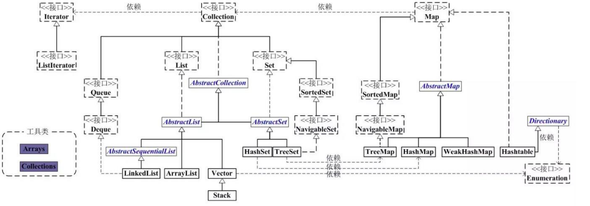
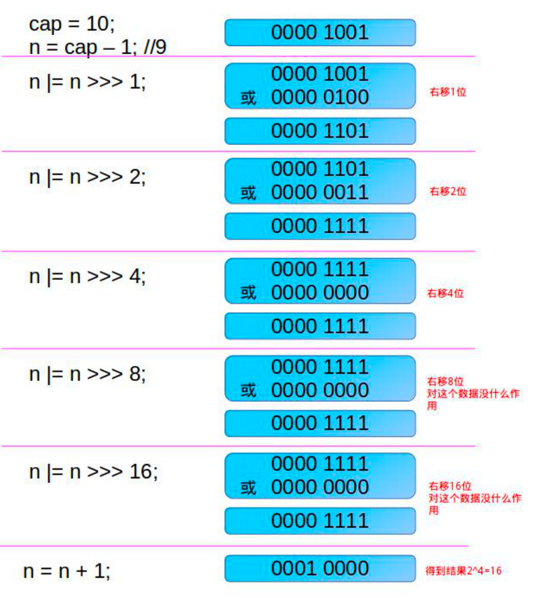
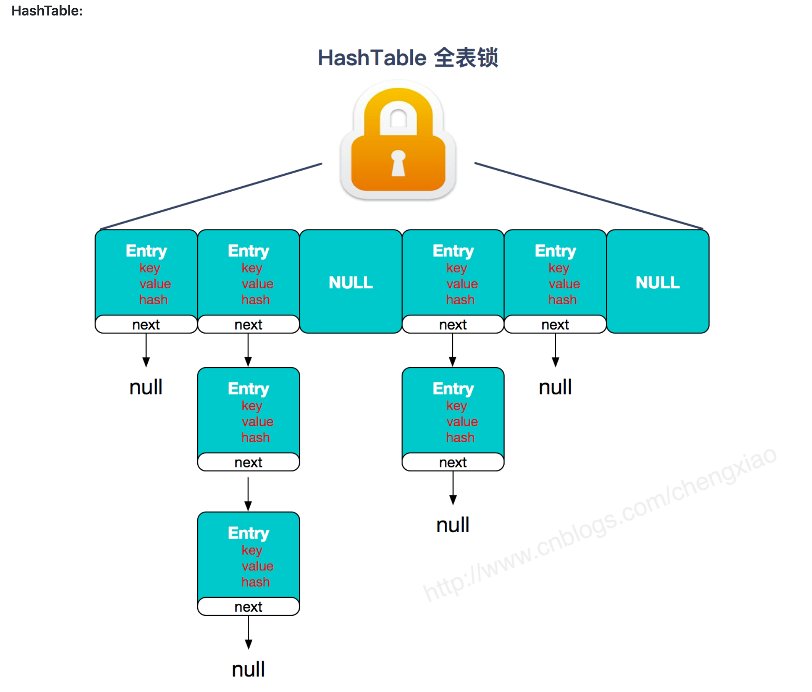

# 1 集合

集合比较重要,会专门有一个文章去总结

## 1.1 Collections 工具类和 Arrays 工具类常见方法总结

原文:https://gitee.com/SnailClimb/JavaGuide/blob/master/docs/java/basic/Arrays,CollectionsCommonMethods.md

Collections 工具类和 Arrays 工具类常见方法

- Collections
  - 排序操作
  - 查找,替换操作
  - 同步控制:多线程下可以使用
- Arrays类的常见操作
  - 排序 : sort()
  - 查找 : binarySearch()
  - 比较: equals()
  - 填充 : fill()
  - 转列表 asList()
  - 转字符串 toString()
  - 复制 copyOf()


## 1.2 接口继承关系和实现

集合类存放于 Java.util 包中，主要有 3 种：set(集）、list(列表包含 Queue）和 map(映射)。

- Collection：Collection 是集合 List、Set、Queue 的最基本的接口。

- Iterator：迭代器，可以通过迭代器遍历集合中的数据

- Map：是映射表的基础接口




在 Java 中除了以 `Map` 结尾的类之外， 其他类都实现了 `Collection` 接口。

## 1.3  List,Set,Map 三者的区别？

- `List`(对付顺序的好帮手)： 存储的元素是有序的、可重复的。
- `Set`(注重独一无二的性质): 存储的元素是无序的、不可重复的。去重
- `Map`(用 Key 来搜索的专家): 使用键值对（kye-value）存储，类似于数学上的函数 y=f(x)，“x”代表 key，"y"代表 value，Key 是无序的、不可重复的，value 是无序的、可重复的，每个键最多映射到一个值。

### 1.3.1 集合框架底层数据结构总结

先来看一下 `Collection` 接口下面的集合。

### 1.3.2 List

- `Arraylist`： `Object[]`数组
- `Vector`：`Object[]`数组
- `LinkedList`： 双向链表(JDK1.6 之前为循环链表，JDK1.7 取消了循环)

### 1.3.3 Set

- `HashSet`（无序，唯一）: 基于 `HashMap` 实现的，底层采用 `HashMap` 来保存元素
- `LinkedHashSet`：`LinkedHashSet` 是 `HashSet` 的子类，并且其内部是通过 `LinkedHashMap` 来实现的。有点类似于我们之前说的 `LinkedHashMap` 其内部是基于 `HashMap` 实现一样，不过还是有一点点区别的
- `TreeSet`（有序，唯一）： 红黑树(自平衡的排序二叉树)

再来看看 `Map` 接口下面的集合。

### 1.3.4 Map

- `HashMap`： JDK1.8 之前 HashMap 由数组+链表组成的，数组是 HashMap 的主体，链表则是主要为了解决哈希冲突而存在的（“拉链法”解决冲突）。JDK1.8 以后在解决哈希冲突时有了较大的变化，当链表长度大于阈值（默认为 8）（将链表转换成红黑树前会判断，如果当前数组的长度小于 64，那么会选择先进行数组扩容，而不是转换为红黑树）时，将链表转化为红黑树，以减少搜索时间
- `LinkedHashMap`： `LinkedHashMap` 继承自 `HashMap`，所以它的底层仍然是基于拉链式散列结构即由数组和链表或红黑树组成。另外，`LinkedHashMap` 在上面结构的基础上，增加了一条双向链表，使得上面的结构可以保持键值对的插入顺序。同时通过对链表进行相应的操作，实现了访问顺序相关逻辑。详细可以查看：[《LinkedHashMap 源码详细分析（JDK1.8）》](https://www.imooc.com/article/22931)
- `Hashtable`： 数组+链表组成的，数组是 HashMap 的主体，链表则是主要为了解决哈希冲突而存在的
- `TreeMap`： 红黑树（自平衡的排序二叉树）

### 1.3.5 如何选用集合?

主要根据集合的特点来选用，比如我们需要根据键值获取到元素值时就选用 `Map` 接口下的集合，需要排序时选择 `TreeMap`,不需要排序时就选择 `HashMap`,需要保证线程安全就选用 `ConcurrentHashMap`。

当我们只需要存放元素值时，就选择实现`Collection` 接口的集合，需要保证元素唯一时选择实现 `Set` 接口的集合比如 `TreeSet` 或 `HashSet`，不需要就选择实现 `List` 接口的比如 `ArrayList` 或 `LinkedList`，然后再根据实现这些接口的集合的特点来选用。

### 1.3.6 Iterator 迭代器

```java
public interface Iterator<E> {
    //集合中是否还有元素
    boolean hasNext();
    //获得集合中的下一个元素
    E next();
    ......
}
```

`Iterator` 对象称为迭代器（设计模式的一种），迭代器可以对集合进行遍历，但每一个集合内部的数据结构可能是不尽相同的，所以每一个集合存和取都很可能是不一样的，虽然我们可以人为地在每一个类中定义 `hasNext()` 和 `next()` 方法，但这样做会让整个集合体系过于臃肿。于是就有了迭代器。

迭代器是将这样的方法抽取出接口，然后在每个类的内部，定义自己迭代方式，这样做就规定了整个集合体系的遍历方式都是 `hasNext()`和`next()`方法，使用者不用管怎么实现的，会用即可。迭代器的定义为：提供一种方法访问一个容器对象中各个元素，而又不需要暴露该对象的内部细节。

> `Iterator` 主要是用来遍历集合用的，它的特点是更加安全，因为它可以确保，在当前遍历的集合元素被更改的时候，就会抛出 `ConcurrentModificationException` 异常。

```java
Map<Integer, String> map = new HashMap();
map.put(1, "Java");
map.put(2, "C++");
map.put(3, "PHP");
Iterator<Map.Entry<Integer, String>> iterator = map.entrySet().iterator();
while (iterator.hasNext()) {
  Map.Entry<Integer, String> entry = iterator.next();
  System.out.println(entry.getKey() + entry.getValue());
}
```

### 1.3.7 有哪些集合是线程不安全的？怎么解决呢？

我们常用的 `Arraylist` ,`LinkedList`,`Hashmap`,`HashSet`,`TreeSet`,`TreeMap`，`PriorityQueue` 都不是线程安全的。解决办法很简单，可以使用线程安全的集合来代替。

如果你要使用线程安全的集合的话， `java.util.concurrent` 包中提供了很多并发容器供你使用：

1. `ConcurrentHashMap`: 可以看作是线程安全的 `HashMap`
2. `CopyOnWriteArrayList`:可以看作是线程安全的 `ArrayList`，在读多写少的场合性能非常好，远远好于 `Vector`.
3. `ConcurrentLinkedQueue`:高效的并发队列，使用链表实现。可以看做一个线程安全的 `LinkedList`，这是一个非阻塞队列。
4. `BlockingQueue`: 这是一个接口，JDK 内部通过链表、数组等方式实现了这个接口。表示阻塞队列，非常适合用于作为数据共享的通道。
5. `ConcurrentSkipListMap` :跳表的实现。这是一个`Map`，使用跳表的数据结构进行快速查找。


## 1.4 Collection 子接口之 List

### 1.4.1 Arraylist 和 Vector 的区别?

1. ArrayList 是 List 的主要实现类，底层使用 Object[ ]存储，适用于频繁的查找工作，线程不安全 ；
2. Vector 是 List 的古老实现类，底层使用 Object[ ]存储，线程安全的。

### 1.4.2 Arraylist 与 LinkedList 区别?

1. **是否保证线程安全：** `ArrayList` 和 `LinkedList` 都是不同步的，也就是不保证线程安全；
2. **底层数据结构：** `Arraylist` 底层使用的是 **`Object` 数组**；`LinkedList` 底层使用的是 **双向链表** 数据结构（JDK1.6 之前为循环链表，JDK1.7 取消了循环。注意双向链表和双向循环链表的区别，下面有介绍到！）
3. **插入和删除是否受元素位置的影响：** ① **`ArrayList` 采用数组存储，所以插入和删除元素的时间复杂度受元素位置的影响。** 比如：执行`add(E e)`方法的时候， `ArrayList` 会默认在将指定的元素追加到此列表的末尾，这种情况时间复杂度就是 O(1)。但是如果要在指定位置 i 插入和删除元素的话（`add(int index, E element)`）时间复杂度就为 O(n-i)。因为在进行上述操作的时候集合中第 i 和第 i 个元素之后的(n-i)个元素都要执行向后位/向前移一位的操作。 ② **`LinkedList` 采用链表存储，所以对于`add(E e)`方法的插入，删除元素时间复杂度不受元素位置的影响，近似 O(1)，如果是要在指定位置`i`插入和删除元素的话（`(add(int index, E element)`） 时间复杂度近似为`o(n))`因为需要先移动到指定位置再插入。**
4. **是否支持快速随机访问：** `LinkedList` 不支持高效的随机元素访问，而 `ArrayList` 支持。快速随机访问就是通过元素的序号快速获取元素对象(对应于`get(int index)`方法)。
5. **内存空间占用：** ArrayList 的空 间浪费主要体现在在 list 列表的结尾会预留一定的容量空间，而 LinkedList 的空间花费则体现在它的每一个元素都需要消耗比 ArrayList 更多的空间（因为要存放直接后继和直接前驱以及数据）。

#### 补充:双向链表,双向循环链表

> 双向链表和双向循环链表

**双向链表：** 包含两个指针，一个 prev 指向前一个节点，一个 next 指向后一个节点。


#### 补充:RandomAccess 接口

```java
public interface RandomAccess {
}
```

查看源码我们发现实际上 `RandomAccess` 接口中什么都没有定义。所以，在我看来 `RandomAccess` 接口不过是一个标识罢了。标识什么？ 标识实现这个接口的类具有随机访问功能。

在 `binarySearch（)` 方法中，它要判断传入的 list 是否 `RamdomAccess` 的实例，如果是，调用`indexedBinarySearch()`方法，如果不是，那么调用`iteratorBinarySearch()`方法

```java
public static <T>
  int binarySearch(List<? extends Comparable<? super T>> list, T key) {
  if (list instanceof RandomAccess || list.size()<BINARYSEARCH_THRESHOLD)
    return Collections.indexedBinarySearch(list, key);
  else
    return Collections.iteratorBinarySearch(list, key);
}
```

`ArrayList` 实现了 `RandomAccess` 接口， 而 `LinkedList` 没有实现。为什么呢？我觉得还是和底层数据结构有关！`ArrayList` 底层是数组，而 `LinkedList` 底层是链表。数组天然支持随机访问，时间复杂度为 O(1)，所以称为快速随机访问。链表需要遍历到特定位置才能访问特定位置的元素，时间复杂度为 O(n)，所以不支持快速随机访问。，`ArrayList` 实现了 `RandomAccess` 接口，就表明了他具有快速随机访问功能。 `RandomAccess` 接口只是标识，并不是说 `ArrayList` 实现 `RandomAccess` 接口才具有快速随机访问功能的！

### 1.4.3 ArrayList 的扩容机制

#### 1.4.3.1 首先从ArrayList 的构造函数说起

**ArrayList有三种方式来初始化，构造方法源码如下：**

```java
/**
     * 默认初始容量大小
     */
private static final int DEFAULT_CAPACITY = 10;


private static final Object[] DEFAULTCAPACITY_EMPTY_ELEMENTDATA = {};

/**
     *默认构造函数，使用初始容量10构造一个空列表(无参数构造)
     */
public ArrayList() {
  this.elementData = DEFAULTCAPACITY_EMPTY_ELEMENTDATA;
}

/**
     * 带初始容量参数的构造函数。（用户自己指定容量）
     */
public ArrayList(int initialCapacity) {
  if (initialCapacity > 0) {//初始容量大于0
    //创建initialCapacity大小的数组
    this.elementData = new Object[initialCapacity];
  } else if (initialCapacity == 0) {//初始容量等于0
    //创建空数组
    this.elementData = EMPTY_ELEMENTDATA;
  } else {//初始容量小于0，抛出异常
    throw new IllegalArgumentException("Illegal Capacity: "+
                                       initialCapacity);
  }
}


/**
    *构造包含指定collection元素的列表，这些元素利用该集合的迭代器按顺序返回
    *如果指定的集合为null，throws NullPointerException。 
    */
public ArrayList(Collection<? extends E> c) {
  elementData = c.toArray();
  if ((size = elementData.length) != 0) {
    // c.toArray might (incorrectly) not return Object[] (see 6260652)
    if (elementData.getClass() != Object[].class)
      elementData = Arrays.copyOf(elementData, size, Object[].class);
  } else {
    // replace with empty array.
    this.elementData = EMPTY_ELEMENTDATA;
  }
}
```

**以无参数构造方法创建 ArrayList 时，实际上初始化赋值的是一个空数组。当真正对数组进行添加元素操作时，才真正分配容量。即向数组中添加第一个元素时，数组容量扩为10。** 下面在我们分析 ArrayList 扩容时会讲到这一点内容！

#### 1.4.3.2  ArrayList 扩容机制

> 先从Add方法入手

```java
/**
* 将指定的元素追加到此列表的末尾。 
*/
public boolean add(E e) {
  //添加元素之前，先调用ensureCapacityInternal方法
  ensureCapacityInternal(size + 1);  // Increments modCount!!
  //这里看到ArrayList添加元素的实质就相当于为数组赋值
  elementData[size++] = e;
  return true;
}
```

> 再来看看 `ensureCapacityInternal()` 方法

可以看到 `add` 方法 首先调用了`ensureCapacityInternal(size + 1)`

`DEFAULT_CAPACITY`是10

```java
//得到最小扩容量
    private void ensureCapacityInternal(int minCapacity) {
        if (elementData == DEFAULTCAPACITY_EMPTY_ELEMENTDATA) {
              // 获取默认的容量和传入参数的较大值
            minCapacity = Math.max(DEFAULT_CAPACITY, minCapacity);
        }

        ensureExplicitCapacity(minCapacity);
    }
```

**当 要 add 进第1个元素时，minCapacity为1，在Math.max()方法比较后，minCapacity 为10。**

> ensureExplicitCapacity() 方法

如果调用 `ensureCapacityInternal()` 方法就一定会进过（执行）这个方法，下面我们来研究一下这个方法的源码！

`elementData`就是我们的数组,他是一个`object`类型的数组,集合的底层还是数组

```java
 //判断是否需要扩容
    private void ensureExplicitCapacity(int minCapacity) {
        modCount++;

        // overflow-conscious code
      //如果最小容量-数组长度大于零则扩容
        if (minCapacity - elementData.length > 0)
            //调用grow方法进行扩容，调用此方法代表已经开始扩容了
            grow(minCapacity);
    }
```

我们来仔细分析一下：

- 当我们要 add 进第1个元素到 ArrayList 时，elementData.length 为0 （因为还是一个空的 list），因为执行了 `ensureCapacityInternal()` 方法 ，所以 minCapacity 此时为10。此时，`minCapacity - elementData.length > 0 `成立，所以会进入 `grow(minCapacity)` 方法。
- 当add第2个元素时，minCapacity 为2，此时e lementData.length(容量)在添加第一个元素后扩容成 10 了。此时，`minCapacity - elementData.length > 0 `不成立，所以不会进入 （执行）`grow(minCapacity)` 方法。
- 添加第3、4···到第10个元素时，依然不会执行grow方法，数组容量都为10。

直到添加第11个元素，minCapacity(为11)比elementData.length（为10）要大。进入grow方法进行扩容。

> grow() 方法

```java
/**
     * 要分配的最大数组大小
     */
    private static final int MAX_ARRAY_SIZE = Integer.MAX_VALUE - 8;

    /**
     * ArrayList扩容的核心方法。
     *grow方法只是把存放数据的数组容量扩大
     *真正的添加数据动作仍在add方法内
     */
    private void grow(int minCapacity) {
        // oldCapacity为旧容量，newCapacity为新容量
        int oldCapacity = elementData.length;
        //将oldCapacity 右移一位，其效果相当于oldCapacity /2，
        //我们知道位运算的速度远远快于整除运算，整句运算式的结果就是将新容量更新为旧容量的1.5倍，
        int newCapacity = oldCapacity + (oldCapacity >> 1);
        //然后检查新容量是否大于最小需要容量，若还是小于最小需要容量，那么就把最小需要容量当作数组的新容量，
        if (newCapacity - minCapacity < 0)
            newCapacity = minCapacity;
       // 如果新容量大于 MAX_ARRAY_SIZE,进入(执行) `hugeCapacity()` 方法来比较 minCapacity 和 MAX_ARRAY_SIZE，
       //如果minCapacity大于最大容量，则新容量则为`Integer.MAX_VALUE`，否则，新容量大小则为 MAX_ARRAY_SIZE 即为 `Integer.MAX_VALUE - 8`。
        if (newCapacity - MAX_ARRAY_SIZE > 0)
            newCapacity = hugeCapacity(minCapacity);
        // minCapacity is usually close to size, so this is a win:
        elementData = Arrays.copyOf(elementData, newCapacity);
    }
```

**int newCapacity = oldCapacity + (oldCapacity >> 1),所以 ArrayList 每次扩容之后容量都会变为原来的 1.5 倍左右（oldCapacity为偶数就是1.5倍，否则是1.5倍左右）！** 奇偶不同，比如 ：10+10/2 = 15, 33+33/2=49。如果是奇数的话会丢掉小数.

> \>>"（移位运算符）：>>1 右移一位相当于除2，右移n位相当于除以 2 的 n 次方。这里 oldCapacity 明显右移了1位所以相当于oldCapacity /2。对于大数据的2进制运算,位移运算符比那些普通运算符的运算要快很多,因为程序仅仅移动一下而已,不去计算,这样提高了效率,节省了资源 　

**我们再来通过例子探究一下`grow()` 方法 ：**

- 当add第1个元素时，oldCapacity 为0，经比较后第一个if判断成立，newCapacity = minCapacity(为10)。但是第二个if判断不会成立，即newCapacity 不比 MAX_ARRAY_SIZE大，则不会进入 `hugeCapacity` 方法。数组容量为10，add方法中 return true,size增为1。
- 当add第11个元素进入grow方法时，newCapacity为15，比minCapacity（为11）大，第一个if判断不成立。新容量没有大于数组最大size，不会进入hugeCapacity方法。数组容量扩为15，add方法中return true,size增为11。
- 以此类推······

**这里补充一点比较重要，但是容易被忽视掉的知识点：**

- java 中的 `length `属性是针对数组说的,比如说你声明了一个数组,想知道这个数组的长度则用到了 length 这个属性.
- java 中的 `length()` 方法是针对字符串说的,如果想看这个字符串的长度则用到 `length()` 这个方法.
- java 中的 `size()` 方法是针对泛型集合说的,如果想看这个泛型有多少个元素,就调用此方法来查看

> hugeCapacity() 方法。

从上面 `grow()` 方法源码我们知道： 如果新容量大于 MAX_ARRAY_SIZE,进入(执行) `hugeCapacity()` 方法来比较 minCapacity 和 MAX_ARRAY_SIZE，如果minCapacity大于最大容量，则新容量则为`Integer.MAX_VALUE`，否则，新容量大小则为 MAX_ARRAY_SIZE 即为 `Integer.MAX_VALUE - 8`。

```java
private static int hugeCapacity(int minCapacity) {
  if (minCapacity < 0) // overflow
    throw new OutOfMemoryError();
  //对minCapacity和MAX_ARRAY_SIZE进行比较
  //若minCapacity大，将Integer.MAX_VALUE作为新数组的大小
  //若MAX_ARRAY_SIZE大，将MAX_ARRAY_SIZE作为新数组的大小
  //MAX_ARRAY_SIZE = Integer.MAX_VALUE - 8;
  return (minCapacity > MAX_ARRAY_SIZE) ?
    Integer.MAX_VALUE :
  MAX_ARRAY_SIZE;
}
```

---

##### `System.arraycopy()` 和 `Arrays.copyOf()`

阅读ArrayList中发现大量调用了这两个方法。比如：我们上面讲的扩容操作以及`add(int index, E element)`、`toArray()` 等方法中都用到了该方法！

> System.arraycopy() 方法

```java
    /**
     * 在此列表中的指定位置插入指定的元素。 
     *先调用 rangeCheckForAdd 对index进行界限检查；然后调用 ensureCapacityInternal 方法保证capacity足够大；
     *再将从index开始之后的所有成员后移一个位置；将element插入index位置；最后size加1。
     */
    public void add(int index, E element) {
        rangeCheckForAdd(index);

        ensureCapacityInternal(size + 1);  // Increments modCount!!
        //arraycopy()方法实现数组自己复制自己
        //elementData:源数组;index:源数组中的起始位置;elementData：目标数组；index + 1：目标数组中的起始位置； size - index：要复制的数组元素的数量；
        System.arraycopy(elementData, index, elementData, index + 1, size - index);
        elementData[index] = element;
        size++;
    }
```

简单测试

```java
public class ArraycopyTest {
	public static void main(String[] args) {
		// TODO Auto-generated method stub
		int[] a = new int[10];
		a[0] = 0;
		a[1] = 1;
		a[2] = 2;
		a[3] = 3;
		System.arraycopy(a, 2, a, 3, 3);
		a[2]=99;
		for (int i = 0; i < a.length; i++) {
			System.out.print(a[i] + " ");//0 1 99 2 3 0 0 0 0 0 
		}
	}
}
```

> Arrays.copyOf()方法

```java
   /**
     以正确的顺序返回一个包含此列表中所有元素的数组（从第一个到最后一个元素）; 返回的数组的运行时类型是指定数组的运行时类型。 
     */
    public Object[] toArray() {
    //elementData：要复制的数组；size：要复制的长度
        return Arrays.copyOf(elementData, size);
    }
```

个人觉得使用 `Arrays.copyOf()`方法主要是为了给原有数组扩容，测试代码如下：

```java
public class ArrayscopyOfTest {

	public static void main(String[] args) {
		int[] a = new int[3];
		a[0] = 0;
		a[1] = 1;
		a[2] = 2;
		int[] b = Arrays.copyOf(a, 10);
		System.out.println("b.length"+b.length);//10
	}
}
```

两者区别与联系

**联系：**

看两者源代码可以发现 copyOf() 内部实际调用了 `System.arraycopy()` 方法

**区别：**

`arraycopy()` 需要目标数组，将原数组拷贝到你自己定义的数组里或者原数组，而且可以选择拷贝的起点和长度以及放入新数组中的位置 `copyOf()` 是系统自动在内部新建一个数组，并返回该数组。

---

##### `ensureCapacity`方法

ArrayList 源码中有一个 `ensureCapacity` 方法不知道大家注意到没有，这个方法 ArrayList 内部没有被调用过，所以很显然是提供给用户调用的，那么这个方法有什么作用呢？

```java
/**
    如有必要，增加此 ArrayList 实例的容量，以确保它至少可以容纳由minimum capacity参数指定的元素数。
     *
     * @param   minCapacity   所需的最小容量
     */
public void ensureCapacity(int minCapacity) {
  int minExpand = (elementData != DEFAULTCAPACITY_EMPTY_ELEMENTDATA)
    // any size if not default element table
    ? 0
    // larger than default for default empty table. It's already
    // supposed to be at default size.
    : DEFAULT_CAPACITY;

  if (minCapacity > minExpand) {
    ensureExplicitCapacity(minCapacity);
  }
}
```

**最好在 add 大量元素之前用 `ensureCapacity` 方法，以减少增量重新分配的次数**

我们通过下面的代码实际测试以下这个方法的效果：

```java
public class EnsureCapacityTest {
	public static void main(String[] args) {
		ArrayList<Object> list = new ArrayList<Object>();
		final int N = 10000000;
		long startTime = System.currentTimeMillis();
		for (int i = 0; i < N; i++) {
			list.add(i);
		}
		long endTime = System.currentTimeMillis();
		System.out.println("使用ensureCapacity方法前："+(endTime - startTime));//使用ensureCapacity方法前：2158

	}
}
```

```java
public class EnsureCapacityTest {
    public static void main(String[] args) {
        ArrayList<Object> list = new ArrayList<Object>();
        final int N = 10000000;
        list = new ArrayList<Object>();
        long startTime1 = System.currentTimeMillis();
        list.ensureCapacity(N);
        for (int i = 0; i < N; i++) {
            list.add(i);
        }
        long endTime1 = System.currentTimeMillis();
        System.out.println("使用ensureCapacity方法后："+(endTime1 - startTime1));//使用ensureCapacity方法前：1773
    }
}
```

通过运行结果，我们可以看出向 ArrayList 添加大量元素之前最好先使用`ensureCapacity` 方法，以减少增量重新分配的次数。


## 1.5 Collection 子接口之 Set

### 1.5.1 comparable 和 Comparator 的区别

- `comparable` 接口实际上是出自`java.lang`包 它有一个 `compareTo(Object obj)`方法用来排序
- `comparator`接口实际上是出自 java.util 包它有一个`compare(Object obj1, Object obj2)`方法用来排序

一般我们需要对一个集合使用自定义排序时，我们就要重写`compareTo()`方法或`compare()`方法，当我们需要对某一个集合实现两种排序方式，比如一个 song 对象中的歌名和歌手名分别采用一种排序方法的话，我们可以重写`compareTo()`方法和使用自制的`Comparator`方法或者以两个 Comparator 来实现歌名排序和歌星名排序，第二种代表我们只能使用两个参数版的 `Collections.sort()`.

#### 1.5.1.1 Comparator 定制排序

```java
ArrayList<Integer> arrayList = new ArrayList<Integer>();
arrayList.add(-1);
arrayList.add(3);
arrayList.add(3);
arrayList.add(-5);
arrayList.add(7);
arrayList.add(4);
arrayList.add(-9);
arrayList.add(-7);
System.out.println("原始数组:");
System.out.println(arrayList);
// void reverse(List list)：反转
Collections.reverse(arrayList);
System.out.println("Collections.reverse(arrayList):");
System.out.println(arrayList);

// void sort(List list),按自然排序的升序排序
Collections.sort(arrayList);
System.out.println("Collections.sort(arrayList):");
System.out.println(arrayList);
// 定制排序的用法
Collections.sort(arrayList, new Comparator<Integer>() {

  @Override
  public int compare(Integer o1, Integer o2) {
    return o2.compareTo(o1);
  }
});
System.out.println("定制排序后：");
System.out.println(arrayList);
/**
原始数组:
[-1, 3, 3, -5, 7, 4, -9, -7]
Collections.reverse(arrayList):
[-7, -9, 4, 7, -5, 3, 3, -1]
Collections.sort(arrayList):
[-9, -7, -5, -1, 3, 3, 4, 7]
定制排序后：
[7, 4, 3, 3, -1, -5, -7, -9]
*/
```

#### 1.5.1.2 重写 compareTo 方法实现按年龄来排序

```java
// person对象没有实现Comparable接口，所以必须实现，这样才不会出错，才可以使treemap中的数据按顺序排列
// 前面一个例子的String类已经默认实现了Comparable接口，详细可以查看String类的API文档，另外其他
// 像Integer类等都已经实现了Comparable接口，所以不需要另外实现了
public  class Person implements Comparable<Person> {
    private String name;
    private int age;

    public Person(String name, int age) {
        super();
        this.name = name;
        this.age = age;
    }

    public String getName() {
        return name;
    }

    public void setName(String name) {
        this.name = name;
    }

    public int getAge() {
        return age;
    }

    public void setAge(int age) {
        this.age = age;
    }

    /**
     * T重写compareTo方法实现按年龄来排序
     */
    @Override
    public int compareTo(Person o) {
        if (this.age > o.getAge()) {
            return 1;
        }
        if (this.age < o.getAge()) {
            return -1;
        }
        return 0;
    }
}
```

```java
public static void main(String[] args) {
TreeMap<Person, String> pdata = new TreeMap<Person, String>();
pdata.put(new Person("张三", 30), "zhangsan");
pdata.put(new Person("李四", 20), "lisi");
pdata.put(new Person("王五", 10), "wangwu");
pdata.put(new Person("小红", 5), "xiaohong");
// 得到key的值的同时得到key所对应的值
Set<Person> keys = pdata.keySet();
for (Person key : keys) {
System.out.println(key.getAge() + "-" + key.getName());
  /**
5-小红
10-王五
20-李四
30-张三
  */
	}
}
```

### 1.5.2 无序性和不可重复性的含义是什么

1、什么是无序性？无序性不等于随机性 ，无序性是指存储的数据在底层数组中并非按照数组索引的顺序添加 ，而是根据数据的哈希值决定的。

2、什么是不可重复性？不可重复性是指添加的元素按照 equals()判断时 ，返回 false，需要同时重写 equals()方法和 HashCode()方法。

### 1.5.3 比较 HashSet、LinkedHashSet 和 TreeSet 三者的异同

HashSet 是 Set 接口的主要实现类 ，HashSet 的底层是 HashMap，线程不安全的，可以存储 null 值；

LinkedHashSet 是 HashSet 的子类，能够按照添加的顺序遍历；

TreeSet 底层使用红黑树，能够按照添加元素的顺序进行遍历，排序的方式有自然排序和定制排序。

## 1.6 Map 接口

### 1.6.1. HashMap 和 Hashtable 的区别

1. **线程是否安全：**HashMap 是非线程安全的，HashTable 是线程安全的,因为 HashTable 内部的方法基本都经过`synchronized` 修饰。（如果你要保证线程安全的话就使用 ConcurrentHashMap 吧！）；
2. **效率：** 因为线程安全的问题，HashMap 要比 HashTable 效率高一点。另外，HashTable 基本被淘汰，不要在代码中使用它；
3. **对 Null key 和 Null value 的支持：** HashMap 可以存储 null 的 key 和 value，但 null 作为键只能有一个，null 作为值可以有多个；HashTable 不允许有 null 键和 null 值，否则会抛出 NullPointerException。
4. **初始容量大小和每次扩充容量大小的不同 ：** ① 创建时如果不指定容量初始值，Hashtable 默认的初始大小为 11，之后每次扩充，容量变为原来的 2n+1。HashMap 默认的初始化大小为 16。之后每次扩充，容量变为原来的 2 倍。② 创建时如果给定了容量初始值，那么 Hashtable 会直接使用你给定的大小，而 HashMap 会将其扩充为 2 的幂次方大小（HashMap 中的`tableSizeFor()`方法保证，下面给出了源代码）。也就是说 HashMap 总是使用 2 的幂作为哈希表的大小,后面会介绍到为什么是 2 的幂次方。
5. **底层数据结构：** JDK1.8 以后的 HashMap 在解决哈希冲突时有了较大的变化，当链表长度大于阈值（默认为 8）（将链表转换成红黑树前会判断，如果当前数组的长度小于 64，那么会选择先进行数组扩容，而不是转换为红黑树）时，将链表转化为红黑树，以减少搜索时间。Hashtable 没有这样的机制。

**HashMap 中带有初始容量的构造函数：**

```java
public HashMap(int initialCapacity, float loadFactor) {
if (initialCapacity < 0)
throw new IllegalArgumentException("Illegal initial capacity: " +
initialCapacity);
if (initialCapacity > MAXIMUM_CAPACITY)
initialCapacity = MAXIMUM_CAPACITY;
if (loadFactor <= 0 || Float.isNaN(loadFactor))
throw new IllegalArgumentException("Illegal load factor: " +
loadFactor);
this.loadFactor = loadFactor;
this.threshold = tableSizeFor(initialCapacity);
}
public HashMap(int initialCapacity) {
this(initialCapacity, DEFAULT_LOAD_FACTOR);
}
```

下面这个方法保证了 HashMap 总是使用 2 的幂作为哈希表的大小。

```java
   /**
     * Returns a power of two size for the given target capacity.
     */
    static final int tableSizeFor(int cap) {
        int n = cap - 1;
        n |= n >>> 1;
        n |= n >>> 2;
        n |= n >>> 4;
        n |= n >>> 8;
        n |= n >>> 16;
        return (n < 0) ? 1 : (n >= MAXIMUM_CAPACITY) ? MAXIMUM_CAPACITY : n + 1;
    }
```

### 1.6.2 HashMap 和 HashSet 区别

如果你看过 `HashSet` 源码的话就应该知道：HashSet 底层就是基于 HashMap 实现的。（HashSet 的源码非常非常少，因为除了 `clone()`、`writeObject()`、`readObject()`是 HashSet 自己不得不实现之外，其他方法都是直接调用 HashMap 中的方法。

| HashMap                            | HashSet                                                      |
| ---------------------------------- | ------------------------------------------------------------ |
| 实现了 Map 接口                    | 实现 Set 接口                                                |
| 存储键值对                         | 仅存储对象                                                   |
| 调用 `put()`向 map 中添加元素      | 调用 `add()`方法向 Set 中添加元素                            |
| HashMap 使用键（Key）计算 Hashcode | HashSet 使用成员对象来计算 hashcode 值，对于两个对象来说 hashcode 可能相同，所以 equals()方法用来判断对象的相等性， |

### 1.6.3  HashMap 和 TreeMap 区别

`TreeMap` 和`HashMap` 都继承自`AbstractMap` ，但是需要注意的是`TreeMap`它还实现了`NavigableMap`接口和`SortedMap` 接口。


实现 `NavigableMap` 接口让 `TreeMap` 有了对集合内元素的搜索的能力。

实现`SortMap`接口让 `TreeMap` 有了对集合中的元素根据键排序的能力。默认是按 key 的升序排序，不过我们也可以指定排序的比较器。示例代码如下：

```java
public class Person {
    private Integer age;
    public Person(Integer age) {
        this.age = age;
    }
    public Integer getAge() {
        return age;
    }
    public static void main(String[] args) {
        TreeMap<Person, String> treeMap = new TreeMap<>(new Comparator<Person>() {
            @Override
            public int compare(Person person1, Person person2) {
                int num = person1.getAge() - person2.getAge();
                return Integer.compare(num, 0);
            }
        });
        treeMap.put(new Person(3), "person1");
        treeMap.put(new Person(18), "person2");
        treeMap.put(new Person(35), "person3");
        treeMap.put(new Person(16), "person4");
        treeMap.entrySet().stream().forEach(personStringEntry -> {
            System.out.println(personStringEntry.getValue());
          /**
person1
person4
person2
person3
          */
        });
    }
}
```

可以看出，`TreeMap` 中的元素已经是按照 `Person` 的 age 字段的升序来排列了。

上面，我们是通过传入匿名内部类的方式实现的，你可以将代码替换成 Lambda 表达式实现的方式：

```java
TreeMap<Person, String> treeMap = new TreeMap<>((person1, person2) -> {
  int num = person1.getAge() - person2.getAge();
  return Integer.compare(num, 0);
});
```

**综上，相比于`HashMap`来说 `TreeMap` 主要多了对集合中的元素根据键排序的能力以及对集合内元素的搜索的能力。**

### 1.6.4 HashSet 如何检查重复

当你把对象加入`HashSet`时，HashSet 会先计算对象的`hashcode`值来判断对象加入的位置，同时也会与其他加入的对象的 hashcode 值作比较，如果没有相符的 hashcode，HashSet 会假设对象没有重复出现。但是如果发现有相同 hashcode 值的对象，这时会调用`equals()`方法来检查 hashcode 相等的对象是否真的相同。如果两者相同，HashSet 就不会让加入操作成功。（摘自我的 Java 启蒙书《Head fist java》第二版）

**hashCode()与 equals()的相关规定：**

1. 如果两个对象相等，则 hashcode 一定也是相同的
2. 两个对象相等,对两个 equals 方法返回 true
3. 两个对象有相同的 hashcode 值，它们也不一定是相等的
4. 综上，equals 方法被覆盖过，则 hashCode 方法也必须被覆盖
5. hashCode()的默认行为是对堆上的对象产生独特值。如果没有重写 hashCode()，则该 class 的两个对象无论如何都不会相等（即使这两个对象指向相同的数据）。

**==与 equals 的区别**

对于基本类型来说，== 比较的是值是否相等；

对于引用类型来说，== 比较的是两个引用是否指向同一个对象地址（两者在内存中存放的地址（堆内存地址）是否指向同一个地方）；

对于引用类型（包括包装类型）来说，equals 如果没有被重写，对比它们的地址是否相等；如果 equals()方法被重写（例如 String），则比较的是地址里的内容。

### 1.6.5 HashMap底层是数组+链表/红黑树，无序键值对集合,线程不安全


基于哈希表实现，链地址法。
loadFactor默认为0.75，threshold（阈）为12，并创建一个大小为16的Entry数组。
在遍历时是无序的，如需有序，建议使用TreeMap。
采用数组方式存储key、value构成的Entry对象，无容量限制。
基于keyhash寻找Entry对象存放在数组中的位置，对于hash冲突采用链表/红黑树的方式来解决。
HashMap在插入元素时可能会扩大数组的容量，在扩大容量时需要重新计算hash，并复制对象到新的数组中。
是非线程安全的。

---

1.哈希冲突时采用链表法的类，一个哈希桶多于8个元素改为TreeNode staticclassNode<K,V>implementsMap.Entry<K,V>
2.哈希冲突时采用红黑树存储的类，一个哈希桶少于6个元素改为Node staticfinalclassTreeNode<K,V>extendsLinkedHashMap.Entry<K,V>

---

某个桶对应的链表过长的话搜索效率低，改为红黑树效率会提高。

---

为何按位与而不是取摸hashmap的iterator读取时是否会读到另一个线程put的数据红黑树；hashmap报ConcurrentModificationException的情况

---

Hash冲突中链表结构的数量大于8个，则调用树化转为红黑树结构，红黑树查找稍微快些；红黑树结构的数量小于6个时，则转为链表结构
如果加载因子越大，对空间的利用更充分，但是查找效率会降低（链表长度会越来越长）；如果加载因子太小，那么表中的数据将过于稀疏（很多空间还没用，就开始扩容了），对空间造成严重浪费。如果我们在构造方法中不指定，则系统默认加载因子为0.75，这是一个比较理想的值，一般情况下我们是无需修改的。
一般对哈希表的散列很自然地会想到用hash值对length取模（即除法散列法），Hashtable 中也是这样实现的，这种方法基本能保证元素在哈希表中散列的比较均匀，但取模会用到除法运算，效率很低，HashMap中则通过h&(length-1)的方法来代替取模，同样实现了均匀的散列，但效率要高很多，这也是HashMap对Hashtable的一个改进。
哈希表的容量一定要是2的整数次幂。首先，length为2的整数次幂的话，h&(length-1)就相当于对length取模，这样便保证了散列的均匀，同时也提升了效率；其次，length为2 的整数次幂的话，为偶数，这样length-1为奇数，奇数的最后一位是1，这样便保证了h&(length-1)的最后一位可能为0，也可能为1（这取决于h的值），即与后的结果可能为偶数，也可能为奇数，这样便可以保证散列的均匀性，而如果length为奇数的话，很明显length-1为偶数，它的最后一位是0，这样h&(length-1)的最后一位肯定为0，即只能为偶数，这样任何hash值都只会被散列到数组的偶数下标位置上，这便浪费了近一半的空间，因此，length取2的整数次幂，是为了使不同hash值发生碰撞的概率较小，这样就能使元素在哈希表中均匀地散列。

#### 1.6.5.1 Map中Entry接口

```java
interface Entry<K,V> {
        /**
         * Returns the key corresponding to this entry.
         *
         * @return the key corresponding to this entry
         * @throws IllegalStateException implementations may, but are not
         *         required to, throw this exception if the entry has been
         *         removed from the backing map.
         */
        K getKey();

        /**
         * Returns the value corresponding to this entry.  If the mapping
         * has been removed from the backing map (by the iterator's
         * <tt>remove</tt> operation), the results of this call are undefined.
         *
         * @return the value corresponding to this entry
         * @throws IllegalStateException implementations may, but are not
         *         required to, throw this exception if the entry has been
         *         removed from the backing map.
         */
        V getValue();

        /**
         * Replaces the value corresponding to this entry with the specified
         * value (optional operation).  (Writes through to the map.)  The
         * behavior of this call is undefined if the mapping has already been
         * removed from the map (by the iterator's <tt>remove</tt> operation).
         *
         * @param value new value to be stored in this entry
         * @return old value corresponding to the entry
         * @throws UnsupportedOperationException if the <tt>put</tt> operation
         *         is not supported by the backing map
         * @throws ClassCastException if the class of the specified value
         *         prevents it from being stored in the backing map
         * @throws NullPointerException if the backing map does not permit
         *         null values, and the specified value is null
         * @throws IllegalArgumentException if some property of this value
         *         prevents it from being stored in the backing map
         * @throws IllegalStateException implementations may, but are not
         *         required to, throw this exception if the entry has been
         *         removed from the backing map.
         */
        V setValue(V value);

        /**
         * Compares the specified object with this entry for equality.
         * Returns <tt>true</tt> if the given object is also a map entry and
         * the two entries represent the same mapping.  More formally, two
         * entries <tt>e1</tt> and <tt>e2</tt> represent the same mapping
         * if<pre>
         *     (e1.getKey()==null ?
         *      e2.getKey()==null : e1.getKey().equals(e2.getKey()))  &amp;&amp;
         *     (e1.getValue()==null ?
         *      e2.getValue()==null : e1.getValue().equals(e2.getValue()))
         * </pre>
         * This ensures that the <tt>equals</tt> method works properly across
         * different implementations of the <tt>Map.Entry</tt> interface.
         *
         * @param o object to be compared for equality with this map entry
         * @return <tt>true</tt> if the specified object is equal to this map
         *         entry
         */
        boolean equals(Object o);

        /**
         * Returns the hash code value for this map entry.  The hash code
         * of a map entry <tt>e</tt> is defined to be: <pre>
         *     (e.getKey()==null   ? 0 : e.getKey().hashCode()) ^
         *     (e.getValue()==null ? 0 : e.getValue().hashCode())
         * </pre>
         * This ensures that <tt>e1.equals(e2)</tt> implies that
         * <tt>e1.hashCode()==e2.hashCode()</tt> for any two Entries
         * <tt>e1</tt> and <tt>e2</tt>, as required by the general
         * contract of <tt>Object.hashCode</tt>.
         *
         * @return the hash code value for this map entry
         * @see Object#hashCode()
         * @see Object#equals(Object)
         * @see #equals(Object)
         */
        int hashCode();

        /**
         * Returns a comparator that compares {@link Map.Entry} in natural order on key.
         *
         * <p>The returned comparator is serializable and throws {@link
         * NullPointerException} when comparing an entry with a null key.
         *
         * @param  <K> the {@link Comparable} type of then map keys
         * @param  <V> the type of the map values
         * @return a comparator that compares {@link Map.Entry} in natural order on key.
         * @see Comparable
         * @since 1.8
         */
        public static <K extends Comparable<? super K>, V> Comparator<Map.Entry<K,V>> comparingByKey() {
            return (Comparator<Map.Entry<K, V>> & Serializable)
                (c1, c2) -> c1.getKey().compareTo(c2.getKey());
        }

        /**
         * Returns a comparator that compares {@link Map.Entry} in natural order on value.
         *
         * <p>The returned comparator is serializable and throws {@link
         * NullPointerException} when comparing an entry with null values.
         *
         * @param <K> the type of the map keys
         * @param <V> the {@link Comparable} type of the map values
         * @return a comparator that compares {@link Map.Entry} in natural order on value.
         * @see Comparable
         * @since 1.8
         */
        public static <K, V extends Comparable<? super V>> Comparator<Map.Entry<K,V>> comparingByValue() {
            return (Comparator<Map.Entry<K, V>> & Serializable)
                (c1, c2) -> c1.getValue().compareTo(c2.getValue());
        }

        /**
         * Returns a comparator that compares {@link Map.Entry} by key using the given
         * {@link Comparator}.
         *
         * <p>The returned comparator is serializable if the specified comparator
         * is also serializable.
         *
         * @param  <K> the type of the map keys
         * @param  <V> the type of the map values
         * @param  cmp the key {@link Comparator}
         * @return a comparator that compares {@link Map.Entry} by the key.
         * @since 1.8
         */
        public static <K, V> Comparator<Map.Entry<K, V>> comparingByKey(Comparator<? super K> cmp) {
            Objects.requireNonNull(cmp);
            return (Comparator<Map.Entry<K, V>> & Serializable)
                (c1, c2) -> cmp.compare(c1.getKey(), c2.getKey());
        }

        /**
         * Returns a comparator that compares {@link Map.Entry} by value using the given
         * {@link Comparator}.
         *
         * <p>The returned comparator is serializable if the specified comparator
         * is also serializable.
         *
         * @param  <K> the type of the map keys
         * @param  <V> the type of the map values
         * @param  cmp the value {@link Comparator}
         * @return a comparator that compares {@link Map.Entry} by the value.
         * @since 1.8
         */
        public static <K, V> Comparator<Map.Entry<K, V>> comparingByValue(Comparator<? super V> cmp) {
            Objects.requireNonNull(cmp);
            return (Comparator<Map.Entry<K, V>> & Serializable)
                (c1, c2) -> cmp.compare(c1.getValue(), c2.getValue());
        }
    }

```

#### 1.6.5.2 HashMap#TreeNode（Map.Entry的实现，红黑树的基本元素）

```java
static final class TreeNode<K,V> extends LinkedHashMap.Entry<K,V> {
        TreeNode<K,V> parent;  // red-black tree links
        TreeNode<K,V> left;
        TreeNode<K,V> right;
        TreeNode<K,V> prev;    // needed to unlink next upon deletion
        boolean red;
        TreeNode(int hash, K key, V val, Node<K,V> next) {
            super(hash, key, val, next);
        }
  }
```

#### 1.6.5.3 HashMap中的成员变量

```java
/**
     * The default initial capacity - MUST be a power of two.
     */
    static final int DEFAULT_INITIAL_CAPACITY = 1 << 4; // aka 16

    /**
     * The maximum capacity, used if a higher value is implicitly specified
     * by either of the constructors with arguments.
     * MUST be a power of two <= 1<<30.
     */
    static final int MAXIMUM_CAPACITY = 1 << 30;

    /**
     * The load factor used when none specified in constructor.
     */
    static final float DEFAULT_LOAD_FACTOR = 0.75f;

    /**
     * The bin count threshold for using a tree rather than list for a
     * bin.  Bins are converted to trees when adding an element to a
     * bin with at least this many nodes. The value must be greater
     * than 2 and should be at least 8 to mesh with assumptions in
     * tree removal about conversion back to plain bins upon
     * shrinkage.
     */
    static final int TREEIFY_THRESHOLD = 8;

    /**
     * The bin count threshold for untreeifying a (split) bin during a
     * resize operation. Should be less than TREEIFY_THRESHOLD, and at
     * most 6 to mesh with shrinkage detection under removal.
     */
    static final int UNTREEIFY_THRESHOLD = 6;

    /**
     * The smallest table capacity for which bins may be treeified.
     * (Otherwise the table is resized if too many nodes in a bin.)
     * Should be at least 4 * TREEIFY_THRESHOLD to avoid conflicts
     * between resizing and treeification thresholds.
     */
    static final int MIN_TREEIFY_CAPACITY = 64;
 
/**
     * The table, initialized on first use, and resized as
     * necessary. When allocated, length is always a power of two.
     * (We also tolerate length zero in some operations to allow
     * bootstrapping mechanics that are currently not needed.)
     */
    transient Node<K,V>[] table;

    /**
     * Holds cached entrySet(). Note that AbstractMap fields are used
     * for keySet() and values().
     */
    transient Set<Map.Entry<K,V>> entrySet;

    /**
     * The number of key-value mappings contained in this map.
     */
    transient int size;

    /**
     * The number of times this HashMap has been structurally modified
     * Structural modifications are those that change the number of mappings in
     * the HashMap or otherwise modify its internal structure (e.g.,
     * rehash).  This field is used to make iterators on Collection-views of
     * the HashMap fail-fast.  (See ConcurrentModificationException).
     */
    transient int modCount;

    /**
     * The next size value at which to resize (capacity * load factor).
     *
     * @serial
     */
    // (The javadoc description is true upon serialization.
    // Additionally, if the table array has not been allocated, this
    // field holds the initial array capacity, or zero signifying
    // DEFAULT_INITIAL_CAPACITY.)
		//HashMap的阈值，用于判断是否需要调整HashMap的容量（threshold=容量*装载因子）intthreshold;
    int threshold;

    /**
     * The load factor for the hash table.
     *
     * @serial
     */
    final float loadFactor;
```

#### 1.6.5.4 HashMap的构造方法

```java
		/**
     * Constructs an empty <tt>HashMap</tt> with the specified initial
     * capacity and load factor.
     *
     * @param  initialCapacity the initial capacity
     * @param  loadFactor      the load factor
     * @throws IllegalArgumentException if the initial capacity is negative
     *         or the load factor is nonpositive
     */
		//注意哪怕是指定了初始容量，也不会直接初始化table，而是在第一次put时调用resize来初始化table，resize里会将threshold视为初始容量。
    public HashMap(int initialCapacity, float loadFactor) {
        if (initialCapacity < 0)
            throw new IllegalArgumentException("Illegal initial capacity: " +
                                               initialCapacity);
        if (initialCapacity > MAXIMUM_CAPACITY)
            initialCapacity = MAXIMUM_CAPACITY;
        if (loadFactor <= 0 || Float.isNaN(loadFactor))
            throw new IllegalArgumentException("Illegal load factor: " +
                                               loadFactor);
        this.loadFactor = loadFactor;
	      ////阈值为不小于容量的2的幂次
      //tableSizeFor（找到大于等于initialCapacity的最小的2的幂次以及原因
        this.threshold = tableSizeFor(initialCapacity);
    }

 		/**
     * Returns a power of two size for the given target capacity.
     */
    static final int tableSizeFor(int cap) {
        int n = cap - 1;
        n |= n >>> 1;
        n |= n >>> 2;
        n |= n >>> 4;
        n |= n >>> 8;
        n |= n >>> 16;
        return (n < 0) ? 1 : (n >= MAXIMUM_CAPACITY) ? MAXIMUM_CAPACITY : n + 1;
    }


```



hash（hash算法，算法比较高效、均匀）

```java
 static final int hash(Object key) {
        int h;
        return (key == null) ? 0 : (h = key.hashCode()) ^ (h >>> 16);
    }
```

key的hash值高16位不变，低16位与高16位异或作为key的最终hash值。（h>>>16，表示无符号右移16位，高位补0，任何数跟0异或都是其本身，因此key的hash值高16 位不变。）
保证了对象的hashCode的高16位的变化能反应到低16位中，


如何根据hash值计算index？（put和get中的代码）
n=table.length;
index=(n-1)&hash;
当n总是2的n次方时，hash&(n-1)运算等价于h%n，但是&比%具有更高的效率。


pdf有put的源码分析


---

```java
		/**
     * Constructs an empty <tt>HashMap</tt> with the specified initial
     * capacity and the default load factor (0.75).
     *
     * @param  initialCapacity the initial capacity.
     * @throws IllegalArgumentException if the initial capacity is negative.
     */
    public HashMap(int initialCapacity) {
        this(initialCapacity, DEFAULT_LOAD_FACTOR);
    }

//-----------------------

		/**
     * Constructs an empty <tt>HashMap</tt> with the default initial capacity
     * (16) and the default load factor (0.75).
     */
    public HashMap() {
        this.loadFactor = DEFAULT_LOAD_FACTOR; // all other fields defaulted
    }


//-----------------------
    /**
     * Constructs a new <tt>HashMap</tt> with the same mappings as the
     * specified <tt>Map</tt>.  The <tt>HashMap</tt> is created with
     * default load factor (0.75) and an initial capacity sufficient to
     * hold the mappings in the specified <tt>Map</tt>.
     *
     * @param   m the map whose mappings are to be placed in this map
     * @throws  NullPointerException if the specified map is null
     */
    public HashMap(Map<? extends K, ? extends V> m) {
        this.loadFactor = DEFAULT_LOAD_FACTOR;
        putMapEntries(m, false);
    }
```


### 1.6.6 HashMap 的底层实现

#### 1.6.6.1 JDK1.8 之前

JDK1.8 之前 `HashMap` 底层是 **数组和链表** 结合在一起使用也就是 **链表散列**。**HashMap 通过 key 的 hashCode 经过扰动函数处理过后得到 hash 值，然后通过 (n - 1) & hash 判断当前元素存放的位置（这里的 n 指的是数组的长度），如果当前位置存在元素的话，就判断该元素与要存入的元素的 hash 值以及 key 是否相同，如果相同的话，直接覆盖，不相同就通过拉链法解决冲突。**

**所谓扰动函数指的就是 HashMap 的 hash 方法。使用 hash 方法也就是扰动函数是为了防止一些实现比较差的 hashCode() 方法 换句话说使用扰动函数之后可以减少碰撞。**

**JDK 1.8 HashMap 的 hash 方法源码:**

JDK 1.8 的 hash 方法 相比于 JDK 1.7 hash 方法更加简化，但是原理不变。

```java
    static final int hash(Object key) {
      int h;
      // key.hashCode()：返回散列值也就是hashcode
      // ^ ：按位异或
      // >>>:无符号右移，忽略符号位，空位都以0补齐
      return (key == null) ? 0 : (h = key.hashCode()) ^ (h >>> 16);
  }
```

对比一下 JDK1.7 的 HashMap 的 hash 方法源码.

```java
static int hash(int h) {
    // This function ensures that hashCodes that differ only by
    // constant multiples at each bit position have a bounded
    // number of collisions (approximately 8 at default load factor).

    h ^= (h >>> 20) ^ (h >>> 12);
    return h ^ (h >>> 7) ^ (h >>> 4);
}
```

相比于 JDK1.8 的 hash 方法 ，JDK 1.7 的 hash 方法的性能会稍差一点点，因为毕竟扰动了 4 次。

所谓 **“拉链法”** 就是：将链表和数组相结合。也就是说创建一个链表数组，数组中每一格就是一个链表。若遇到哈希冲突，则将冲突的值加到链表中即可。

可能key不一样,但是经过hash计算后是相同的,这种情况就用链表来规避冲突问题


#### 1.6.6.2. JDK1.8 之后

相比于之前的版本， JDK1.8 之后在解决哈希冲突时有了较大的变化，当链表长度大于阈值（默认为 8）（将链表转换成红黑树前会判断，如果当前数组的长度小于 64，那么会选择先进行数组扩容，而不是转换为红黑树）时，将链表转化为红黑树，以减少搜索时间。


> TreeMap、TreeSet 以及 JDK1.8 之后的 HashMap 底层都用到了红黑树。红黑树就是为了解决二叉查找树的缺陷，因为二叉查找树在某些情况下会退化成一个线性结构。

### 1.6.7 HashMap 的长度为什么是 2 的幂次方

为了能让 HashMap 存取高效，尽量较少碰撞，也就是要尽量把数据分配均匀。我们上面也讲到了过了，Hash 值的范围值-2147483648 到 2147483647，前后加起来大概 40 亿的映射空间，只要哈希函数映射得比较均匀松散，一般应用是很难出现碰撞的。但问题是一个 40 亿长度的数组，内存是放不下的。所以这个散列值是不能直接拿来用的。用之前还要先做对数组的长度取模运算，得到的余数才能用来要存放的位置也就是对应的数组下标。这个数组下标的计算方法是“ `(n - 1) & hash`”。（n 代表数组长度）。这也就解释了 HashMap 的长度为什么是 2 的幂次方。

**这个算法应该如何设计呢？**

我们首先可能会想到采用%取余的操作来实现。但是，重点来了：**“取余(%)操作中如果除数是 2 的幂次则等价于与其除数减一的与(&)操作（也就是说 hash%length==hash&(length-1)的前提是 length 是 2 的 n 次方；）。”** 并且 **采用二进制位操作 &，相对于%能够提高运算效率，这就解释了 HashMap 的长度为什么是 2 的幂次方。**

### 1.6.8 HashMap 多线程操作导致死循环问题

哈希冲突 也叫 哈希碰撞

　　然而万事无完美，如果两个不同的元素，通过哈希函数得出的实际存储地址相同怎么办？也就是说，当我们对某个元素进行哈希运算，得到一个存储地址，然后要进行插入的时候，发现已经被其他元素占用了，其实这就是所谓的**哈希冲突**，也叫哈希碰撞。前面我们提到过，哈希函数的设计至关重要，好的哈希函数会尽可能地保证 **计算简单**和**散列地址分布均匀,**但是，我们需要清楚的是，数组是一块连续的固定长度的内存空间，再好的哈希函数也不能保证得到的存储地址绝对不发生冲突。那么哈希冲突如何解决呢？哈希冲突的解决方案有多种:开放定址法（发生冲突，继续寻找下一块未被占用的存储地址），再散列函数法，链地址法，而HashMap即是采用了链地址法，也就是**数组+链表**的方式，

主要原因在于并发下的 Rehash 会造成元素之间会形成一个循环链表。不过，jdk 1.8 后解决了这个问题，但是还是不建议在多线程下使用 HashMap,因为多线程下使用 HashMap 还是会存在其他问题比如数据丢失。并发环境下推荐使用 ConcurrentHashMap 。

https://coolshell.cn/articles/9606.html


### 1.6.9 HashMap 有哪几种常见的遍历方式?

HashMap **遍历从大的方向来说，可分为以下 4 类**：

1. 迭代器（Iterator）方式遍历；
2. For Each 方式遍历；
3. Lambda 表达式遍历（JDK 1.8+）;
4. Streams API 遍历（JDK 1.8+）。

但每种类型下又有不同的实现方式，因此具体的遍历方式又可以分为以下 7 种：

1. 使用迭代器（Iterator）EntrySet 的方式进行遍历；
2. 使用迭代器（Iterator）KeySet 的方式进行遍历；
3. 使用 For Each EntrySet 的方式进行遍历；
4. 使用 For Each KeySet 的方式进行遍历；
5. 使用 Lambda 表达式的方式进行遍历；
6. 使用 Streams API 单线程的方式进行遍历；
7. 使用 Streams API 多线程的方式进行遍历。

---

#### 1.迭代器 EntrySet

```java
public class HashMapTest {
    public static void main(String[] args) {
        // 创建并赋值 HashMap
        Map<Integer, String> map = new HashMap();
        map.put(1, "Java");
        map.put(2, "JDK");
        map.put(3, "Spring Framework");
        map.put(4, "MyBatis framework");
        map.put(5, "Java中文社群");
        // 遍历
        Iterator<Map.Entry<Integer, String>> iterator = map.entrySet().iterator();
        while (iterator.hasNext()) {
            Map.Entry<Integer, String> entry = iterator.next();
            System.out.print(entry.getKey());
            System.out.print(entry.getValue());
        }
    }
}
```

> 以上程序的执行结果为：1 Java 2 JDK 3 Spring Framework 4 MyBatis framework 5 Java中文社群

#### 2.迭代器 KeySet

```java
public class HashMapTest {
    public static void main(String[] args) {
        // 创建并赋值 HashMap
        Map<Integer, String> map = new HashMap();
        map.put(1, "Java");
        map.put(2, "JDK");
        map.put(3, "Spring Framework");
        map.put(4, "MyBatis framework");
        map.put(5, "Java中文社群");
        // 遍历
        Iterator<Integer> iterator = map.keySet().iterator();
        while (iterator.hasNext()) {
            Integer key = iterator.next();
            System.out.print(key);
            System.out.print(map.get(key));
        }
    }
}
```

以上程序的执行结果为：

> 1 Java 2 JDK 3 Spring Framework 4 MyBatis framework 5 Java中文社群

#### 3.ForEach EntrySet

```java
public class HashMapTest {
    public static void main(String[] args) {
        // 创建并赋值 HashMap
        Map<Integer, String> map = new HashMap();
        map.put(1, "Java");
        map.put(2, "JDK");
        map.put(3, "Spring Framework");
        map.put(4, "MyBatis framework");
        map.put(5, "Java中文社群");
        // 遍历
        for (Map.Entry<Integer, String> entry : map.entrySet()) {
            System.out.print(entry.getKey());
            System.out.print(entry.getValue());
        }
    }
}
```

以上程序的执行结果为：

> 1 Java 2 JDK 3 Spring Framework 4 MyBatis framework 5 Java中文社群

#### 4.ForEach KeySet

```java
public class HashMapTest {
    public static void main(String[] args) {
        // 创建并赋值 HashMap
        Map<Integer, String> map = new HashMap();
        map.put(1, "Java");
        map.put(2, "JDK");
        map.put(3, "Spring Framework");
        map.put(4, "MyBatis framework");
        map.put(5, "Java中文社群");
        // 遍历
        for (Integer key : map.keySet()) {
            System.out.print(key);
            System.out.print(map.get(key));
        }
    }
}
```

以上程序的执行结果为：

> 1 Java 2 JDK 3 Spring Framework 4 MyBatis framework 5 Java中文社群

#### 5.Lambda

```java
public class HashMapTest {
    public static void main(String[] args) {
        // 创建并赋值 HashMap
        Map<Integer, String> map = new HashMap();
        map.put(1, "Java");
        map.put(2, "JDK");
        map.put(3, "Spring Framework");
        map.put(4, "MyBatis framework");
        map.put(5, "Java中文社群");
        // 遍历
        map.forEach((key, value) -> {
            System.out.print(key);
            System.out.print(value);
        });
    }
}
```

以上程序的执行结果为：

> 1 Java 2 JDK 3 Spring Framework 4 MyBatis framework 5 Java中文社群

#### 6.Streams API 单线程

```java
public class HashMapTest {
    public static void main(String[] args) {
        // 创建并赋值 HashMap
        Map<Integer, String> map = new HashMap();
        map.put(1, "Java");
        map.put(2, "JDK");
        map.put(3, "Spring Framework");
        map.put(4, "MyBatis framework");
        map.put(5, "Java中文社群");
        // 遍历
        map.entrySet().stream().forEach((entry) -> {
            System.out.print(entry.getKey());
            System.out.print(entry.getValue());
        });
    }
}
```

以上程序的执行结果为：

> 1 Java 2 JDK 3 Spring Framework 4 MyBatis framework 5 Java中文社群

#### 7.Streams API 多线程

```java
public class HashMapTest {
    public static void main(String[] args) {
        // 创建并赋值 HashMap
        Map<Integer, String> map = new HashMap();
        map.put(1, "Java");
        map.put(2, "JDK");
        map.put(3, "Spring Framework");
        map.put(4, "MyBatis framework");
        map.put(5, "Java中文社群");
        // 遍历
        map.entrySet().parallelStream().forEach((entry) -> {
            System.out.print(entry.getKey());
            System.out.print(entry.getValue());
        });
    }
}
```

以上程序的执行结果为：

> 4 MyBatis framework 5 Java中文社群 1 Java 2 JDK 3 Spring Framework

### 1.6.10 ConcurrentHashMap 和 Hashtable 的区别

主要原因在于并发下的 Rehash 会造成元素之间会形成一个循环链表。不过，jdk 1.8 后解决了这个问题，但是还是不建议在多线程下使用 HashMap,因为多线程下使用 HashMap 还是会存在其他问题比如数据丢失。并发环境下推荐使用 ConcurrentHashMap 。

ConcurrentHashMap 和 Hashtable 的区别主要体现在实现线程安全的方式上不同。

- **底层数据结构：** JDK1.7 的 ConcurrentHashMap 底层采用 **分段的数组+链表** 实现，JDK1.8 采用的数据结构跟 HashMap1.8 的结构一样，数组+链表/红黑二叉树。Hashtable 和 JDK1.8 之前的 HashMap 的底层数据结构类似都是采用 **数组+链表** 的形式，数组是 HashMap 的主体，链表则是主要为了解决哈希冲突而存在的；
- **实现线程安全的方式（重要）：** ① **在 JDK1.7 的时候，ConcurrentHashMap（分段锁）** 对整个桶数组进行了分割分段(Segment)，每一把锁只锁容器其中一部分数据，多线程访问容器里不同数据段的数据，就不会存在锁竞争，提高并发访问率。 **到了 JDK1.8 的时候已经摒弃了 Segment 的概念，而是直接用 Node 数组+链表+红黑树的数据结构来实现，并发控制使用 synchronized 和 CAS 来操作。（JDK1.6 以后 对 synchronized 锁做了很多优化）** 整个看起来就像是优化过且线程安全的 HashMap，虽然在 JDK1.8 中还能看到 Segment 的数据结构，但是已经简化了属性，只是为了兼容旧版本；② **Hashtable(同一把锁)** :使用 synchronized 来保证线程安全，效率非常低下。当一个线程访问同步方法时，其他线程也访问同步方法，可能会进入阻塞或轮询状态，如使用 put 添加元素，另一个线程不能使用 put 添加元素，也不能使用 get，竞争会越来越激烈效率越低。

**两者的对比图：**

详细介绍:https://www.cnblogs.com/chengxiao/p/6842045.html



> **HashTable是线程安全的。**但是HashTable线程安全的策略实现代价却太大了，简单粗暴，get/put所有相关操作都是synchronized的，这相当于给整个哈希表加了一把**大锁**，多线程访问时候，只要有一个线程访问或操作该对象，那其他线程只能阻塞，相当于将所有的操作**串行化**，在竞争激烈的并发场景中性能就会非常差。


> 　　HashTable性能差主要是由于所有操作需要竞争同一把锁，而如果容器中有多把锁，每一把锁锁一段数据，这样在多线程访问时不同段的数据时，就不会存在锁竞争了，这样便可以有效地提高并发效率。这就是ConcurrentHashMap所采用的"**分段锁**"思想。


JDK1.8 的 `ConcurrentHashMap` 不在是 **Segment 数组 + HashEntry 数组 + 链表**，而是 **Node 数组 + 链表 / 红黑树**。不过，Node 只能用于链表的情况，红黑树的情况需要使用 **`TreeNode`**。当冲突链表达到一定长度时，链表会转换成红黑树。


### 1.6.11 ConcurrentHashMap 线程安全的具体实现方式/底层具体实现

#### 1.6.11.1. JDK1.7（上面有示意图）

首先将数据分为一段一段的存储，然后给每一段数据配一把锁，当一个线程占用锁访问其中一个段数据时，其他段的数据也能被其他线程访问。

**ConcurrentHashMap 是由 Segment 数组结构和 HashEntry 数组结构组成**。

Segment 实现了 ReentrantLock,所以 Segment 是一种可重入锁，扮演锁的角色。HashEntry 用于存储键值对数据。

```java
static class Segment<K,V> extends ReentrantLock implements Serializable {
}
```

一个 ConcurrentHashMap 里包含一个 Segment 数组。Segment 的结构和 HashMap 类似，是一种数组和链表结构，一个 Segment 包含一个 HashEntry 数组，每个 HashEntry 是一个链表结构的元素，每个 Segment 守护着一个 HashEntry 数组里的元素，当对 HashEntry 数组的数据进行修改时，必须首先获得对应的 Segment 的锁。

#### 1.6.11.2. JDK1.8 （上面有示意图）

ConcurrentHashMap 取消了 Segment 分段锁，采用 CAS 和 synchronized 来保证并发安全。数据结构跟 HashMap1.8 的结构类似，数组+链表/红黑二叉树。Java 8 在链表长度超过一定阈值（8）时将链表（寻址时间复杂度为 O(N)）转换为红黑树（寻址时间复杂度为 O(log(N))）

synchronized 只锁定当前链表或红黑二叉树的首节点，这样只要 hash 不冲突，就不会产生并发，效率又提升 N 倍。

### 1.6.12 Hashtable

Hashtable同样是基于哈希表实现的，同样每个元素是一个key-value对，其内部也是通过单链表解决冲突问题，容量不足（超过了阈值）时，同样会自动增长。
Hashtable也是JDK1.0引入的类，是线程安全的，能用于多线程环境中。
Hashtable同样实现了Serializable接口，它支持序列化，实现了Cloneable接口，能被克隆。


### 1.6.13 LinkedHashMap（底层是(数组+链表/红黑树)+环形双向链表，继承自HashMap）

LinkedHashMap是key键有序的HashMap的一种实现。它除了使用哈希表这个数据结构，使用环形双向链表来保证key的顺序。
HashMap是无序的，也就是说，迭代HashMap所得到的元素顺序并不是它们最初放置到HashMap的顺序。HashMap的这一缺点往往会造成诸多不便，因为在有些场景中，我们确需要用到一个可以保持插入顺序的Map。庆幸的是，JDK为我们解决了这个问题，它为HashMap提供了一个子类——LinkedHashMap。虽然LinkedHashMap增加了时间和空间上的开销，但是它通过维护一个额外的双向链表保证了迭代顺序。特别地，该迭代顺序可以是插入顺序，也可以是访问顺序。因此，根据链表中元素的顺序可以将LinkedHashMap分为：保持插入顺序的LinkedHashMap和保持访问顺序（LRU，get后调整链表序，最新获取的放在最后）的LinkedHashMap，其中LinkedHashMap的默认实现是按插入顺序排序的。

特点：
一般来说，如果需要使用的Map中的key无序，选择HashMap；如果要求key有序，则选择TreeMap。
但是选择TreeMap就会有性能问题，因为TreeMap的get操作的时间复杂度是O(log(n))的，相比于HashMap的O(1)还是差不少的，LinkedHashMap的出现就是为了平衡这些因素，使得能够以O(1)时间复杂度增加查找元素，又能够保证key的有序性

实现原理：
将所有Entry节点链入一个双向链表的HashMap。在LinkedHashMap中，所有put进来的Entry都保存在哈希表中，但由于它又额外定义了一个以head为头结点的双向链表，因此对于每次put进来Entry，除了将其保存到哈希表上外，还会将其插入到双向链表的尾部。


# 2 异常


在 Java 中，所有的异常都有一个共同的祖先 java.lang 包中的 **Throwable 类**。Throwable： 有两个重要的子类：**Exception（异常）** 和 **Error（错误）** ，二者都是 Java 异常处理的重要子类，各自都包含大量子类。

**Error（错误）:是程序无法处理的错误**，表示运行应用程序中较严重问题。大多数错误与代码编写者执行的操作无关，而表示代码运行时 JVM（Java 虚拟机）出现的问题。例如，Java 虚拟机运行错误（Virtual MachineError），当 JVM 不再有继续执行操作所需的内存资源时，将出现 OutOfMemoryError。这些异常发生时，Java 虚拟机（JVM）一般会选择线程终止。

这些错误表示故障发生于虚拟机自身、或者发生在虚拟机试图执行应用时，如 Java 虚拟机运行错误（Virtual MachineError）、类定义错误（NoClassDefFoundError）等。这些错误是不可查的，因为它们在应用程序的控制和处理能力之 外，而且绝大多数是程序运行时不允许出现的状况。对于设计合理的应用程序来说，即使确实发生了错误，本质上也不应该试图去处理它所引起的异常状况。在 Java 中，错误通过 Error 的子类描述。

**Exception（异常）:是程序本身可以处理的异常**。Exception 类有一个重要的子类 **RuntimeException**。RuntimeException 异常由 Java 虚拟机抛出。**NullPointerException**（要访问的变量没有引用任何对象时，抛出该异常）、**ArithmeticException**（算术运算异常，一个整数除以 0 时，抛出该异常）和 **ArrayIndexOutOfBoundsException** （下标越界异常）。

**注意：异常和错误的区别：异常能被程序本身处理，错误是无法处理。**

## 2.1 Throwable 类常用方法

- **`public string getMessage()`**:返回异常发生时的简要描述
- **`public string toString()`**:返回异常发生时的详细信息
- **`public string getLocalizedMessage()`**:返回异常对象的本地化信息。使用 `Throwable` 的子类覆盖这个方法，可以生成本地化信息。如果子类没有覆盖该方法，则该方法返回的信息与 `getMessage（）`返回的结果相同
- **`public void printStackTrace()`**:在控制台上打印 `Throwable` 对象封装的异常信息

## 2.2  try-catch-finally

- **try 块：** 用于捕获异常。其后可接零个或多个 catch 块，如果没有 catch 块，则必须跟一个 finally 块。
- **catch 块：** 用于处理 try 捕获到的异常。
- **finally 块：** 无论是否捕获或处理异常，finally 块里的语句都会被执行。当在 try 块或 catch 块中遇到 return 语句时，finally 语句块将在方法返回之前被执行。

**在以下 4 种特殊情况下，finally 块不会被执行：**

1. 在 finally 语句块第一行发生了异常。 因为在其他行，finally 块还是会得到执行
2. 在前面的代码中用了 System.exit(int)已退出程序。 exit 是带参函数 ；若该语句在异常语句之后，finally 会执行
3. 程序所在的线程死亡。
4. 关闭 CPU。

## 2.3 使用 `try-with-resources` 来代替`try-catch-finally`

1. **适用范围（资源的定义）：** 任何实现 `java.lang.AutoCloseable`或者``java.io.Closeable` 的对象
2. **关闭资源和final的执行顺序：** 在 `try-with-resources` 语句中，任何 catch 或 finally 块在声明的资源关闭后运行

《Effecitve Java》中明确指出：

> 面对必须要关闭的资源，我们总是应该优先使用 `try-with-resources` 而不是`try-finally`。随之产生的代码更简短，更清晰，产生的异常对我们也更有用。`try-with-resources`语句让我们更容易编写必须要关闭的资源的代码，若采用`try-finally`则几乎做不到这点。

Java 中类似于`InputStream`、`OutputStream` 、`Scanner` 、`PrintWriter`等的资源都需要我们调用`close()`方法来手动关闭，一般情况下我们都是通过`try-catch-finally`语句来实现这个需求，如下：

```java
  //读取文本文件的内容
        Scanner scanner = null;
        try {
            scanner = new Scanner(new File("D://read.txt"));
            while (scanner.hasNext()) {
                System.out.println(scanner.nextLine());
            }
        } catch (FileNotFoundException e) {
            e.printStackTrace();
        } finally {
            if (scanner != null) {
                scanner.close();
            }
        }
```

但是,java7以后推荐这么去写

```java
try (Scanner scanner = new Scanner(new File("test.txt"))) {
    while (scanner.hasNext()) {
        System.out.println(scanner.nextLine());
    }
} catch (FileNotFoundException fnfe) {
    fnfe.printStackTrace();
}
```

当然多个资源需要关闭的时候，使用 `try-with-resources` 实现起来也非常简单，如果你还是用`try-catch-finally`可能会带来很多问题。

通过使用分号分隔，可以在`try-with-resources`块中声明多个资源。

```java
try (BufferedInputStream bin = new BufferedInputStream(new FileInputStream(new File("test.txt")));
             BufferedOutputStream bout = new BufferedOutputStream(new FileOutputStream(new File("out.txt")))) {
            int b;
            while ((b = bin.read()) != -1) {
                bout.write(b);
            }
        }
        catch (IOException e) {
            e.printStackTrace();
        }
```

# 3 多线程

## 3.1 简述线程、程序、进程的基本概念。以及他们之间关系是什么?

**线程**与进程相似，但线程是一个比进程更小的执行单位。一个进程在其执行的过程中可以产生多个线程。与进程不同的是同类的多个线程共享同一块内存空间和一组系统资源，所以系统在产生一个线程，或是在各个线程之间作切换工作时，负担要比进程小得多，也正因为如此，线程也被称为轻量级进程。

**程序**是含有指令和数据的文件，被存储在磁盘或其他的数据存储设备中，也就是说程序是静态的代码。

**进程**是程序的一次执行过程，是系统运行程序的基本单位，因此进程是动态的。系统运行一个程序即是一个进程从创建，运行到消亡的过程。简单来说，一个进程就是一个执行中的程序，它在计算机中一个指令接着一个指令地执行着，同时，每个进程还占有某些系统资源如 CPU 时间，内存空间，文件，输入输出设备的使用权等等。换句话说，当程序在执行时，将会被操作系统载入内存中。 线程是进程划分成的更小的运行单位。线程和进程最大的不同在于基本上各进程是独立的，而各线程则不一定，因为同一进程中的线程极有可能会相互影响。从另一角度来说，进程属于操作系统的范畴，主要是同一段时间内，可以同时执行一个以上的程序，而线程则是在同一程序内几乎同时执行一个以上的程序段。

## 3.2. 线程有哪些基本状态?

Java 线程在运行的生命周期中的指定时刻只可能处于下面 6 种不同状态的其中一个状态（图源《Java 并发编程艺术》4.1.4 节）。


线程在生命周期中并不是固定处于某一个状态而是随着代码的执行在不同状态之间切换。Java 线程状态变迁如下图所示（图源《Java 并发编程艺术》4.1.4 节）：


## 3.3 文件与 I\O 流

### 3.3.1 Java 中 IO 流分为几种?

- 按照流的流向分，可以分为输入流和输出流；
- 按照操作单元划分，可以划分为字节流和字符流；
- 按照流的角色划分为节点流和处理流。

Java Io 流共涉及 40 多个类，这些类看上去很杂乱，但实际上很有规则，而且彼此之间存在非常紧密的联系， Java I0 流的 40 多个类都是从如下 4 个抽象类基类中派生出来的。

- InputStream/Reader: 所有的输入流的基类，前者是字节输入流，后者是字符输入流。
- OutputStream/Writer: 所有输出流的基类，前者是字节输出流，后者是字符输出流。

按操作方式分类结构图：


####  既然有了字节流,为什么还要有字符流?

问题本质想问：**不管是文件读写还是网络发送接收，信息的最小存储单元都是字节，那为什么 I/O 流操作要分为字节流操作和字符流操作呢？**

回答：字符流是由 Java 虚拟机将字节转换得到的，问题就出在这个过程还算是非常耗时，并且，如果我们不知道编码类型就很容易出现乱码问题。所以， I/O 流就干脆提供了一个直接操作字符的接口，方便我们平时对字符进行流操作。如果音频文件、图片等媒体文件用字节流比较好，如果涉及到字符的话使用字符流比较好。

#### BIO,NIO,AIO 有什么区别?

- **BIO (Blocking I/O):** 同步阻塞 I/O 模式，数据的读取写入必须阻塞在一个线程内等待其完成。在活动连接数不是特别高（小于单机 1000）的情况下，这种模型是比较不错的，可以让每一个连接专注于自己的 I/O 并且编程模型简单，也不用过多考虑系统的过载、限流等问题。线程池本身就是一个天然的漏斗，可以缓冲一些系统处理不了的连接或请求。但是，当面对十万甚至百万级连接的时候，传统的 BIO 模型是无能为力的。因此，我们需要一种更高效的 I/O 处理模型来应对更高的并发量。
- **NIO (Non-blocking/New I/O):** NIO 是一种同步非阻塞的 I/O 模型，在 Java 1.4 中引入了 NIO 框架，对应 java.nio 包，提供了 Channel , Selector，Buffer 等抽象。NIO 中的 N 可以理解为 Non-blocking，不单纯是 New。它支持面向缓冲的，基于通道的 I/O 操作方法。 NIO 提供了与传统 BIO 模型中的 `Socket` 和 `ServerSocket` 相对应的 `SocketChannel` 和 `ServerSocketChannel` 两种不同的套接字通道实现,两种通道都支持阻塞和非阻塞两种模式。阻塞模式使用就像传统中的支持一样，比较简单，但是性能和可靠性都不好；非阻塞模式正好与之相反。对于低负载、低并发的应用程序，可以使用同步阻塞 I/O 来提升开发速率和更好的维护性；对于高负载、高并发的（网络）应用，应使用 NIO 的非阻塞模式来开发
- **AIO (Asynchronous I/O):** AIO 也就是 NIO 2。在 Java 7 中引入了 NIO 的改进版 NIO 2,它是异步非阻塞的 IO 模型。异步 IO 是基于事件和回调机制实现的，也就是应用操作之后会直接返回，不会堵塞在那里，当后台处理完成，操作系统会通知相应的线程进行后续的操作。AIO 是异步 IO 的缩写，虽然 NIO 在网络操作中，提供了非阻塞的方法，但是 NIO 的 IO 行为还是同步的。对于 NIO 来说，我们的业务线程是在 IO 操作准备好时，得到通知，接着就由这个线程自行进行 IO 操作，IO 操作本身是同步的。查阅网上相关资料，我发现就目前来说 AIO 的应用还不是很广泛，Netty 之前也尝试使用过 AIO，不过又放弃了。


