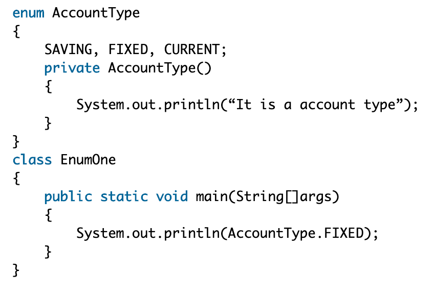

# [java参数传递（到底是值传递还是引用传递？）](https://www.cnblogs.com/hpyg/p/8005599.html)

https://www.cnblogs.com/hpyg/p/8005599.html


# [JAVA基础：基本类型](https://www.cnblogs.com/mataoshou/p/10819586.html)

https://www.cnblogs.com/mataoshou/p/10819586.html


看到了  1.2.8

---


# java 的ClassLoader

---

# 哪个关键字可以对对象加互斥锁？

**A:**

**synchronized** **关键字** **:** 用来给对象和方法或者代码块加锁，当它锁定一个方法或者一个代码块的时候，同一时刻最多只有一个线程执行这个段代码。

**volatile：**用来确保将变量的跟新操作通知到其他线程，当把变量声明为volatile类型后，编译器与运行时都会注意到这个变量是共享的，因此不会将该变量上的操作与其他内存操作一起重排序。然而，在访问volatile变量时不会执行加锁操作，因此也就不会使执行线程阻塞，因此volatile变量是一种比 synchronized关键字更轻量级的同步机制。

**serialize：**Java 对象序列化为二进制文件。

**static关键字：** static关键字可以修饰变量，方法，静态代码块。

​             静态变量:

​                     由static修饰的变量称为静态变量

​                     静态变量属于类，而不属于某个对象

​                     静态变量它的副本只有一个(静态变量在类中只加载一)

​             静态方法：

​                     在静态方法中只能调用静态变量和静态方法

​                     在非静态方法中，可以调用静态方法或者变量。

​                     在静态方法中不能使用this和super关键字。

​            静态代码块

​                     作用:用来给静态成员变量初始化

---

# 关键字super的作用是？

  子类的构造方法总是先调用父类的构造方法，如果子类的构造方法没有明显地指明使用父类的哪个构造方法，子类就调用父类不带参数的构造方法。
而父类没有无参的构造函数，所以子类需要在自己的构造函数中显示的调用父类的构造函数。

---

# 正则

---

# 多态的向上转型题。


向上转型：父类只能调用父类方法或者子类覆写后的方法,而子类中的单独方法则是无法调用的。


假定Base b = new Derived（）; 调用执行b.methodOne（）后，输出结果是什么？

```java
/**
 * @Classname test2
 * @Description TODO
 * @Date 2020/8/2 3:27 下午
 * @Created by jason
 
 * 只要是被子类重写的方法，super.方法名 重写后 都是调用子类的    (不被super调用都是调用子类方法)
 * 说一下逻辑
 * 首先 b.methodOne();
 * Derived继承了Base
 * 重写了methodOne 在重写的方法里调用了super,这样就来到了父类的methodOne中,此时会输出A,但是因为
 * methodOne被重写了则methodTwo会用子类的方法,所以又进入到了子类,但是子类的methodTwo又super.methodTwo() 又来到了父类的methodTwo
 * 这时,输出B
 * 但是因为methodTwo被重写了则继续调用子类的MethodTwo,则又回到了子类输出D
 * 至此,子类的methodOne终于执行完成最后输出C
 * 所以输出是ABDC
 */
public class test2 {
    public static class Base {
        public void methodOne() {
            System.out.print("A");
            methodTwo();
        }
        public void methodTwo() {
            System.out.print("B");
        }
    }
    public static class Derived extends Base {
        public void methodOne() {
            super.methodOne();
            System.out.print("C");
        }

        public void methodTwo() {
            super.methodTwo();
            System.out.print("D");
        }
    }

    public static void main(String[] args) {
        Base b = new Derived();
        b.methodOne();
    }

}

```


  子类的构造方法总是先调用父类的构造方法，如果子类的构造方法没有明显地指明使用父类的哪个构造方法，子类就调用父类不带参数的构造方法。
而父类没有无参的构造函数，所以子类需要在自己的构造函数中显示的调用父类的构造函数。

---

# 加载

```java
public class P {
public static int abc = 123;
static{
System.out.println("P is init");
}
}
public class S extends P {
static{
System.out.println("S is init");
}
}
public class Test {
public static void main(String[] args) {
System.out.println(S.abc);
}
}

```

子类直接调用父类的静态方法,会初始化父类  子类只是被加载不会被初始化

属于被动引用不会出发子类初始化 

 1.子类引用父类的静态字段，只会触发子类的加载、父类的初始化，不会导致子类初始化 

 2.通过数组定义来引用类，不会触发此类的初始化 

 3.常量在编译阶段会进行常量优化，将常量存入调用类的常量池中， 本质上并没有直接引用到定义常量的类，因此不会触发定义常量的类的初始化。 

 参考：《深入理解Java虚拟机》


不会初始化子类的几种

\1. 调用的是父类的static方法或者字段

2.调用的是父类的final方法或者字段

\3. 通过数组来引用

---

# 重写方法应遵循规则

方法名相同，参数类型相同

子类返回类型小于等于父类方法返回类型，

子类抛出异常小于等于父类方法抛出异常，

子类访问权限大于等于父类方法访问权限。


---

# yield()

```java
/**
 * yield()的作用是让步，
 * 它能够让当前线程从“运行状态”进入到“就绪状态”，
 * 从而让其他等待线程获取执行权，但是不能保证在当前线程调用yield()之后，
 * 其他线程就一定能获得执行权，也有可能是当前线程又回到“运行状态”继续运行，
 */
class ThreadTest extends Thread {
    public void run() {
        System.out.println("In run");
        yield();
        System.out.println("Leaving run");
    }

    public static void main(String[] argv) {
        (new ThreadTest()).start();
    }
}
//程序运行输出先有In run后有Leaving run
```

---

# 抽象

```
抽象类不能被实例化

A.抽象类可以有非抽象的方法，而接口中的方法都是抽象方法

B.java中类只能单继承，接口可以‘继承’多个接口

C.抽象类必须有构造方法，接口一定没有构造方法

D.实例化一般指new一个对象，所以抽象类不能实例化
```

---

# 线程调用

如果没有start开启线程而是使用run

则会按照顺序依次执行,并不是并行执行


调用sleep()方***让线程进入睡眠状态---睡眠指定的时间后再次执行；

 调用wait()方***让线程进入等待状态 ----等待别的线程执行notify()或notifyAll()唤醒后继续执行；

调用start()方***让线程进入就绪状态---得到CPU时间就执行线程；

run()方法是线程的具体逻辑方法，执行完，线程就结束


 两种方法的区别:

  1.start方法

​     用 start方法来启动线程，是真正实现了多线程， 通过调用Thread类的start()方法来启动一个线程，这时此线程处于就绪（可运行）状态，并没有运行，一旦得到cpu时间片，就开始执行run()方法。但要注意的是，此时无需等待run()方法执行完毕，即可继续执行下面的代码。所以run()方法并没有实现多线程。

  2.run方法

​     run()方法只是类的一个普通方法而已，如果直接调用Run方法，程序中依然只有主线程这一个线程，其程序执行路径还是只有一条，还是要顺序执行，还是要等待run方法体执行完毕后才可继续执行下面的代码。


---

# 对象初始化


```
goodandgbc
```


java 中String是 immutable的，也就是不可变，一旦初始化，其引用指向的内容是不可变的。

也就是说，String str = “aa”；str=“bb”；第二句不是改变“aa”所存储地址的内容，而是另外开辟了一个空间用来存储“bb”；同时由str指向

原来的“aa”，现在已经不可达，GC时会自动回收。

因此String作为参数传进来时候，str= "test ok"; 实际给副本引用str指向了新分配的地址，该地址存储“test ok”。

因此，原先的str仍然指向“good”


初始化过程是这样的： 

1.首先，初始化父类中的静态成员变量和静态代码块，按照在程序中出现的顺序初始化； 

2.然后，初始化子类中的静态成员变量和静态代码块，按照在程序中出现的顺序初始化； 

3.其次，初始化父类的普通成员变量和代码块，在执行父类的构造方法；

4.最后，初始化子类的普通成员变量和代码块，在执行子类的构造方法；


---

```java

/**
 * @Classname test
 * @Description TODO
 * @Date 2020/8/5 3:20 下午
 * @Created by jason
 */
class C {
    C() {
        System.out.print("C");
    }
}

class A {
    C c = new C();

    A() {
        this("A");
        System.out.print("A");
    }

    A(String s) {
        System.out.print("我是父类A的:"+s);
    }
}

class Test extends A {
    Test() {
        super("B");
        System.out.print("Test的"+"B");
    }


    public static void main(String[] args) {
        new Test();
    }

}


```

打印:C我是父类A的:BTest的BD

---

# final

final修饰的成员变量为基本数据类型是，在赋值之后无法改变。当final修饰的成员变量为引用数据类型时，在赋值后其指向地址无法改变，但是对象内容还是可以改变的。

final修饰的成员变量在赋值时可以有三种方式。1、在声明时直接赋值。2、在构造器中赋值。3、在初始代码块中进行赋值。


final修饰的方法，不允许被子类覆盖。

final修饰的类，不能被继承。

final修饰的变量，不能改变值。

final修饰的引用类型，不能再指向别的东西，但是可以改变其中的内容。


final修饰类、方法、属性！不能修饰抽象类，因为抽象类一般都是需要被继承的，final修饰后就不能继承了。

final修饰的方法不能被重写而不是重载！ 

final修饰属性，此属性就是一个常量，不能被再次赋值


final修饰类、方法、属性！不能修饰抽象类，因为抽象类一般都是需要被继承的，final修饰后就不能继承了。

final修饰的方法不能被重写而不是重载！ 

final修饰属性，此属性就是一个常量，不能被再次赋值！

---

# 类方法中不可以直接调用对象变量

静态方法中不能调用对象的变量，因为静态方法在类加载时就初始化，对象变量需要在新建对象后才能使用

---

# 枚举



枚举类有三个实例，故调用三次构造方法，打印三次It is a account type

---

# string和stringbuffer

创建了多少个对象：String s="welcome"+"to"+360;

一个

```java
String test="javaandpython"; 
String str1="java"; 
String str2="and"; 
String str3="python"; 
System. out. println(test=="java"+"and"+"python"): 
System. out. println(test ==str1 + str2 + str3);
```

对于上面这段代码，结果是true false

这是因为字符串字面量拼接操作是在Java编译器编译期间就执行了，也就是说编译器编译时，直接把"java"、"and"和"python"这三个字面量进行"+"操作得到一个"javaandpython" 常量，并且直接将这个常量放入字符串池中，这样做实际上是一种优化，将3个字面量合成一个，避免了创建多余的字符串对象（只有一个对象"javaandpython"，在字符串常量池中）。而字符串引用的"+"运算是在Java运行期间执行的，即str1 + str2 + str3在程序执行期间才会进行计算，它会在堆内存中重新创建一个拼接后的字符串对象。且在字符串常量池中也会有str1,str2与str3，这里创建多少个新的对象与原来字符串常量池中有没有str1\str2\str3有关，如果之前存在就不会创建新的对象。

总结来说就是：字面量"+"拼接是在编译期间进行的，拼接后的字符串存放在字符串池中；而字符串引用的"+"拼接运算实在运行时进行的，新创建的字符串存放在堆中。

那么再来看这题，很明显只在编译期间在字符串常量池中创建了"welcometo360"一个字符串


**String, StringBuffer,StringBuilder的区别**

**java中String、StringBuffer、StringBuilder是编程中经常使用的字符串类，他们之间的区别也是经常在面试中会问到的问题。现在总结一下，看看他们的不同与相同。**

**1.可变与不可变**

**String类中使用字符数组保存字符串，如下就是，因为有“final”修饰符，所以可以知道string对象是不可变的。**

**private final char value[];**

   **String** **为不可变对象,一旦被创建,就不能修改它的值.** **.** **对于已经存在的String对象的修改都是重新创建一个新的对象,然后把新的值保存进去.**

**StringBuilder与StringBuffer都继承自AbstractStringBuilder类，在AbstractStringBuilder中也是使用字符数组保存字符串，如下就是，可知这两种对象都是可变的。**

**char[] value;**

   **StringBuffer:是一个可变对象,当对他进行修改的时候不会像String那样重新建立对象** **,** **它只能通过构造函数来建立,** **如：** **StringBuffer sb = new StringBuffer();**

**不能通过赋值符号对他进行付值.** **，** **如** **sb = "welcome to here!";//error****
****对象被建立以后,在内存中就会分配内存空间,并初始保存一个null.向StringBuffer中赋值的时候可以通过它的append方法.**   **sb.append("hello");**

**2.是否多线程安全**

**String中的对象是不可变的，也就可以理解为常量，** **显然线程安全** **。**

**AbstractStringBuilder是StringBuilder与StringBuffer的公共父类，定义了一些字符串的基本操作，如expandCapacity、append、insert、indexOf等公共方法。**

**StringBuffer对方法加了同步锁或者对调用的方法加了同步锁，所以是** **线程安全的** **。看如下源码：**

 

```java
  public   synchronized  StringBuffer reverse() {

      super .reverse();

      return   this ;

 }

 

  public   int  indexOf(String str) {

      return  indexOf(str, 0);         //存在 public synchronized int indexOf(String str, int fromIndex) 方法

 }
```


 

**StringBuilder并没有对方法进行加同步锁，所以是** **非线程安全的** **。**

 **3.StringBuilder与StringBuffer共同点**

**StringBuilder与StringBuffer有公共父类AbstractStringBuilder(** **抽象类** **)。**

**抽象类与接口的其中一个区别是：抽象类中可以定义一些子类的公共方法，子类只需要增加新的功能，不需要重复写已经存在的方法；而接口中只是对方法的申明和常量的定义。**

**StringBuilder、StringBuffer的方法都会调用AbstractStringBuilder中的公共方法，如super.append(...)。只是StringBuffer会在方法上加synchronized关键字，进行同步。**

**最后，如果程序不是多线程的，那么使用StringBuilder效率高于StringBuffer。**

 

**效率比较String < StringBuffer < StringBuilder，但是在String S1 =“This is only a”+“simple”+“test”时，String效率最高。**

---

# jvm内的指针


```java
package NowCoder;
class Test {
    public static void hello() {
        System.out.println("hello");
    }
}
public class MyApplication {
    public static void main(String[] args) {
        // TODO Auto-generated method stub
        Test test=null;
        test.hello();
    }
}
```

当程序执行Test tset时：jvm发现还没有加载过一个称为”Test”的类，它就开始查找并加载类文件”Test.class”。它从类文件中抽取类型信息并放在了方法区中，jvm于是以一个直接指向方法区lava类的指针替换了'test'符号引用，以后就可以用这个指针快速的找到Test类了。所以这也是为什么可以直接test.任何静态的东西

引用不同于指针，引用中既包含指向对象的指针、又包含指向类的指针，test中指向对象的指针确实为空，但指向Test的指针可不为空啊

---

### java创建对象

Java有5种方式来创建对象：

1. 使用 new 关键字（最常用）： ObjectName obj = new ObjectName();
2. 使用反射的Class类的newInstance()方法： ObjectName obj = ObjectName.class.newInstance(); 
3. 使用反射的Constructor类的newInstance()方法： ObjectName obj = ObjectName.class.getConstructor.newInstance();
4. 使用对象克隆clone()方法： ObjectName obj = obj.clone(); 
5. 使用反序列化（ObjectInputStream）的readObject()方法： try (ObjectInputStream ois = new ObjectInputStream(new FileInputStream(FILE_NAME))) { ObjectName obj = ois.readObject(); }

---

# java的引用

发现这道题完全没头绪，就去查了一下，感觉说的比较清楚了。

**四种引用类型**

JDK1.2 之前，一个对象只有“已被引用”和"未被引用"两种状态，这将无法描述某些特殊情况下的对象，比如，当内存充足时需要保留，而内存紧张时才需要被抛弃的一类对象。

所以在 JDK.1.2 之后，Java 对引用的概念进行了扩充，将引用分为了：强引用（Strong Reference）、软引用（Soft Reference）、弱引用（Weak Reference）、虚引用（Phantom Reference）4 种，这 4 种引用的强度依次减弱。

**一，强引用**

Object obj = new Object(); //只要obj还指向Object对象，Object对象就不会被回收 obj = null; //手动置null

只要强引用存在，垃圾回收器将永远不会回收被引用的对象，哪怕内存不足时，JVM也会直接抛出OutOfMemoryError，不会去回收。如果想中断强引用与对象之间的联系，可以显示的将强引用赋值为null，这样一来，JVM就可以适时的回收对象了

**二，软引用**

软引用是用来描述一些非必需但仍有用的对象。**在内存足够的时候，软引用对象不会被回收，只有在内存不足时，系统则会回收软引用对象，如果回收了软引用对象之后仍然没有足够的内存，才会抛出内存溢出异常**。这种特性常常被用来实现缓存技术，比如网页缓存，图片缓存等。

在 JDK1.2 之后，用java.lang.ref.SoftReference类来表示软引用。

**三，弱引用**

弱引用的引用强度比软引用要更弱一些，**无论内存是否足够，只要 JVM 开始进行垃圾回收，那些被弱引用关联的对象都会被回收**。在 JDK1.2 之后，用 java.lang.ref.WeakReference 来表示弱引用。

**四，虚引用**

虚引用是最弱的一种引用关系，如果一个对象仅持有虚引用，那么它就和没有任何引用一样，它随时可能会被回收，在 JDK1.2 之后，用 PhantomReference 类来表示，通过查看这个类的源码，发现它只有一个构造函数和一个 get() 方法，而且它的 get() 方法仅仅是返回一个null，也就是说将永远无法通过虚引用来获取对象，虚引用必须要和 ReferenceQueue 引用队列一起使用。

---

# 变量的初始化

存在与方法或静态代码块中的局部变量，必须初始化

局部变量是指类方法中的变量，必须初始化。

局部变量运行时被分配在栈中，量大，生命周期短，如果虚拟机给每个局部变量都初始化一下，是一笔很大的开销，但变量不初始化为默认值就使用是不安全的。出于速度和安全性两个方面的综合考虑，解决方案就是虚拟机不初始化，但要求编写者一定要在使用前给变量赋值。

---

# 枚举属于数据类型还是类?

枚举（enum）类型是Java 5新增的特性，它是一种新的类型，允许用常量来表示特定的数据片断，而且全部都以类型安全的形式来表示，是特殊的类，可以拥有成员变量和方法。

既然是类,就不是数据类型了

---

# abstract 和实现

类实现多个接口的时候，只需要一个implements，多个接口通过逗号进行隔开，先继承类再实现接口


1、abstract类不能用来创建abstract类的对象；
2、final类不能用来派生子类，因为用final修饰的类不能被继承；
3、如2所述，final不能与abstract同时修饰一个类，abstract类就是被用来继承的；
4、类中有abstract方法必须用abstract修饰，但abstract类中可以没有抽象方法，接口中也可以有abstract方法。

---

# 数组

Java中数组是对象，不是基本数据类型（原生类），大小不可变且连续存储，因为是对象所以存在堆中

数组长度在创建时就确定了，要改变数组长度只能重新创建新的数组，将原有数组复制到新的数组之中。这也是ArrayList扩容时候的效率低于LinkedList的原因。

---

# try

选B，catch可以省略，try的形式有三种：

try-catch

try-finally

try-catch-finally

但**catch和finally语句不能同时省略！**

---

# interface

Java8的接口方法可以有如下定义

only public, abstract, default, static and strictfp are permitted

---

# 方法

1.抽象方法只能定义在抽象类中，抽象方法和抽象类必须由abstract修饰，abstract关键字只能描述类和方法，不能描述变量。抽象方法只定义方法声明，不定义方法实现。抽象类不可以被实例化（创建对象），只有通过子类继承抽象类并覆盖抽象类中的所有抽象方法后，该子类才可以被实例化，否则该子类还是一个抽象类。抽象类中有构造函数用于给子类对象进行初始化，同时抽象类中可以含有非抽象方法。abstract关键字不可以与final，private,static关键字共存，因为被final修饰的方法不可以被重写，意味着子类不可以重写该方法，如果abstract和final共同修饰父类中的方法，子类要实现抽象方法（abstract的作用），而final又不让该方法重写，这相互矛盾。如果private和abstract共同修饰父类中的方法，private修饰则该方法不可以被子类访问，但是abstract修饰需要子类去实现，两者产生矛盾。如果static和abstract共同修饰父类中的方法，static表示是静态的方法，随着类的加载而加载，则该方法不需要在子类中去实现，这与abstract关键字矛盾。 2.static用于修饰成员变量和成员函数，想要实现对象中的共性数据的对象共享，可以将这个数据进行静态修饰，被静态修饰的成员可以直接被类名调用，静态随着类的加载而加载，而且优先于对象存在。静态方法只能访问静态成员（静态方法和静态变量），不可以访问非静态成员，这是因为静态方法加载时，优先于对象存在，所以没有办法访问对象中的成员。静态方法中不能使用this和super关键字，因为this代表本类对象，super代表父类对象，而静态时，有可能没有对象存在，所以this和super无法使用。 3.final关键字可以修饰类，方法，变量（成员变量内，局部变量，静态变量），被final修饰的类是一个最终类，不可以被继承，被final修饰的方法是一个最终方法，不可以被覆盖，但是可以被继承。被final修饰的变量只能是一个常量，只能赋值一次。内部类被定义在类中的局部位置上时，只能访问局部被final修饰的局部变量。

---

# 运行时常量池

在JDK1.8之前**运行时常量池**被放在方法区,属于线程共享,JDK1.8之后,元空间取代了方法区,**运行时常量池**被也被放在元空间中,**运行时常池** 主要存放, class文件元信息描述,编译后的代码，引用类型数据，类文件常量池。所谓的运行时常量池其实就是将编译后的类信息放入运行时的一个区域中，用来动态获取类信息。**运行时常量池**是在类加载完成之后，将每个class常量池中的符号引用值转存到**运行时常量池**中，也就是说，每个class都有一个**运行时常量池**，类在解析之后，将符号引用替换成直接引用，与全局常量池中的引用值保持一致。**运行时常量池**是方法区的一部分。Class 文件中除了有类的版本、字段、方法、接口等描述信息外，还有常量池信息（用于存放编译期生成的各种字面量和符号引用）


---

# 继承

类只支持单继承，接口支持多继承

---

# juc包

A、Semaphore：类，控制某个资源可被同时访问的个数;

B、ReentrantLock：类，具有与使用synchronized方法和语句所访问的隐式监视器锁相同的一些基本行为和语义，但功能更强大；

C、 Future：接口，表示异步计算的结果；

D、 CountDownLatch： 类，可以用来在一个线程中等待多个线程完成任务的类。

---

# 单例模式


单例模式: 第一步，不让外部调用创建对象，所以把构造器私有化，用private修饰。 第二步，怎么让外部获取本类的实例对象？通过本类提供一个方法，供外部调用获取实例。由于没有对象调用，所以此方法为类方法，用static修饰。 第三步，通过方法返回实例对象，由于类方法(静态方法)只能调用静态方法，所以存放该实例的变量改为类变量，用static修饰。 最后，类变量，类方法是在类加载时初始化的，只加载一次。所以由于外部不能创建对象，而且本来实例只在类加载时创建一次

单例模式，obj1和obj2其实是一个对象,应该返回true!

