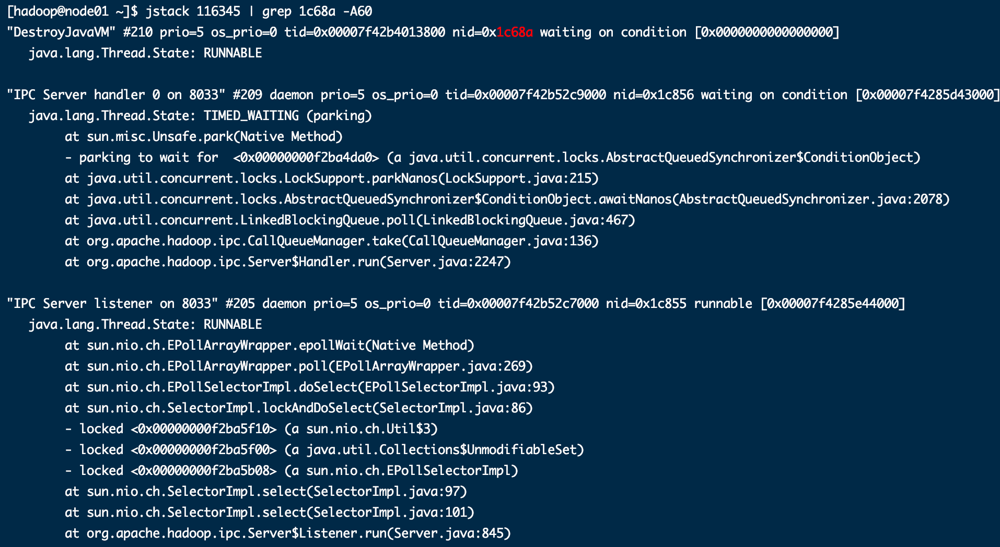

##  1 服务器线上变慢,如何评估性能?

## 1.1 整机  top

load average 后边的三个值分别是1分钟 5分钟  15分钟 的系统平均负载值,如果这三个值相加除3 高于60% 则系统负荷过高

也就是这三个值尽量都在60%以下是最好的

top命令需要看  cpu 和内存的占用

uptime 

相当于top的精简版

## 1.2 CPU vmstat

### 1.2.1查看cpu

vmstat -n  2 3  每两秒采集一次,共计采样三次

一般vmstat工具的使用时通过两个数字参数来完成

第一个参数是采样的时间间隔,单位是秒

第二个参数是采样的次数

- procs

r : 代表 运行和等待CPU时间片的进程数,原则上一核的CPU的运行队列不超过2,整个系统的运行队列不超过总核数的2倍,否则代表系统压力过大

  r是runtime

b: 等待资源的进程数,比如正在等待磁盘I/O,网络I/O

- cpu:

​	us:   user  用户进程消耗CPU时间百分比,us值高,代表了用户进程消耗CPU时间多,如果长期大于50%,就需要优化程序了

​	sy:   system   内核进程消耗的CPU时间百分比

**us+sy 参考值是80%,超过80%则可能存在CPU不足**

​	id : 出于空闲的CPU百分比

​	wa:系统等待IO的CPU时间百分比

​	st:来自于一个虚拟机偷取的CPU时间的百分比

### 1.2.2 查看额外

- 查看所有CPU核信息 

mpstat -P ALL 2

每两秒采样一次并打印

%idle 是空闲值  

- 每个进程使用cpu的用量分解信息   

pidstat -u 1 -p 进程编号

1是间隔1秒

## 1.3 内存 free

应用程序可用内存/系统物理内存 > 70% 内存充足

应用程序可用内存/ 系统内存 <20%  内存不足  需要加内存

20% < 应用程序可用内存/系统物理内存 < 70%内存基本够用

- 查看内存使用 free -m

- 额外查看

pidstat -p 进程号 -r 采样间隔秒数

## 1.4 硬盘  df

df -h   

-h 意思是人类看的懂的表现方式

## 1.5 磁盘 iostat

磁盘io

- 磁盘io性能评估

磁盘块设备分布

r kB/S 每秒读取数据量kB;

wkB/s 每秒写入数据量kB;

svctm I/O 请求的平均服务时间,单位毫秒

await I/O 请求的平均服务时间,单位毫秒 : 值越小 性能越好

util : 一秒钟有百分之几的时间用于I/O操作,接近100%时,表示磁盘带宽跑满,需要优化程序或者增加磁盘

Iostat -xdk 2 3 每间隔2秒采样3次

- 查看额外表示

pidstat -d 采样间隔时间秒数  -p 进程号

## 1.6 网络 ifstat

- 本地没有,下载ifstat

百度安装 

- 查看网络io

  

# 2 生产环境cpu占用过高,怎么办

解决思路:

​	这种情况,需要结合linux和jdk的命令去排查问题

步骤:

- 1 先用top命令找出cpu占比最高的进程

top查看cpu占用,发现

- 2 ps -ef 或者jps 进一步定位,得知是什么后台程序造成的

定位到116345是resourcemanager

- 3 定位具体线程或者代码

ps -mp 进程  -o THREAD,tid,time

-m 显示所有线程,注意不是进程

-p pid进程使用cpu的时间

-o 该参数后事用户自定格式

可以看到116345进程下有很多线程在工作,可以看到116362这个线程cpu占用是0.4,那我们就来查看这个线程

- 4 将需要的线程id转换成为16进制格式

printf "%x\n"   要查看的线程id

printf "%x\n"  116362   === > 1c68a

- 5 jstack  进程id  | grep tid(16进制线程id小写英文)  -A60

Jstack 116345 |grep 1c68a -A60

-A60是打印出前60行

在这里的日志去定位代码

# 3 jvm性能监控和新能分析的工具

https://docs.oracle.com/javase/8/

